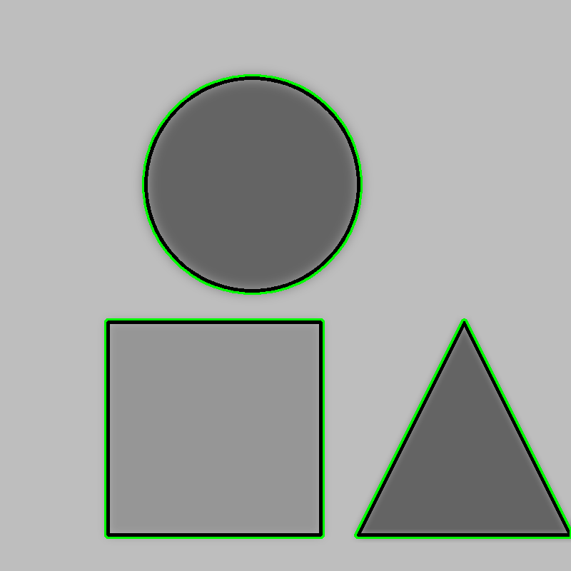

# 🧪 Taller - Análisis de Figuras Geométricas: Centroide, Área y Perímetro

## 📅 Fecha
`2025-04-28` – Fecha de realización

---

## 🎯 Objetivo del Taller

Desarrollar habilidades en el procesamiento de imágenes usando Python y OpenCV para:

* Detectar contornos de figuras en imágenes binarizadas.
* Calcular el área, perímetro y centroide de cada figura.
* Clasificar la forma de las figuras (círculo, cuadrado, triángulo).

---

## 🧠 Conceptos aprendidos

Los principales conceptos aplicados en este taller fueron:

- [x] Binarización de imágenes y su utilización.
- [x] Detección de contornos de una primitiva geométrica
- [x] Cálculo del área, perímetro y centroide de un contorno dado
- [x] Reconocimiento de figuras basado en el contorno
- [x] Manipulación de imágenes con `matplotlib`, `numpy` y `opencv-python`.

---

## 📖 Conceptos clave

### Imagen binarizada

Una imagen binarizada es una versión simplificada de una imagen en la que cada píxel es blanco o negro. Esto se hace aplicando un umbral: los píxeles más brillantes que el umbral pasan a ser blancos, y los más oscuros, negros. Suele utilizarse para que características como el texto o las formas sean más fáciles de detectar y procesar.


## Herramientas y entorno

Para este taller, el entorno utilizado es Colab.

Herramientas: `opencv-python`, `numpy`, `matplotlib`

---

## 📁 Estructura del proyecto

```text
2025-05-02_taller_analisis_figuras_geometricas/
├── python/
│ └── analisis_figuras_geometricas.ipynb
├── resultados/
│ └── analisis_figuras_geometricas.gif
│ └── img_bin.png
│ └── resultado.png
├── README.md
```
---

## 🧪 Aplicación

El proceso de implementación fue el siguiente:

### 🔹 Etapas de desarrollo
1. Preparar el entorno con las herramientas correspondientes
2. Crear la imagen binarizada
3. Detectar los contornos utilizando cv2.findContours()
4. Calcular las propiedades básicas de cada contorno
5. 'Etiquetar' cada figura con sus métricas: área, perímetro y coordenadas del centroide
6. Clasificación de los contornos
7. Generación de la secuencia de resultados (GIF)

### 🔹 Código relevante

Realmente, todo es importante en el desarrollo de este taller, sin embargo, el corazón del taller está detrás de la identificación de contornos y caracterización de los mismos. Por ende, el código que resume esta práctica puede ser el siguiente:


```python
# 2. Buscar contornos sobre la imagen binaria
contours, _ = cv2.findContours(binary, cv2.RETR_EXTERNAL, cv2.CHAIN_APPROX_SIMPLE)

# 4. Calcular métricas
for cnt in contours:
    area = cv2.contourArea(cnt)
    perimeter = cv2.arcLength(cnt, True)
    
    M = cv2.moments(cnt)
    if M['m00'] != 0:
        cx = int(M['m10'] / M['m00'])
        cy = int(M['m01'] / M['m00'])
    else:
        cx, cy = 0, 0

# 5. Clasificación de figuras
img_final = img_metricas.copy()
for cnt in contours:
    M = cv2.moments(cnt) # Momento del centroide
    if M['m00'] != 0:
        cx = int(M['m10'] / M['m00'])
        cy = int(M['m01'] / M['m00'])
    else:
        cx, cy = 0, 0

    approx = cv2.approxPolyDP(cnt, 0.02 * cv2.arcLength(cnt, True), True)
    num_vertices = len(approx) # Número de vértices de la figura

    shape = "Desconocido"
    if num_vertices == 3:
        shape = "Triangulo"
    elif num_vertices == 4:
        # Determinar si cuadrado o rectángulo midiendo lados
        x, y, w, h = cv2.boundingRect(approx)
        aspect_ratio = float(w) / h
        shape = "Cuadrado" if 0.95 <= aspect_ratio <= 1.05 else "Rectangulo"
    elif num_vertices == 5:
        shape = "Pentagono"
    elif num_vertices == 6:
        shape = "Hexagono"
    else:
        area = cv2.contourArea(cnt)
        perimeter = cv2.arcLength(cnt, True)
        if perimeter != 0:
            circularity = 4 * np.pi * (area / (perimeter * perimeter))
            if circularity > 0.75:
                shape = "Circulo"

    cv2.putText(img_final, shape, (cx - 50, cy + 30), cv2.FONT_HERSHEY_SIMPLEX, 0.5, (0, 0, 255), 1)
```

---

## 📊 Resultados Visuales

### 📌 Este taller **requiere explícitamente un GIF animado**:

El resultado final de la práctica se representa por la siguiente secuencia:



---

## 🧩 Prompts Usados

```text
"Explain to me in a simple way what a binarized image is"
```


```text
"I am working in Colab using: opencv-python, numpy, matplotlib. Create a code in this language that create and load a binarized image generated with cv2.threshold()"
```

```text
"It only detects the border of the image, it doesnt detects the figure contorns. Why could this happen?" (This explains that it is necessary to use cv2.findContours() with white figures and black background).
```

```text
"Create a Python code that does the following:

Given a binarized image and a list of contours detected in that image using cv2.findContours(), compute the following properties for each contour:

1. area: calculate the area of each contour using the cv2.contourArea() function.
2.  Perimeter: Calculates the perimeter of each contour using the function cv2.arcLength().
3.  Centroid: Calculates the centroid of each contour from the moments of the image, obtained with the function cv2.moments().

The code must receive as input the binarized image and the list of contours, and must return a list of dictionaries, where each dictionary represents a contour and contains the keys 'area', 'perimeter' and 'centroid' with their respective values. The code should be well commented for ease of understanding. Assume that the code will run in a Google Colab environment, so you can include the necessary imports and any additional configuration you consider useful."
```
```text
"I am working in Colab using: opencv-python, numpy, matplotlib. Create a code in this language that allow to classify contours in shapes such as: Circle, square and triangle."
```

---

## 💬 Reflexión Final

Durante el desarrollo de este taller reforzamos de manera práctica conceptos clave del procesamiento de imágenes, como la binarización, la detección de contornos y el cálculo de métricas geométricas a partir de estos. Aprendimos cómo, a partir de una imagen binarizada, es posible extraer información relevante como el área, el perímetro y el centroide de las figuras, y cómo estas propiedades permiten clasificarlas de manera efectiva. Además, entendimos la importancia de configurar adecuadamente funciones como cv2.findContours() y cv2.approxPolyDP() para lograr resultados precisos y confiables.

La parte más interesante y desafiante fue la clasificación de las figuras geométricas. Implementar una lógica que identificara triángulos, cuadrados, rectángulos y círculos nos permitió aplicar conocimientos geométricos dentro de un entorno computacional. También destacamos el valor de las visualizaciones generadas, como el GIF final, que nos permitió validar y presentar los resultados de forma clara. Para futuros proyectos, consideraríamos incorporar métodos más avanzados de análisis de forma, o incluso técnicas de aprendizaje automático, para enfrentar casos más complejos o con mayor variabilidad en las imágenes.

---


## ✅ Checklist de Entrega

- [x] Carpeta `2025-04-28_taller_analisis_figuras_geometricas`.  
- [x] Contornos correctamente detectados y procesados.
- [x] Cálculo preciso de área, perímetro y centroide.
- [x] Visualización clara de las métricas en la imagen.
- [x] Clasificación de formas (bonificada) correctamente implementada (si procede).
- [x] Commits descriptivos en inglés.
- [x] README completo con explicaciones, indicaciones y pruebas visuales (GIF).