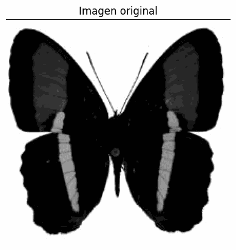
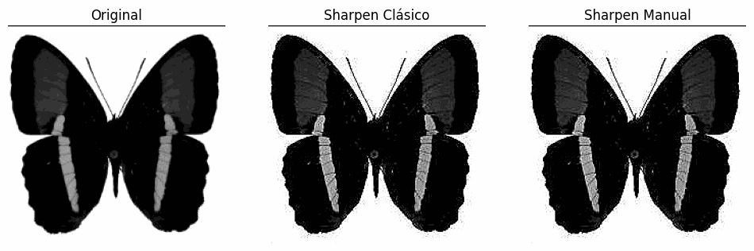
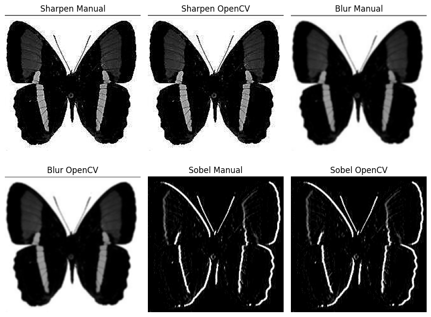
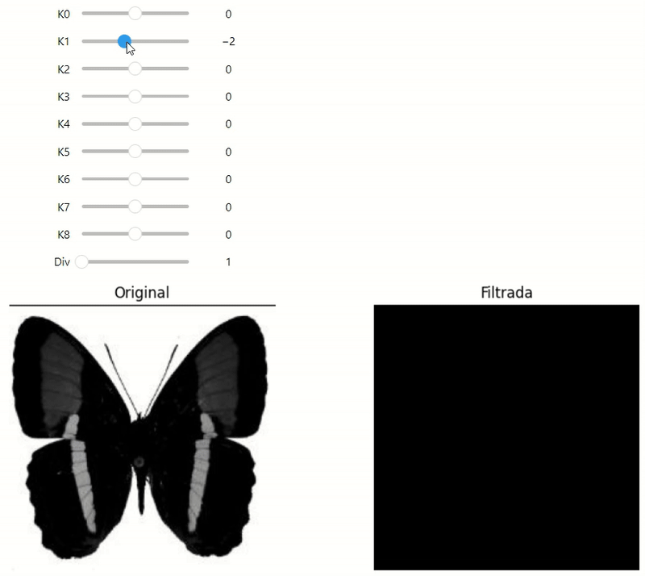

# 🧪 Taller - Filtro Visual: Convoluciones Personalizadas

## 📅 Fecha
`2025-04-29` – Fecha de realización

---

## 🎯 Objetivo del Taller

Diseñar e implementar filtros personalizados en imágenes para modificar bordes, difuminar o realzar detalles. Este taller busca profundizar en el concepto de convolución y su impacto visual en el procesamiento de imágenes.

---

## 🧠 Conceptos aprendidos

Los principales conceptos aplicados en este taller fueron:

- [x] Convolución 2D
- [x] Implementación personalizada del kernel y cómo afecta a la convolución
- [x] Filtros de procesado de imagen

---

## 📖 Conceptos clave

### ¿Qué es una convolución 2D?

Una convolución 2D es una operación que se aplica a una imagen para procesarla. Consiste en recorrer la imagen utilizando una pequeña matriz llamada kernel o filtro, que se superpone a bloques de la imagen. En cada posición, se realiza una multiplicación elemento por elemento entre el núcleo y la parte correspondiente de la imagen, y luego se suman los resultados. El valor final se guarda en una nueva imagen.

### ¿Qué es un kernel personalizado?

Un kernel personalizado es una matriz de números que se diseña manualmente para aplicar un efecto específico a la imagen, como la detección de bordes, el desenfoque o la mejora. Cambiar los valores del kernel cambia el resultado de la convolución.

Traducción realizada con la versión gratuita del traductor DeepL.com

---

## 🔧 Herramientas y Entornos

Para este taller, el entorno utilizado es Colab (Python).

Herramientas: `opencv-python`, `numpy`, `matplotlib`, `imageio`, `ipywidget`.

---

## 📁 Estructura del Proyecto

```text
2025-04-29_taller_convoluciones_personalizadas/
├── python/
│ └── convoluciones_personalizadas.ipynb
├── resultados/
│ └── comparaciones_convoluciones.gif
│ └── proceso_convoluciones.gif
│ └── comparativa_filtros.png
│ └── convolucion_dinamica.gif
├── README.md
```

---

## 🧪 Implementación

Explica el proceso:

### 🔹 Etapas realizadas
1. Preparar el entorno con las herramientas correspondientes
2. Implementación manual de la convolución 2D con NumPy
3. Cargar una imagen en escala de grises
4. Definición de tres kernels diferentes
5. Aplicación de los diferentes kernel definidos manualmente
6. Aplicación de kernels con funciones incorporadas
7. Comparativa entre convoluciones manuales e incorporadas
8. Generación de GIFs para evidenciar los resultados
8. Implementación de convolución dinámica

### 🔹 Código relevante

Considerando que el centro de foco de este taller es la implementación de convoluciones de forma manual y su comparativa, considero como el código más relevente la siguiente sección:

```python
def aplicar_convolucion_manual(img, kernel):
    """
    Aplica un filtro definido por un kernel a una imagen en escala de grises.

    Parámetros:
    - img: imagen de entrada (en escala de grises).
    - kernel: matriz que define el filtro (2D numpy array).

    Retorna:
    - Imagen filtrada por convolución.
    """
    h, w = img.shape
    kh, kw = kernel.shape
    pad_h, pad_w = kh // 2, kw // 2

    # Añadir bordes para evitar pérdida de información en los extremos
    img_padded = cv2.copyMakeBorder(img, pad_h, pad_h, pad_w, pad_w, cv2.BORDER_REPLICATE)

    # Crear imagen de salida vacía
    output = np.zeros_like(img)

    # Aplicar convolución pixel por pixel
    for i in range(h):
        for j in range(w):
            region = img_padded[i:i+kh, j:j+kw]
            output[i, j] = np.clip(np.sum(region * kernel), 0, 255)

    return output

# Filtro de enfoque (sharpen)
sharpen_kernel = np.array([
    [0, -1,  0],
    [-1, 5, -1],
    [0, -1,  0]
])

# Filtro de suavizado (blur)
blur_kernel = np.ones((3, 3), dtype=np.float32) / 9.0

# Filtro de detección de bordes (Sobel horizontal)
sobel_x = np.array([
    [-1, 0, 1],
    [-2, 0, 2],
    [-1, 0, 1]
])

img_sharpen = aplicar_convolucion_manual(img, sharpen_kernel)
img_blur = aplicar_convolucion_manual(img, blur_kernel)
img_edges = aplicar_convolucion_manual(img, sobel_x)
```

---

## 📊 Resultados Visuales

### 📌 Este taller **requiere explícitamente GIFs animados**:

#### Todas las convoluciones aplicadas



#### Comparativa de filtros clásicos y manuales




#### Comparativa de filtros estática



#### Convolucion manual con kernel dinámico



---

## 🧩 Prompts Usados

Enumera los prompts utilizados:

```text
Explain to me in a simple way, like a 12 year old child, what a 2D convolution is and what a custom kernel is in this context.
```
```text
I am working in Python. Create a code that manually implements a 2D convolution from scratch with NumPy (Define a function that applies a custom kernel to each pixel.)
```
```text
Now, with the function implemented. Create a code that shows the design and implementation of at least 3 different kernels:

Sharpening
Smoothing (blur)
Corner or edge detection (corners = Sobel + cross-derivatives)
```
```text
I am working in Python. Create a code that applies the same filters (sharpen, blur, edge), but with OpenCV functions such as cv2.filter2D() and plot the results together with those made with the manual kernel to compare the results.
```
```text
I am working in Python. Create a code that apply manually a convolution but dinamically, with nine sliders representing the values of the kernel.
```
---

## 💬 Reflexión Final

En este taller reforzamos el concepto de convolución que habíamos estudiado previamente en clase. Aunque no llegamos a comprender en profundidad todos los detalles de implementación, logramos captar la idea principal de cómo funciona un kernel para realizar una convolución bidimensional sobre una imagen. Esta comprensión básica fue suficiente para construir nuestras propias máscaras y experimentar con sus efectos sobre distintas imágenes.

La parte más interesante del proceso fue desarrollar y aplicar manualmente distintos kernels. Fue especialmente llamativo observar cómo pequeños cambios en la matriz del kernel generaban transformaciones visuales notables en la imagen. A través de estas pruebas también comparamos los resultados obtenidos manualmente con los que ofrece OpenCV, lo cual nos permitió identificar ventajas y limitaciones de cada enfoque, como se resume en la siguiente tabla:

| Efecto Deseado       | Desempeño del Kernel Manual (según observación)                                | Desempeño del Kernel con OpenCV (según observación)                                  | Posible Razón de la Diferencia                                                                                                                                           |
|----------------------|----------------------------------------------------------------------------------|----------------------------------------------------------------------------------------|---------------------------------------------------------------------------------------------------------------------------------------------------------------------------|
| **Enfocar (Sharpen)**| Logra un resultado casi (por no decir, exactamente) idéntico          | Hace un buen trabajo y la velocidad es notablemente superior.                         | Los kernels para enfoque requieren valores precisos y una configuración cuidadosa.            |
| **Desenfocar (Blur)**| A simple vista, parece que cumple bien su función.                              | Funciona mejor gracias a la velocidad de la función incorporada.                      | Las funciones de desenfoque de OpenCV están altamente optimizadas, lo que mejora tanto el rendimiento como la calidad visual.                                            |
| **Detección de Bordes**| Se adapta bien al contexto de la imagen.                                       | Resultado muy similar al manual.               | N/A.                           |

---

## ✅ Checklist de Entrega

- [x] Carpeta `2025-04-29_taller_convoluciones_personalizadas`.  
- [x] Implementación manual de la operación de convolución.
- [x] Diseño de al menos tres kernels personalizados.
- [x] Comparación visual clara con filtros clásicos.
- [x] Código funcional, documentado y ordenado.
- [x] README completo con explicaciones, indicaciones y pruebas visuales (GIF).
- [x] Commits descriptivos en inglés.

---