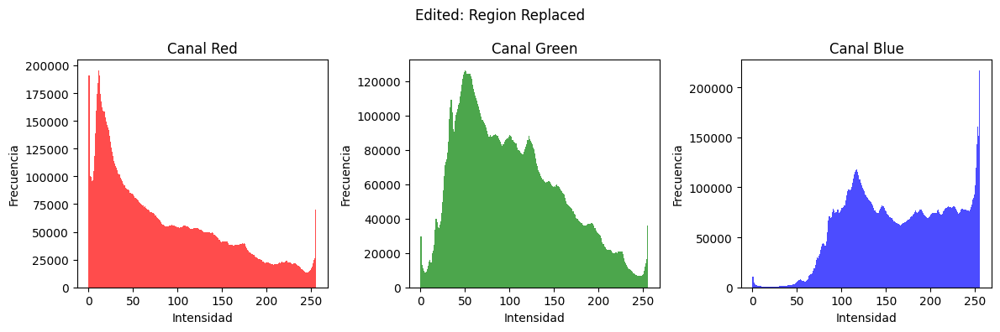

# 🧪 Workshop - From Pixels to Coordinates: Exploring the Image as a Matrix

## 📅 Date
`2025-05-03` - Date of completion

---

## 🎯 Workshop Objective

 To comprehend the digital representation of images as numerical matrices and acquire the ability to manipulate their components at the pixel level, including direct interaction with color and brightness values and targeted access to specific image regions for analysis and modification.

---

## 🧠 Concepts Learned

The main concepts applied in this workshop were:

- [x] Representation of Digital Images as Numerical Matrices
- [x] Pixel Management
- [x] Color Channels (RGB and HSV)
- [x] Matrix Slicing for Region Manipulation
- [x] Intensity Histograms
- [x] Brightness and Contrast Adjustments
 
## 📖 Key concepts

### What is a pixel?
A pixel is the smallest unit of a digital image or screen. It’s like a tiny square dot that holds a specific color. When many pixels are placed together in a grid, they form a full image, similar to how small LEGO pieces form a bigger model.

### What is a coordinate?
A coordinate is a pair of numbers (x, y) that tells us the exact position of something in a grid. In images, x represents the horizontal (left to right) position, and y represents the vertical (top to bottom) position.

### How are pixels and coordinates related?
Each pixel in an image has a unique coordinate that tells the computer where it is located. For example, the pixel at coordinate (0, 0) is usually at the top-left corner of the image.

### How is an image represented?
An image is represented as a grid (or 2D array) of pixels. Each pixel has a coordinate (x, y) and a color value, often described in RGB (red, green, blue). This structured grid of colored pixels is how digital images are stored and displayed.

### What is a color channel?
A color channel is one part of the color in a pixel. Each channel holds a value for how much of a certain color is used. Most images use three channels — like red, green, and blue — to mix and create any color.

### What is RGB?
RGB stands for Red, Green, and Blue. It’s a color model where every color is made by mixing different amounts of these three colors. Each pixel has three values: how red, how green, and how blue it is (usually from 0 to 255).

### What is HSV?
HSV stands for Hue, Saturation, and Value. It’s another way to describe colors:

* Hue is the type of color (like red, blue, yellow).

* Saturation is how pure or intense the color is.

* Value is how bright or dark the color is.
HSV is often easier for humans to understand when adjusting colors.

## 🔧 Tools and Environment

For this workshop, the environment used is Colab (Python).

Tools: `opencv-python`, `numpy`, `matplotlib`

---

## 📁 Project Structure

```
2025-05-03_taller_imagen_matriz_pixeles/
├── python/
│   └── imagen_matriz_pixeles.ipynb
│   └── image.png
├── resultados/
│   └── color_change_region.png
│   └── color_channels.png
│   └── dynamic_matrix_pixels_modification.gif
│   └── hist_hsv_original.png
│   └── hist_rgb_color_changed.png
│   └── hist_rgb_original.png
│   └── hist_rgb_region_changed.png
│   └── histogram_line_rgb.png
│   └── histogram_matrix_pixels.gif
│   └── original_region.png
│   └── region_modifications_matrix_pixels.gif
│   └── section_change_region.png
├── README.md
```

---

## 🧪 Implementation

The implementation process was the following:

### 🔹 Steps Taken

1. Prepare the environment with the corresponding tools
2. Load a color image
3. Display the channels separated (RGB & HSV)
4. Modify image's regions with matrix slicing
5. Calculate and display the intensity histogram with `cv2.calcHist()` or `matplotlib.pyplot.hist()`.
6. Apply brightness and contrast adjustments


### 🔹 Key Code

```python
# Load the image
image = cv2.imread('image.jpg', cv2.IMREAD_COLOR)

# Convert BGR to RGB for display
rgb_img = cv2.cvtColor(image, cv2.COLOR_BGR2RGB)

# Convert RGB to HSV
hsv_img = cv2.cvtColor(rgb_img, cv2.COLOR_RGB2HSV)

# Display the image
plt.imshow(rgb_img)
plt.axis('off')
plt.show()
```
```python
r, g, b = cv2.split(rgb_img)
h, s, v = cv2.split(hsv_img)
```
```python
### Task 1: Change the color of a rectangular area
# Define the region: rows from 50 to 150, columns from 100 to 200
image_color_change[50:2300, 100:1000] = [55, 200, 98]  # Red rectangle (in RGB)

### Task 2: Replace a region with another part of the image
# Define source and destination regions
# Copy region from top-left
src_region = rgb_img[1000:2800, 4000:4500]
# Paste it into a new place (e.g., at row 200, column 200)
image_region_replace[200:2000, 200:700] = src_region
```
```python
# Function to plot color histograms for each image
def plot_color_histograms(image, title):
    """
    Muestra el histograma clásico (con barras) de los canales R, G y B de una imagen en formato RGB.

    Args:
        imagen_rgb: imagen en formato RGB (no BGR).
        titulo: título general del gráfico.
    """
    canales = ('Red', 'Green', 'Blue')
    colores = ('r', 'g', 'b')
    datos_canales = cv2.split(image)

    plt.figure(figsize=(12, 4))
    for i, (datos, nombre, color) in enumerate(zip(datos_canales, canales, colores)):
        plt.subplot(1, 3, i+1)
        plt.hist(datos.ravel(), bins=256, range=(0, 256), color=color, alpha=0.7)
        plt.title(f'Canal {nombre}')
        plt.xlabel('Intensidad')
        plt.ylabel('Frecuencia')

    plt.suptitle(title)
    plt.tight_layout()
    plt.show()

def plot_color_histograms_line(images, titles):
    fig, axs = plt.subplots(len(images), 1, figsize=(10, 12))

    for i, img in enumerate(images):
        axs[i].set_title(titles[i])
        colors = ('r', 'g', 'b')
        for j, col in enumerate(colors):
            hist = cv2.calcHist([img], [j], None, [256], [0, 256])
            axs[i].plot(hist, color=col)
        axs[i].set_xlim([0, 256])
        axs[i].set_xlabel('Pixel Intensity')
        axs[i].set_ylabel('Frequency')

    plt.tight_layout()
    plt.show()


def show_hsv_histogram_bars(hsv_image, title='HSV Histogram with Bars'):
    """
    Displays the classic bar histogram for the H, S, and V channels of a BGR image.

    Args:
        bgr_image: The image in BGR format.
        title: The overall title for the plot.
    """

    # Split the channels
    channels = ('Hue', 'Saturation', 'Value (Brightness)')
    colors = ('m', 'c', 'k')  # magenta, cyan, black (you can change them if you prefer others)
    channel_data = cv2.split(hsv_image)

    # Create plot
    plt.figure(figsize=(12, 4))
    for i, (data, name, color) in enumerate(zip(channel_data, channels, colors)):
        plt.subplot(1, 3, i + 1)
        # For Hue, the range is 0-180 in OpenCV. S and V range from 0-255.
        data_range = (0, 180) if i == 0 else (0, 256)
        plt.hist(data.ravel(), bins=256, range=data_range, color=color, alpha=0.7)
        plt.title(f'Channel {name}')
        plt.xlabel('Intensity')
        plt.ylabel('Frequency')

    plt.suptitle(title)
    plt.tight_layout()
    plt.show()
```
```python
def update_image(brightness, contrast):
    # Aplicar el cambio de brillo y contraste usando cv2.convertScaleAbs
    adjusted = cv2.convertScaleAbs(rgb_img, alpha=contrast, beta=brightness-100)

    # Mostrar la imagen ajustada en el notebook con matplotlib
    plt.imshow(adjusted)
    plt.axis('off')  # No mostrar los ejes
    plt.show()
```
## 📊 Visual Results

### 📊 Brief Analysis of Histograms and Images

#### 1. RGB Histogram – Original (`hist_rgb_original.png`)
There is a relatively even distribution across the red, green, and blue channels, without strong peaks in any particular area.  
This indicates a balanced and naturally colored image, with no significant color dominance or digital alteration.


#### 2. RGB Histogram – Color Changed (`hist_rgb_color_changed.png`)
Noticeable spikes appear in specific intensity ranges. 
This is likely caused by the arbitrary global color change, which shifts the overall color distribution and amplifies certain tones.


#### 3. RGB Histogram – Region Changed (`hist_rgb_region_changed.png`)
The histogram shows a similar overall shape to the original, but certain channels have sharper peaks or dips in localized areas.  
This suggests that a color modification was applied to only part of the image, altering the pixel distribution selectively while preserving much of the original structure.



#### 4. HSV Histogram – Original (`hist_hsv_original.png`)
The Hue histogram shows a strong peak around value 100, indicating a dominance of green-blue tones in the image. While there’s some spread, most colors fall within a cool color range. The Saturation and Value channels are well distributed, suggesting the image has vivid colors and balanced brightness, without signs of dullness or overexposure.


#### 5. Line RGB Histogram (`histogram_line_rgb.png`)
This line-style representation highlights more subtle differences between channels.  
While the general trend across RGB is similar, slight offsets suggest minor dominance of certain hues—likely tied to lighting or composition. Sharp transitions in the curves may point to regions of high contrast or edited areas.


#### 6. Color Channels (`color_channels.png`)
When visually separating the RGB channels, one can observe that the red and green channels carry most of the image’s structure, while the blue channel may contribute less detail or contrast.  
This helps confirm which colors are more prominent and how the image is composed at the pixel level.


### 🔍 Overall Observations

- The changes in histograms—particularly the sharp peaks and altered distributions—reveal deliberate color adjustments, either global or regional.
- HSV analysis confirms that the original image is rich in hues and light, consistent with natural or vibrant content.
- The visual channel separation aligns with histogram interpretations and supports conclusions about color balance and editing.

Finally, we can see the interactive widget to modify brightness and contrast in the image:

### 📌 Este taller **requiere explícitamente GIFs animados**:

#### Sequence of changes by region


Two modifications were made per region:

1. the color of the image in an entire rectangular region was changed. In this case, it was changed to green. This is why a green rectangle is seen in the left part of the image.

2. A rectangular section of the image was copied from the right side of the image and superimposed in the center.

#### Histograms


#### Brightness and contrast adjustment (dynamic)


The brightness and contrast of the original photo can be dynamically adjust.

## 🧩 Prompts Used

```text
Explain me in the easiest way possible: What is a pixel and a coordenate? How are they related? How an image is represented?
```
```text
Explain me in the easiest way possible: What is a color channel? What is or what it refers: RGB and HSV?
```
```text
Im using python, specifically, Colab. Create  a code that Access and display RGB and HSV channels separately in a single image.
```
```text
Im using python, specifically, Colab. Create a code that calculate and display the intensity histogram with cv2.calcHist() or matplotlib.pyplot.hist().
```
```text
Im using OpenCV in a Jupyer Notebook. This error appears when i try to implement a dynamic bar to change brigthness and contrast. What does it means and how can i  solve it?
error: OpenCV(4.11.0) D:\a\opencv-python\opencv-python\opencv\modules\highgui\src\window.cpp:868: error: (-215:Assertion failed) trackbar in function 'cv::getTrackbarPos'
```
---

## 💬 Final Reflection

- What did you learn or reinforce in this workshop?

I learned how the images are digitally represented by matrices, and how to manipulate them at a pixel-level. Being able to modify components such as brightness and contrast and, even though, replacing and modifying specific regions.

- What was the most complex or interesting part?

To do the interactive widget to modify brightness and constrast. It was both things, complex and insteresting because i never try it before.

---

## ✅ Delivery Checklist

- [x] Folder `2025-05-03_taller_imagen_matriz_pixeles`  
- [x] Correct manipulation of regions by matrix slicing.
- [x] Proper access and display of color channels.
- [x] Clear and correct histograms.
- [x] Effective application of brightness and contrast adjustments.
- [x] Clean and documented code.
- [x] README complete with explanation, prompts and visual evidence (GIF).
- [x] Descriptive Commits in English.