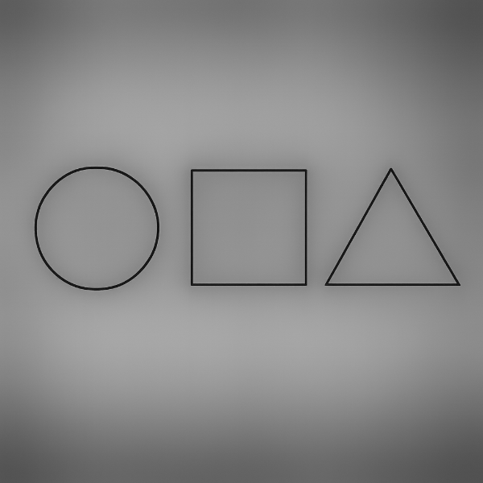
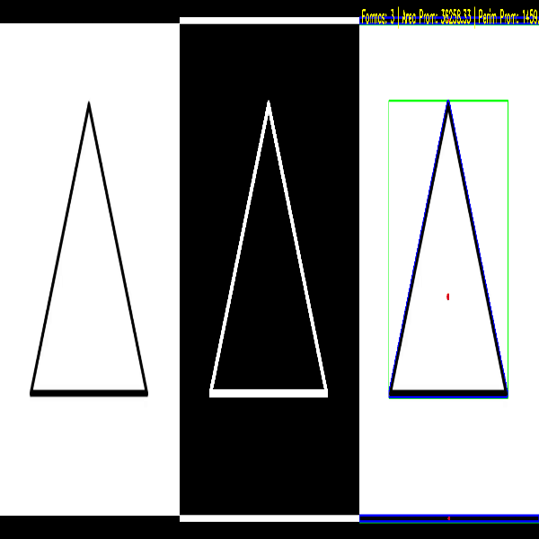

# 🧪 Taller - Segmentando el Mundo: Binarización y Reconocimiento de Formas

## 📅 Fecha
`2025-04-29` – Fecha de realización

---

## 🎯 Objetivo del Taller

Aplicar técnicas básicas de segmentación en imágenes mediante umbralización y detección de formas simples. El objetivo es comprender cómo identificar regiones de interés en imágenes mediante procesos de binarización y análisis morfológico.

---

## 🧠 Conceptos Aprendidos

Lista los principales conceptos aplicados:

- [x] Segmentación de imágenes
- [x] Detección de contornos
- [x] Análisis morfológico (área, perímetro, centro de masa)
- [x] Otro: Binarización adaptativa y bounding boxes

---

## 🔧 Herramientas y Entornos

- Python (Jupyter Notebook en Google Colab)
- Librerías: `opencv-python`, `numpy`, `matplotlib`, `imageio`

---

## 📁 Estructura del Proyecto

```
2025-04-29_taller_segmentacion_formas/
├── python/               
│   └── segmentacion_formas.ipynb
├── datos/
│   └── video.mp4
│   └── formas.png
├── resultados/ 
│   └── segmentation_figures_results.gif      
├── README.md
```

---

## 🧪 Implementación

### 🔹 Etapas realizadas

1. Carga y preprocesamiento de imágenes o cuadros de video: Conversión a escala de grises si la imagen no está en este formato.
2. Aplicación de umbralización:

    * Umbral fijo inverso.
    * Umbral adaptativo con dilatación para engrosar los contornos.

3. Detección de contornos y cálculo de métricas:
    * Identificación de contornos mediante la función cv2.findContours.
    * Cálculo de área, perímetro, centro de masa y bounding boxes para cada contorno.

4. Cálculo de métricas globales:

    * Número de formas detectadas.
    * Cálculo del área promedio y perímetro promedio de las formas detectadas.

5. Generación de un GIF animado con los cuadros procesados, mostrando:

    * Imagen original.
    * Imagen umbralizada (umbral fijo y adaptativo).
    * Imagen con contornos y métricas visualizadas.

6. Visualización de resultados en un gráfico utilizando matplotlib, con las imágenes combinadas y anotaciones gráficas.

### 🔹 Código relevante

```python
# Función para cargar y preprocesar una imagen o cuadro de video
def preprocesar_cuadro(imagen):
    # Convertir a escala de grises si no lo está
    if len(imagen.shape) == 3:
        imagen = cv2.cvtColor(imagen, cv2.COLOR_BGR2GRAY)
    return imagen

# Función para aplicar umbralización (fijo y adaptativo)
def aplicar_umbralizacion(imagen):
    _, umbral_fijo = cv2.threshold(imagen, 127, 255, cv2.THRESH_BINARY_INV)
    umbral_adaptativo = cv2.adaptiveThreshold(imagen, 255, cv2.ADAPTIVE_THRESH_GAUSSIAN_C, 
                                              cv2.THRESH_BINARY_INV, 21, 5)
    kernel = np.ones((3, 3), np.uint8)
    umbral_adaptativo = cv2.dilate(umbral_adaptativo, kernel, iterations=1)
    return umbral_fijo, umbral_adaptativo

# Función para detectar contornos y calcular métricas
def detectar_contornos(imagen_binaria, imagen_original):
    contornos, _ = cv2.findContours(imagen_binaria, cv2.RETR_EXTERNAL, cv2.CHAIN_APPROX_SIMPLE)
    if len(imagen_original.shape) == 2:
        imagen_color = cv2.cvtColor(imagen_original, cv2.COLOR_GRAY2BGR)
    else:
        imagen_color = imagen_original.copy()

    areas = []
    perimetros = []

    for contorno in contornos:
        area = cv2.contourArea(contorno)
        perimetro = cv2.arcLength(contorno, True)
        areas.append(area)
        perimetros.append(perimetro)
        
        momentos = cv2.moments(contorno)
        if momentos['m00'] != 0:
            cx = int(momentos['m10'] / momentos['m00'])
            cy = int(momentos['m01'] / momentos['m00'])
            cv2.circle(imagen_color, (cx, cy), 5, (0, 0, 255), -1)
        
        x, y, w, h = cv2.boundingRect(contorno)
        cv2.rectangle(imagen_color, (x, y), (x+w, y+h), (0, 255, 0), 2)
        cv2.drawContours(imagen_color, [contorno], -1, (255, 0, 0), 2)

    num_formas = len(contornos)
    area_promedio = np.mean(areas) if areas else 0
    perimetro_promedio = np.mean(perimetros) if perimetros else 0

    return imagen_color, num_formas, area_promedio, perimetro_promedio

# Función para generar el GIF animado
def generar_gif(imagen_original, umbral_adaptativo, imagen_contornos, nombre_salida="segmentation_results.gif"):
    imagenes = []
    img_orig_rgb = cv2.cvtColor(imagen_original, cv2.COLOR_BGR2RGB)
    img_orig_resized = cv2.resize(img_orig_rgb, (600, 600))
    imagenes.append(img_orig_resized)

    umbral_rgb = cv2.cvtColor(umbral_adaptativo, cv2.COLOR_GRAY2RGB)
    umbral_resized = cv2.resize(umbral_rgb, (600, 600))
    imagenes.append(umbral_resized)

    contornos_rgb = cv2.cvtColor(imagen_contornos, cv2.COLOR_BGR2RGB)
    contornos_resized = cv2.resize(contornos_rgb, (600, 600))
    imagenes.append(contornos_resized)

    imageio.mimsave(nombre_salida, imagenes, duration=1000, loop=0)
    print(f"GIF generado: {nombre_salida}")

# Función para procesar video o imagen estática
def procesar_secuencia(fuente, nombre_gif="segmentation_resultado_video.gif"):
    cap = cv2.VideoCapture(fuente)
    if not cap.isOpened():
        raise ValueError("No se pudo abrir el video.")

    max_cuadros = 50
    cuadro_actual = 0
    imagenes_gif = []

    while cuadro_actual < max_cuadros:
        ret, cuadro = cap.read()
        if not ret:
            break

        cuadro_gris = preprocesar_cuadro(cuadro)
        umbral_fijo, umbral_adaptativo = aplicar_umbralizacion(cuadro_gris)
        cuadro_contornos, num_formas, area_promedio, perimetro_promedio = detectar_contornos(umbral_adaptativo, cuadro)

        texto = f"Formas: {num_formas} | Area Prom: {area_promedio:.2f} | Perim Prom: {perimetro_promedio:.2f}"
        cv2.putText(cuadro_contornos, texto, (10, 30), cv2.FONT_HERSHEY_SIMPLEX, 0.8, (0, 255, 255), 2)

        imagen_original_rgb = cv2.cvtColor(cuadro, cv2.COLOR_BGR2RGB)
        imagen_umbralizada = cv2.cvtColor(umbral_adaptativo, cv2.COLOR_GRAY2RGB)
        imagen_contornos_rgb = cv2.cvtColor(cuadro_contornos, cv2.COLOR_BGR2RGB)

        imagen_combinada = np.hstack((imagen_original_rgb, imagen_umbralizada, imagen_contornos_rgb))
        imagen_combinada_resized = cv2.resize(imagen_combinada, (600, 600))

        imagenes_gif.append(imagen_combinada_resized)
        time.sleep(0.5)
        cuadro_actual += 1

    cap.release()
    imageio.mimsave(nombre_gif, imagenes_gif, duration=1, loop=0)
    print(f"GIF generado: {nombre_gif}")

# Función principal para manejar el modo de procesamiento
def main(modo="imagen", fuente="../datos/formas.png"):
    if modo == "imagen":
        procesar_imagen_estatica(fuente)
    elif modo == "video":
        procesar_secuencia(fuente)
    else:
        raise ValueError("Modo no válido. Usa 'imagen' o 'video'.")

```

---

## 📊 Resultados Visuales

### 📌 Este taller **requiere explícitamente un GIF animado**:

#### Análisis de imagen



También se generaron métricas:

- Número de formas detectadas: 3
- Área promedio: 51507.67 píxeles
- Perímetro promedio: 928.29 píxeles

#### Análisis de video



---

## 🧩 Prompts Usados

```text
1. "Estoy trabajando en Google Colab con opencv-python, numpy y matplotlib. ¿Puedes guiarme para segmentar una imagen en escala de grises usando umbral fijo y adaptativo?"
2. "Genera un código en Python que, dada una imagen binarizada, detecte contornos con cv2.findContours y dibuje los contornos y centros de masa sobre la imagen."
3. "Agrega al código anterior la función de calcular el área y perímetro promedio de las figuras detectadas, e imprímelo en consola."
4. "Me puedes explicar de manera sencilla, ¿Cómo puedo visualizar bounding boxes y centros de masa sobre las formas detectadas con OpenCV?"
```

---

## 💬 Reflexión Final

Este taller me permitió reforzar los fundamentos de procesamiento de imágenes, entendiendo cómo a partir de imágenes en escala de grises y técnicas de binarización es posible detectar regiones de interés. La comparación entre umbral fijo y adaptativo me mostró cómo se puede ajustar el análisis a condiciones locales de iluminación.

La parte más interesante fue identificar contornos y calcular sus propiedades como centro de masa, área y perímetro. Aprendí que con unas pocas funciones de OpenCV se pueden obtener métricas significativas para tareas como reconocimiento de formas. En futuros proyectos, me gustaría aplicar este tipo de segmentación como paso previo al entrenamiento de modelos de visión por computador.

---

## ✅ Checklist de Entrega

- [x] Carpeta `2025-04-29_taller_segmentacion_formas`
- [x] Código limpio y funcional (`segmentacion_formas.ipynb`)
- [x] GIF incluido con nombre descriptivo (`segmentation_results.gif`)
- [x] Visualizaciones y métricas exportadas
- [x] README completo y claro
- [x] Commits descriptivos en inglés

---
