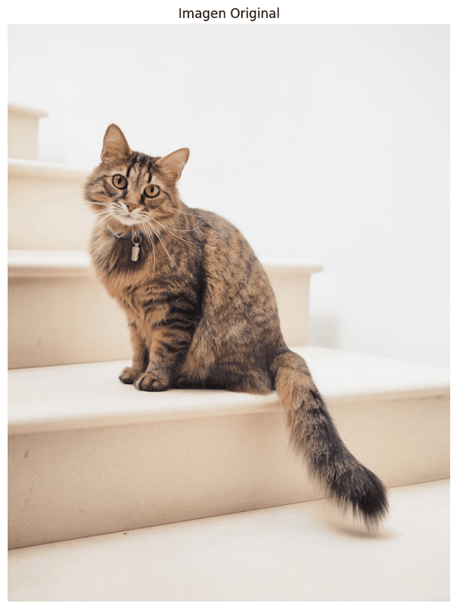
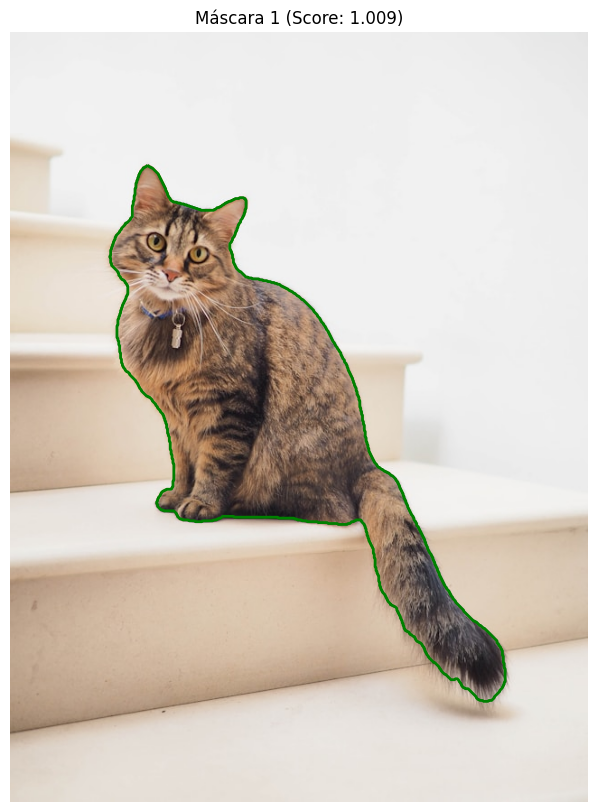
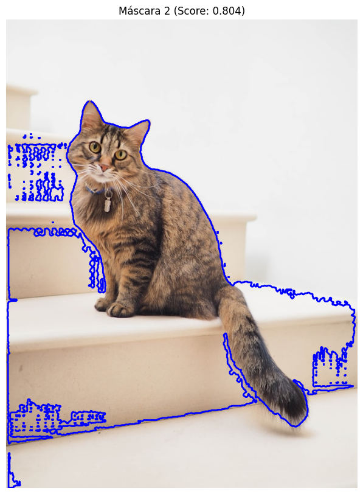

# 🧪 Taller - Segmentación Semántica Multimodal: Qué hay en la Imagen

## 📅 Fecha
`2025-04-30` – Fecha de realización

---

## 🎯 Objetivo del Taller

Aplicar segmentación semántica utilizando modelos avanzados (SAM, DeepLab) para identificar y extraer regiones específicas (personas, árboles, vehículos, etc.) dentro de imágenes.

Obtener las máscaras de estas regiones para su posterior análisis, recorte o visualización.

---

## 🧠 Conceptos Aprendidos

Lista los principales conceptos aplicados:

- [x] Segmentación de imágenes
- [x] Modelos de Segmentación (SAM)
- [x] Obtención y uso de máscaras
- [x] Análisis y visualización de resultados de segmentación

---

## 🔧 Herramientas y Entornos

Especifica los entornos usados:

- [x] Python (Google Colab o local)
  - Librerías clave: `opencv-python`, `torch`, `numpy`, `matplotlib`, `Pillow`, `segment-anything`, `supervision`, `transformers`, `huggingface_hub`
- [x] Jupyter / Google Colab


---

## 📁 Estructura del Proyecto

```
2025-04-30_taller_segmentacion_semantica_sam_deeplab/
├── ColabNotebooks/               
│   └── sam_segmentation.ipynb
│   └── sam_vit_h_4b8939.pth
├── imagenes_entrada/
│   └── imagen.jpg
├── mascaras_salida/               
│   └── mask_0.png
│   └── mask_1.png
│   └── mask_2.png
├── resultados/               
│   └── imagen_original.png
│   └── mask_colored_0.png
│   └── mask_colored_1.png
│   └── mask_colored_2.png
│   └── segmentation_process.gif
├── README.md
```

---

## 📖 Descripción del Modelo Usado: SAM (Segment Anything Model)

SAM, desarrollado por Meta AI, es un modelo de segmentación de imágenes de vanguardia diseñado para ser un "modelo fundacional" en este campo. Su principal característica es su capacidad para segmentar cualquier objeto en una imagen, incluso aquellos que no ha visto durante su entrenamiento.

A diferencia de modelos de segmentación tradicionales que están entrenados para reconocer un conjunto fijo de categorías (como "persona", "coche", "árbol"), SAM puede generar máscaras de segmentación de alta calidad para objetos basándose en diferentes tipos de "prompts" o indicaciones, como un simple clic en el objeto, un recuadro que lo delimite, o incluso texto (aunque la implementación en el notebook se basa en puntos o cajas). Esto lo hace increíblemente flexible y útil para identificar y extraer regiones arbitrarias en una imagen.

En resumen, SAM nos permite obtener máscaras precisas de los elementos que nos interesan en una imagen de forma muy efectiva.

---

## 🧪 Implementación

Antes de explicar la implementación, es importante recalcar que el desarrollo se realizó en Colab y el notebook del repositorio es meramente ilustrativo. Para ejecutar el proyecto, consultar el notebook en: [sam_segmentation.ipynb](https://colab.research.google.com/drive/1R_N0eKghF6xmVljKvBXjIdLsyHWx8fn8?usp=sharing)

El proceso llevado a cabo para la segmentación semántica de imágenes fue el siguiente:

### 🔹 Etapas realizadas

Describe brevemente cada fase del proceso:

1.  **Preparación de la imagen:** Carga de la imagen de entrada y su preprocesamiento necesario según el modelo a utilizar (ajuste de tamaño, normalización de valores de píxeles, etc.). Para SAM, esto incluye "setear" la imagen en el predictor.
2.  **Aplicación del modelo de segmentación:** Pasar la imagen preprocesada a través del modelo de IA elegido (SAM o DeepLab) para generar las predicciones de segmentación a nivel de píxel.
3.  **Extracción de máscaras:** Procesar la salida del modelo para obtener las máscaras binarias o segmentadas que corresponden a las regiones de interés identificadas (personas, objetos, etc.).
4.  **Visualización de resultados:** Mostrar la imagen original junto con las máscaras generadas o la imagen segmentada para verificar los resultados.
5.  **Guardado de resultados:** Almacenar las máscaras generadas y/o las visualizaciones finales para su uso posterior.

### 🔹 Código relevante

Incluye un fragmento que resuma el corazón del taller, mostrando cómo se obtiene la predicción principal del modelo:

```python
# Aplicar el modelo a la imagen preprocesada y obtener la predicción
# (Este ejemplo es específico para la salida típica de DeepLab)
output = model(input_tensor)['out'] # Obtiene el diccionario de salida y selecciona la clave 'out' con las predicciones logit
prediction = output.argmax(1).squeeze().cpu().numpy() # Encuentra la clase con mayor puntuación para cada píxel, elimina dimensiones extra y convierte a array de NumPy en CPU
```

---

## 📊 Resultados Visuales

### 📌 Este taller **requiere explícitamente un GIF animado** y las mascaras obtenidas:

## Secuencia del proceso de segmentación



## Imagen original


Es un gato muy bonito porque, ¿Quién no ama los gatos? 🐈

## Máscara 0


* Segmenta parcialmente al gato, especialmente el torso.

* **Problemas:** la textura del fondo (escaleras) interfiere y provoca pérdida de detalle, dejando áreas internas sin segmentar (agujeros).

* **Probable entrada:** un punto cerca del cuerpo, pero sin ayudar a delimitar con claridad.

## Máscara 1



* Segmentación más precisa del gato completo, incluyendo cabeza, cuerpo y cola.

* Contorno limpio, sin mucha fuga hacia las escaleras.

* Esta es claramente la más útil de las tres para propósitos de segmentación del objeto principal.

*  **Probable entrada:** punto centrado en el cuerpo o múltiples entradas (punto + caja).

## Máscara 2



* Incluye al gato y parte del fondo (escalones).

* Tiene fugas significativas en la base, capturando sombras o estructuras del entorno.

* Es útil si quieres una máscara más "contextual", pero no sirve para aislar solo al gato.

---

## 🧩 Prompts Usados

En este caso solo se solicito un código para la visualización de las máscaras obtenidas y que nos permitiera guardarlas como imagenes binarizadas.

```text
1. "Estoy usando SAM en Python. Genera un código que me permita visualizar los resultados de Segment Anything con colores distintos y guardar las máscaras como imagenes binarizadas"
```
---

## 💬 Reflexión Final

Este taller me permitió explorar el uso de modelos avanzados de segmentación semántica como Segment Anything Model (SAM) de Meta AI. A diferencia de técnicas tradicionales, SAM permite segmentar regiones específicas de una imagen con solo seleccionar un punto o una caja, lo cual resulta muy útil en entornos interactivos o donde se requiere precisión.

Aprendí a instalar el modelo, cargar imágenes, generar máscaras y visualizarlas correctamente. Me pareció interesante cómo SAM generaliza bien incluso en imágenes nuevas sin necesidad de reentrenamiento. Además, comprender cómo se representan las máscaras y cómo exportarlas para su análisis posterior me ayudó a conectar esta técnica con aplicaciones reales de visión por computador.

En general, este taller me mostró cómo el estado del arte en segmentación ya está disponible para ser usado directamente en proyectos personales o profesionales, y me motiva a seguir explorando otras técnicas basadas en IA multimodal.

---

## ✅ Checklist de Entrega


 - [x] Carpeta `2025-04-30_taller_segmentacion_semantica_sam_deeplab`
 - [x] Código funcional en Colab o Jupyter Notebook (.ipynb)
 - [x] Imagen original utilizada (imagenes_entrada/)
 - [x] Máscaras generadas en formato binario (mascaras_salida/)
 - [x] Visualización de resultados con anotaciones (resultados/)
 - [x] GIF animado que muestre el proceso de segmentación
 - [x] README completo con secciones: objetivo, actividades, prompts, reflexión, evidencias
 - [x] Commits realizados con mensajes descriptivos en inglés

---