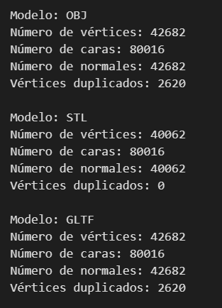
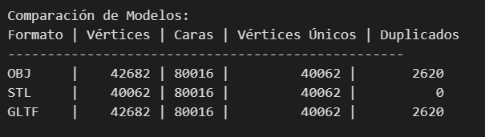
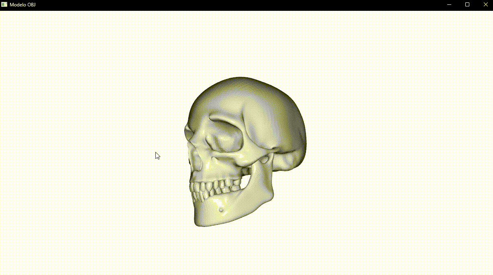
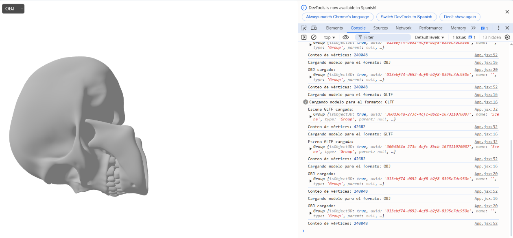
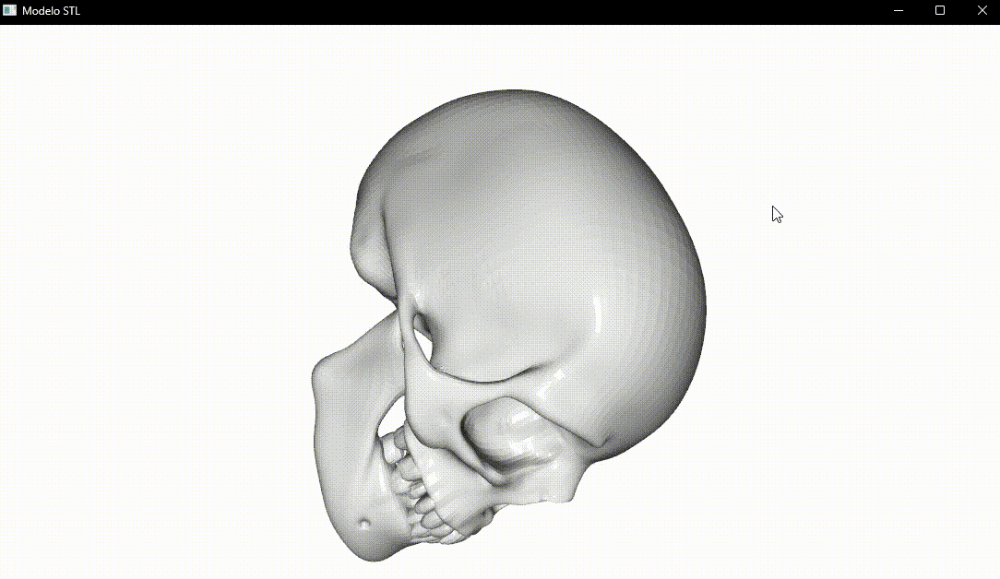
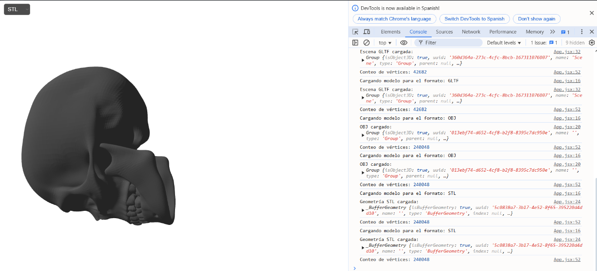
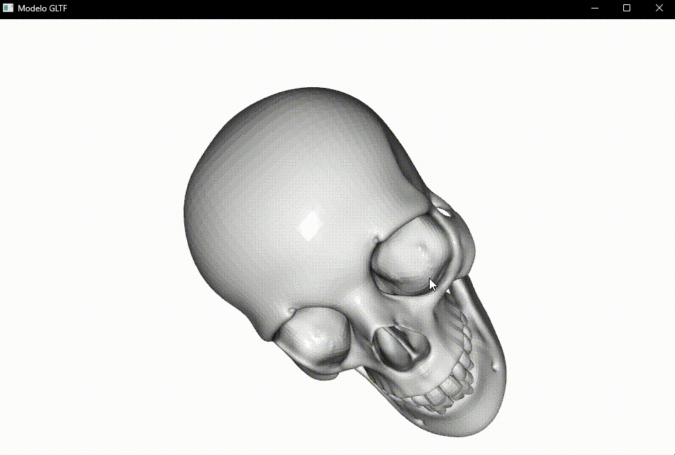
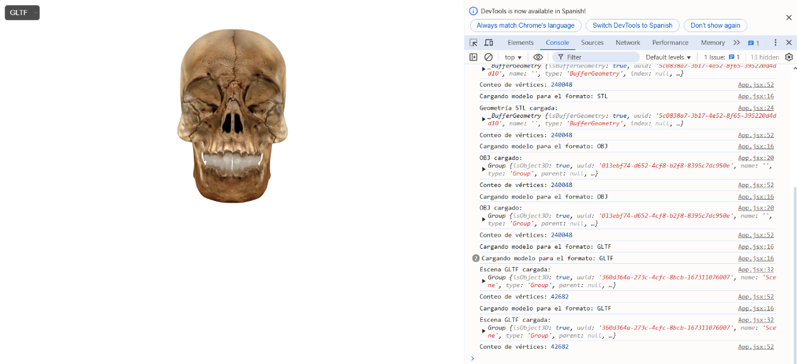

# 🧪 Taller - Importando el Mundo: Visualización y Conversión de Formatos 3D

## 📅 Fecha
`2025-05-01` – Fecha de entrega o realización

---

## 🎯 Objetivo del Taller

Comparar y convertir entre distintos formatos de modelos 3D: .OBJ, .STL y .GLTF, y visualizar sus diferencias en geometría y materiales. El objetivo es entender la estructura interna de los archivos 3D, su compatibilidad entre entornos, y cómo se interpretan en distintas plataformas de visualización.

---

## 🧠 Conceptos Aprendidos

Los principales conceptos aplicados fueron:

- [x] Trabajo con diferentes formatos de modelos 3D (OBJ, STL, GLTF)
- [x] Características y limitaciones de formatos 3D (ej: texturas en STL, jerarquía en GLTF)
- [x] Conversión de modelos entre formatos
- [x] Uso de herramientas de conversión 3D (ej: Blender, librerias de Python)
- [x] Integración de modelos 3D en entornos web (Three.js con React Three Fiber)

---

## 🔧 Herramientas y Entornos

Los entornos usados para la elaboración de la práctica fueron los siguientes:

- [x] 💻 **Python** (Colab o Jupyter Notebook)
  - Herramientas: `trimesh`, `open3d`, `assimp`, `numpy`
- [x] 🌐 **Three.js con React Three Fiber**


---

## 📁 Estructura del Proyecto

```
2025-05-01_taller_conversion_formatos_3d/
├── python/
├── threejs/
├── resultados/
└── README.md
```

---

## 🧪 Implementación

El proceso de este taller para la visualización y conversión de formatos 3D se divide en las siguientes etapas, abarcando tanto un entorno Python como uno basado en Three.js con React:
### 🔹 Etapas realizadas
1. Preparación de datos o escena: En esta etapa se cargan los modelos 3D en diferentes formatos (.OBJ, .STL, .GLTF) utilizando librerías como trimesh o open3d en Python, y cargadores específicos (OBJLoader, STLLoader, useGLTF) en Three.js. Además, se prepara el entorno de visualización.
2. Aplicación de modelo o algoritmo: Se aplican algoritmos para analizar las propiedades de los modelos, como el número de vértices, caras y normales. También se realizan conversiones entre los distintos formatos 3D. En el entorno web, se configura la escena 3D y los controles de interacción.
3. Visualización o interacción: Se visualizan los modelos cargados y, en el caso del entorno web, se permite la interacción con ellos mediante controles orbitales y la selección del formato a visualizar. Esto ayuda a observar las diferencias visuales entre los formatos.
4. Guardado de resultados: Aunque no se explicita un guardado de resultados intermedios en el mismo código, se documenta el proceso, las comparaciones y las visualizaciones en un archivo README, incluyendo GIFs animados y el código relevante.

### 🔹 Código relevante

Incluye un fragmento que resuma el corazón del taller:

#### Python

```python
import trimesh
import numpy as np

# Assuming 'path_to_your_model.obj' is the file path
model_path = "path_to_your_model.obj" # Replace with actual path

try:
    # Load the model
    model = trimesh.load(model_path, force='mesh')

    # Get basic properties
    vertices = model.vertices
    faces = model.faces

    num_vertices = len(vertices)
    num_faces = len(faces)
    unique_vertices = len(np.unique(vertices, axis=0))
    num_duplicates = num_vertices - unique_vertices

    print(f"Modelo cargado: {model_path}")
    print(f"Número de vértices: {num_vertices}")
    print(f"Número de caras: {num_faces}")
    print(f"Vértices únicos: {unique_vertices}")
    print(f"Vértices duplicados: {num_duplicates}")

    # Note: For conversion:
    # model.export("output_model.stl")
    # model.export("output_model.glb")

except Exception as e:
    print(f"Error al cargar el modelo: {e}")
```

#### Three.js

```javascript
import { useLoader } from '@react-three/fiber';
import { OrbitControls, useGLTF } from '@react-three/drei';
import { OBJLoader } from 'three/examples/jsm/loaders/OBJLoader';
import { STLLoader } from 'three/examples/jsm/loaders/STLLoader';
import { MeshStandardMaterial } from 'three'; // Import MeshStandardMaterial

function Model({ format }) {
  let model;
  const modelPaths = {
    OBJ: '/models/12140_Skull_v3_L2.obj',
    STL: '/public/models/skull.stl',
    GLTF: '/public/models/skull.glb',
  };

  // Conditional loading based on format
  if (format === 'OBJ') {
    const obj = useLoader(OBJLoader, modelPaths.OBJ);
    model = <primitive object={obj} />;
  } else if (format === 'STL') {
    const geometry = useLoader(STLLoader, modelPaths.STL);
    model = (
      <mesh geometry={geometry}>
        <meshStandardMaterial color="gray" /> {/* Apply default material */}
      </mesh>
    );
  } else if (format === 'GLTF') {
    const { scene } = useGLTF(modelPaths.GLTF);
    model = <primitive object={scene} dispose={null} />;
  }

  return (
    <group position={[0, 0, 0]} scale={[1, 1, 1]}>
      {model}
    </group>
  );
}

function App() {
  const [format, setFormat] = useState('OBJ'); // State to control format
  return (
    <Canvas camera={{ position: [0, 0, 5] }}>
      <ambientLight intensity={0.5} />
      <directionalLight position={[5, 5, 5]} intensity={1} />
      <Model format={format} /> // Pass the selected format
      <OrbitControls />
    </Canvas>
  );
}
```

---

## 📊 Resultados Visuales

### 📌 Este taller **requiere explícitamente un GIF animado**:

#### Métricas (Python)



#### Comparación modelos Python



#### Visualización de los modelos

##### OBJ





##### STL





##### GLTF




---

## 🧩 Prompts Usados

Enumera los prompts utilizados:

```text
"Crea un código en python que permita cargar modelos y extraer sus propiedades utilizando trimesh"
```
```text
"Escribe una función de jsx que permita cargar modelos en 3d en formato obj, stl, y gltf"
```
```text
"Muestrame alternativas para visualizar y compara modelos en formato obj, stl y gtlf diferentes al uso de la librería open3d en Python"
```

---

## 💬 Reflexión Final

Reflexión Final del Taller
Este taller permitió profundizar en la comprensión práctica de los formatos de modelos 3D más comunes, .OBJ, .STL y .GLTF. Se reforzó el conocimiento sobre sus estructuras internas, evidenciando cómo la información geométrica, y opcionalmente los materiales y texturas, se almacenan de manera diferente en cada uno. La experiencia de cargar, analizar y visualizar estos modelos tanto en un entorno de scripting con Python como en una aplicación web interactiva con Three.js y React fue clave para consolidar este aprendizaje.

La parte más interesante fue, sin duda, observar directamente las diferencias visuales al renderizar el mismo modelo en distintos formatos en el entorno web, y contrastar esto con el análisis numérico de propiedades como el conteo de vértices y caras realizado en Python. La complejidad radicó quizás en la configuración inicial del entorno web con React Three Fiber y en entender las particularidades de cada cargador de Three.js para manejar correctamente la geometría y los materiales de cada formato.

Para futuros proyectos, aplicaría este conocimiento fundamental en el desarrollo de herramientas de visualización o pipelines de procesamiento de modelos 3D. Se podría mejorar el taller explorando la conversión con materiales y texturas, o incluyendo formatos con características más avanzadas como animaciones (.GLTF con esqueletos). La capacidad de manejar y convertir eficientemente estos formatos es esencial en campos como la visualización web, la realidad aumentada/virtual y la impresión 3D.


---

## ✅ Checklist de Entrega

- [x] Carpeta `YYYY-MM-DD_nombre_taller`
- [x] Código limpio y funcional
- [x] GIF incluido con nombre descriptivo
- [x] Visualizaciones o métricas exportadas
- [x] README completo y claro
- [x] Commits descriptivos en inglés

---