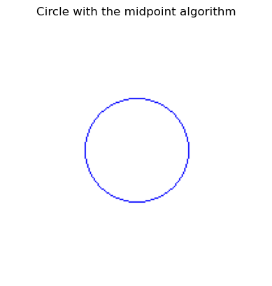
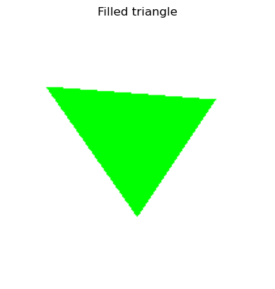
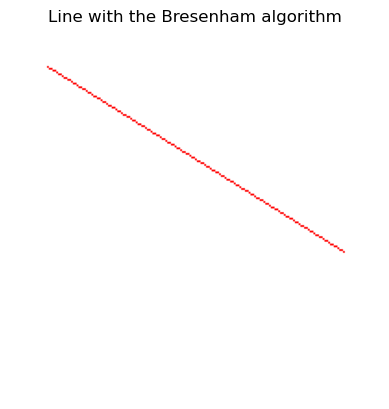

# 🧪 Workshop - Rasterization from Zero: Drawing with Classical Algorithms

## 📅 Date
`2025-05-02` - Date of completion

---

## 🎯 Workshop Objective

Understand and put into practice the fundamental algorithms used to draw lines, circles, and triangles on the screen, comprehending the detailed process of how each image is formed pixel by pixel. The goal is to gain deep knowledge of creating basic shapes in computer graphics without relying on advanced tools or libraries.

---

## 🧠 Concepts Learned

The main concepts applied in this workshop were:

- [x] Bresenham’s algorithm  
- [x] Midpoint algorithm  
- [x] Simple scanline rasterization  
- [x] Use of libraries such as PIL and matplotlib to generate and display images  
- [ ] Direct pixel manipulation  
- [ ] Use of coordinates and geometric structures

## 📖 Brief Description of Implemented Algorithms

### Bresenham’s Algorithm

Bresenham’s algorithm is an efficient method for rasterizing lines on a discrete plane (like a pixel screen). It determines the optimal pixels to approximate a straight line between two given points using only integer calculations. The algorithm iterates along one dimension and at each step decides which neighboring pixel is closest to the ideal line path, based on accumulated error tracking. Its efficiency lies in avoiding floating-point operations by using additions and subtractions.


### Midpoint Algorithm

The midpoint algorithm is a clever way to draw circles on a computer. Instead of calculating every pixel, it only computes a small section of the circle and then 'reflects' it to draw the rest. It uses a 'midpoint' to decide whether to move downward or stay on the same row while drawing, and thus creates a nearly perfect circle more efficiently.


### Simple Scanline Rasterization

Scanline rasterization fills a triangle by processing the image line by line (scanlines). For each scanline, intersections with the triangle’s edges are determined and the pixels between them are painted.


## 🔧 Tools and Environment

For this workshop, only the following was used:

- Google Colab with libraries such as: `matplotlib` and `Image`.

---

## 📁 Project Structure

```
2025-05-02_taller_algoritmos_rasterizacion_basica
├── python/
│   └── rasterizacion_algoritmos.ipynb
├── resultados/
│   ├── linea.png
│   ├── circulo.png
│   ├── triangulo.png
│   ├── resultado_final.png
│   ├── rasterizacion_algoritmos.png
├── README.md
```

---

## 🧪 Implementation

The implementation process was fully guided, and clearly defined as follows:

### 🔹 Steps Taken
1. Prepare the drawing environment  
2. Implement Bresenham’s algorithm and draw a straight line  
3. Implement the midpoint algorithm and draw a circle  
4. Implement scanline rasterization and draw a filled triangle  
5. Display final results

### 🔹 Key Code

```python
# Apply all rasterization methods to the same image
bresenham(20, 20, 180, 120)
midpoint_circle(100, 100, 40)
fill_triangle((30, 50), (100, 150), (160, 60))
plt.imshow(image)
plt.axis('off')
plt.show()
```

There is also important to overview the algorithms implementations:

```python
# Bresenham’s Line Drawing Algorithm
# Draws a straight line using only integer operations for efficiency
# Parameters: starting point (x0, y0), ending point (x1, y1)
def bresenham(x0, y0, x1, y1):
    dx = abs(x1 - x0)
    dy = abs(y1 - y0)
    sx = 1 if x0 < x1 else -1
    sy = 1 if y0 < y1 else -1
    err = dx - dy

    while True:
        pixels[x0, y0] = (255, 0, 0)
        if x0 == x1 and y0 == y1:
            break
        e2 = 2 * err
        if e2 > -dy:
            err -= dy
            x0 += sx
        if e2 < dx:
            err += dx
            y0 += sy
```

```python
# Midpoint Circle Algorithm
# Efficiently plots a circle by exploiting 8-way symmetry
# Parameters: center of circle (x0, y0), radius
def midpoint_circle(x0, y0, radius):
    x = radius
    y = 0
    p = 1 - radius

    while x >= y:
        for dx, dy in [(x, y), (y, x), (-x, y), (-y, x), (-x, -y), (-y, -x), (x, -y), (y, -x)]:
            if 0 <= x0 + dx < width and 0 <= y0 + dy < height:
                pixels[x0 + dx, y0 + dy] = (0, 0, 255)
        y += 1
        if p <= 0:
            p = p + 2*y + 1
        else:
            x -= 1
            p = p + 2*y - 2*x + 1
```

```python
# Scanline Triangle Rasterization
# Fills a triangle by interpolating edges and coloring horizontal spans
# Parameters: three triangle vertices p1, p2, p3
def fill_triangle(p1, p2, p3):
    # sort by y
    pts = sorted([p1, p2, p3], key=lambda p: p[1])
    (x1, y1), (x2, y2), (x3, y3) = pts

    def interpolate(y0, y1, x0, x1):
        if y1 - y0 == 0: return []
        return [int(x0 + (x1 - x0) * (y - y0) / (y1 - y0)) for y in range(y0, y1)]

    x12 = interpolate(y1, y2, x1, x2)
    x23 = interpolate(y2, y3, x2, x3)
    x13 = interpolate(y1, y3, x1, x3)

    x_left = x12 + x23
    for y, xl, xr in zip(range(y1, y3), x13, x_left):
        for x in range(min(xl, xr), max(xl, xr)):
            if 0 <= x < width and 0 <= y < height:
                pixels[x, y] = (0, 255, 0)
```
---

## 📊 Visual Results

- Straight line  


- Circle  



- Triangle filled by simple scanline rasterization  



- Final result  



---

## 🧩 Prompts Used

```text
"I'm using the Colab environment. Generate a .gitignore file for this tool"
```

```text
"Explain in simple terms what Bresenham's algorithm is and how it draws a line."
```

```text
"Create a Python (Colab) script that clears an image modified using the PIL library."
```

```text
"Explain in simple terms what the midpoint algorithm is and how it draws a circle."
```

```text
"Explain in simple terms what scanline rasterization is and how it fills a triangle."
```

```text
"Among the three methods you explained: Bresenham, midpoint, and scanline rasterization, what are the general differences? What differences exist in terms of precision and speed?"
```

---

## 💬 Final Reflection

In this workshop, we explored and reinforced key concepts in computer graphics, particularly focusing on Bresenham’s algorithm, the midpoint algorithm, and scanline rasterization. These techniques enabled us to draw lines, circles, and fill shapes efficiently, helping us understand how rasterization works at a lower level. Additionally, we strengthened our skills with Python libraries such as matplotlib and PIL, which we had only used a few times before. The most complex and interesting aspect of the workshop was understanding the internal workings of each algorithm. While we were able to implement them and observe correct results, we wouldn’t say we fully understood every detail of the code behind them—especially in the case of Bresenham’s algorithm, which involves careful handling of discrete coordinates. Finally, we analyzed the differences between the methods in terms of speed and precision. Each technique has its strengths depending on the context in which it's used, as summarized in the following table:


- What are the differences between the methods? Which ones are faster or more precise?

| Method                  | Purpose                              | Precision                       | Speed / Efficiency               | Key Notes                                            |
| :---------------------- | :----------------------------------- | :------------------------------ | :------------------------------- | :-------------------------------------------------- |
| Bresenham               | Draw straight lines                  | Very precise (only integers)    | Very fast (only add/subtract)   | Ideal for thin, straight lines                      |
| Midpoint                | Draw circles (also ellipses)         | Very good                       | Very fast                        | Uses symmetry and avoids costly operations          |
| Scanline Rasterization | Fill triangles or polygons           | High (dependent on edges)       | Fast but more complex            | Fills whole shapes, not just edges                  |

---

## ✅ Delivery Checklist

- [x] Folder `2025-05-02_taller_algoritmos_rasterizacion_basica`  
- [x] Working implementation of line, circle, and triangle  
- [x] Clear visualization of results  
- [x] Well-organized and commented code  
- [x] README with explanations and screenshots  
- [x] Complete and clear README  
- [x] Descriptive commits in English