# 🧪 Taller - Escenas Paramétricas: Creación de Objetos desde Datos

## 📅 Fecha
`2025-05-08`

## 🎯 Objetivo del Taller
Busca generar escenas con objetos en 3D a partir de listas de coordenadas o datos, permitiendo crear geometría en tiempo real, estructuras condicionales y exportar las escenas generadas

## 🧠 Conceptos Aprendidos

Lista los principales conceptos aplicados:

- [x] Importación de coordenadas desde archivos externos
- [x] Creación de objetos 3D a partir de coordenadas específicadas
- [x] Aplicación de transformaciones a los objetos creados
- [x] Enlazamiento de las transformaciones con la interacción del usuario o el progreso en el tiempo
- [x] Exportación de objetos 3D y escenas en diferentes tipos de archivos 

## 🔧 Herramientas y Entornos

Especifica los entornos usados:

- Python (`vedo`, `trimesh`, `open3d`, `pandas`, `numpy`, `imageio`, `oo`)
- Unity (versión LTS, XR Toolkit, Shader Graph)
- Three.js / React Three Fiber
- Jupyter / Google Colab

## 📁 Estructura del Proyecto

```
2025-05-08_taller_escenas_parametricas/
├── python/
├── unity/
├── threejs/            
├── datos/                 
├── resultados/            
├── README.md
```

## 🧪 Implementación

Explica el proceso:

### 🔹 Etapas realizadas
1. Preparación e importación de coordenadas y puntos: Para todos los proyectos podemos ver que la primera etapa consiste en definir o tomar las coordenadas que van a determinar la posición inicial de los objetos que se crearán en la escena.
    1.1 Python: Se hace a través de una función llamada "load_points" que define tres opciones para los datos, la primera es tomar las coordenadas desde una archivo csv, la segunda es tomarlos desde un archivo json, o la tercera es tomar un arreglo predefinido en el código. Esto se logra a partir de filepath y los datos se guardan en un arreglo con ayuda de numpy.
    1.2 Threejs: Los datos aquí no se toman de archivos externos sino que se definen dentro del código de forma estática los centros de cada una de las cajas a partir del arreglo "data", y las dimensiones están dadas por los valores por defecto que se le dan a los sliders y botones que se crean en la escena.
    1.3 Unity: Se hace a través de la función "cargar desde JSON" que permite leer un archivo json dentro de la carpeta assets, y tomar sus valores para ser pasados a la función que se encarga de crear la escena.
2. Creación de la escena: Hace referencia al proceso de tomar los datos preparados anteriormente y crear cada uno de los objetos que van a ir en las escenas.
    1.1 Python: Se hace a través de la función create objects from points, que hace uso de los métodos de la librería vedo, a través de estos definimos esferas, cubos y cilindros (el tipo de figura está dado según la posición de la tupla de coordenadas en la lista de datos), y a cada una se le pasa una tupla con las coordenadas del centro y se definen los datos para la longitud del lado del cubo, el radio de la esfera, el radio y altura del cilindro. Además, se agregan estas figuras a la escena con vedo.show.
    1.2 Threejs: A partir de las utilidades de Three js y de Canvas, en la función a exportar de la escena se genera un return que llama la función box, que genera un cubo o un paralelepípedo, y al retornarla le pasa cómo parámetros los datos obtenidos anteriormente.
    1.3 Unity: Se hace en la función Generar Objetos, que hace uso de las funciones CreatePrimitive para crear objetos en la escena, para esto se define un PrimitiveType, que es el tipo de objeto y viene dado con los datos en el archivo json, se definen los colores, y se define la escala iniciales.
3. Adición de interacción y cambios en el tiempo:
    1.1 Python: Se crea un for, que se repite una cantidad de veces definidas según la cantidad de frames que se usarán para el gif, y lleva el conteo de cada iteración con una variable t de tiempo, y se aplican transformaciones de escala y de cambio de color de acuerdo al seno de esa variable t y el índice del objeto (para escala), y de acuerdo a la operación de módulo según el índice de la figura (para el cambio de color).
    1.2 Threejs: Se agrega un botón para selector de colores y dos sliders, estos se pasan a través del hook useControls, de manera que cada vez que haya un cambio en estos se vuelva a renderizar la escena. Se ponen los valores por defecto para cada uno de los controles, y para el caso de los sliders se determina su valor máximo y su valor mínimo, y se asocian a las variables baseColor, baseScale y rotateX, que van a determinar el color del objeto B, la escala para las dimensiones x, y, z y la rotación en el eje x de los objetos A, B, C, estos cambios se determinan también a partir de un mapeo que reconoce qué figura se va a transformar para realizar sólo las transformaciones indicadas para esta figura.
    1.3 Unity: Se crean dos sliders y un botón, siendo un slider para escala, otro para rotación y el botón para exportar la escena en un archivo JSON, cada uno de estos controles se asocia a una función al cambiar los datos, y estas funciones se añaden al script, siendo AplicarEscala, AplicarRotacion y ExportarJSON.
4. Exportación de objetos y GIFS:
    1.1 Python: Finalmente, con ayuda de imageio se toman todos los frames generados en el bucle y se crea un gif que se exporta en la carpeta actual del proyecto, además se usa la opción writer de vedo para crear una función llamada export_objects_vedo, que toma cada objeto, le asigna una ruta de acuerdo a la figura y la exporta cómo objetos en stl.
    1.2 Threejs: Este proyecto no exporta ningún tipo de resultado, sin embargo se toma un gif manual para mostrar cómo la escena cambia conforme se interactúa con los botones y sliders disponibles en el navegador.
    1.3 Unity: La exportación se hace a partir del botón exportar, que activa la función ExportarJSON que toma cada uno de los objetos y va extrayendo los parámetros indispensables cómo el color, las coordenadas, las dimensiones, y las va adecuando en un formato que va escribiendo sobre el archivo JSON.

### 🔹 Código relevante

```python
def create_objects_from_points(points):
    objects = []
    for i, (x, y, z) in enumerate(points):
        if i % 3 == 0:
            obj = vedo.Cube(pos=(x, y, z), side=0.5 + i * 0.1, c='red')
        elif i % 3 == 1:
            obj = vedo.Sphere(pos=(x, y, z), r=0.3 + 0.05*i, c='blue')
        else:
            obj = vedo.Cylinder(pos=(x, y, z), r=0.2 + 0.05*i, height=0.6 + 0.2*i, c='green')
        objects.append(obj)
    return objects
```

```python
for t in range(n_frames):
    for i, obj in enumerate(shapes):
        scale = 1 + 0.2 * np.sin(t * 0.3 + i)
        obj.scale([scale]*3)
        obj.color(['red', 'blue', 'green'][i % 3])
    
    plotter.clear()
    plotter.show(shapes, resetcam=(t == 0), interactive=False)
    
    frame_path = os.path.join(frame_dir, f"frame_{t:03d}.png")
    plotter.screenshot(frame_path)
    filenames.append(frame_path)
```

```threejs
export default function Scene() {
  const { baseColor, baseScale, rotateX } = useControls({
    baseColor: '#ff6347',
    baseScale: { value: 1, min: 0.1, max: 3 },
    rotateX: { value: 0, min: 0, max: Math.PI * 2 },
  })

  const data = [
    { id: 1, type: 'A', offset: [0, 0, 0] },
    { id: 2, type: 'B', offset: [2, 0, 0] },
    { id: 3, type: 'C', offset: [-2, 0, 0] },
  ]
```
```threejs
{data.map((item, index) => {
        const scale = item.type === 'A' ? [baseScale, 1, 1] :
                      item.type === 'B' ? [1, baseScale, 1] :
                                          [1, 1, baseScale]

        const color = item.type === 'A' ? baseColor :
                      item.type === 'B' ? 'skyblue' :
                                          'limegreen'

        const rotation = [rotateX, 0, 0]
```

```unity
public void GenerarObjetos()
    {
        Limpiar();

        foreach (var dato in datos)
        {
            PrimitiveType tipo = PrimitiveType.Cube;
            if (dato.tipo == "esfera") tipo = PrimitiveType.Sphere;
            else if (dato.tipo == "cilindro") tipo = PrimitiveType.Cylinder;

            GameObject obj = GameObject.CreatePrimitive(tipo);
            obj.transform.position = dato.posicion;
            obj.transform.localScale = dato.escala;

            Renderer rend = obj.GetComponent<Renderer>();
            rend.material.color = dato.color;

            objetosCreados.Add(obj);
        }

        if (escalaSlider != null) AplicarEscala(escalaSlider.value);
        if (rotacionSlider != null) AplicarRotacion(rotacionSlider.value);
    }
```

## 📊 Resultados Visuales
```markdown


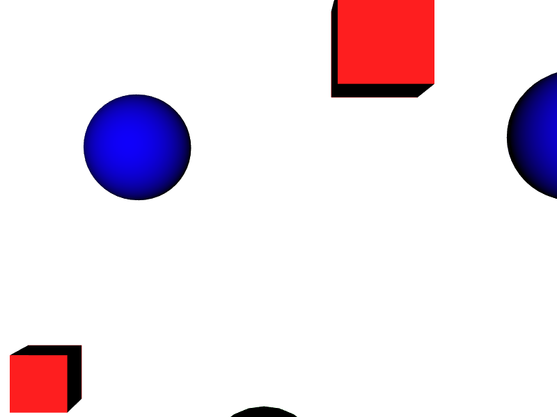
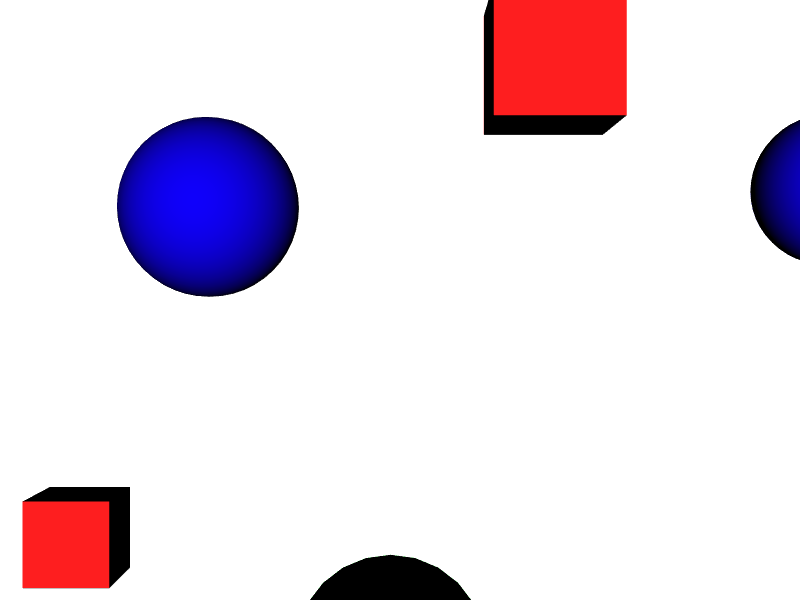
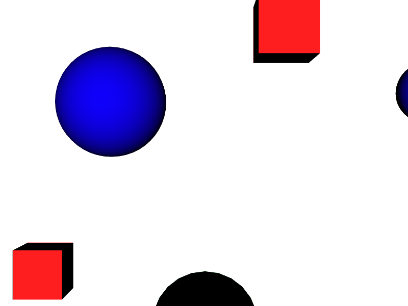
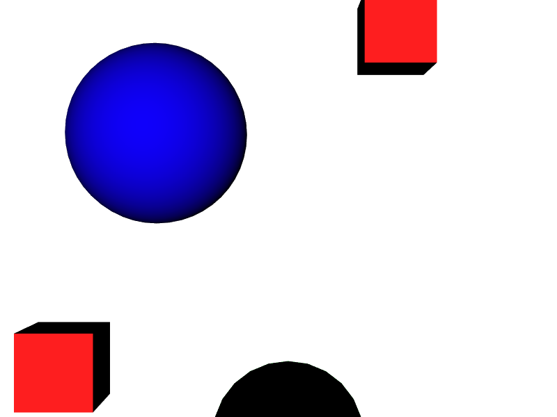
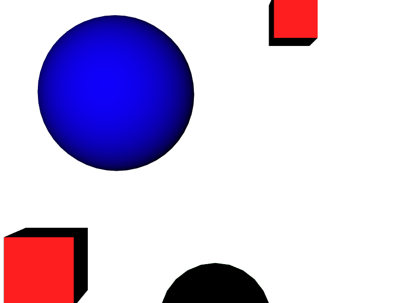
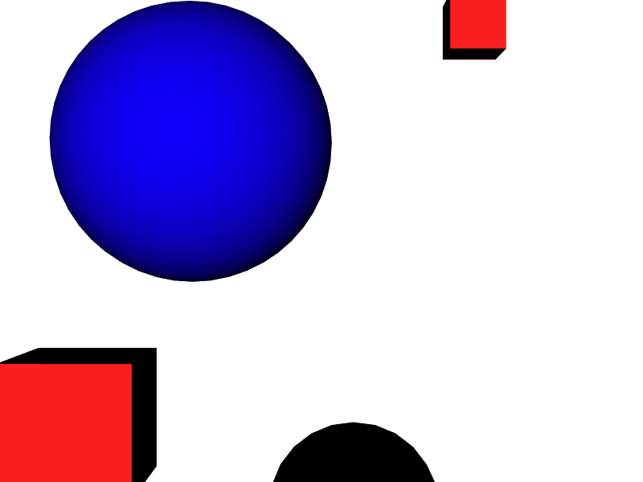
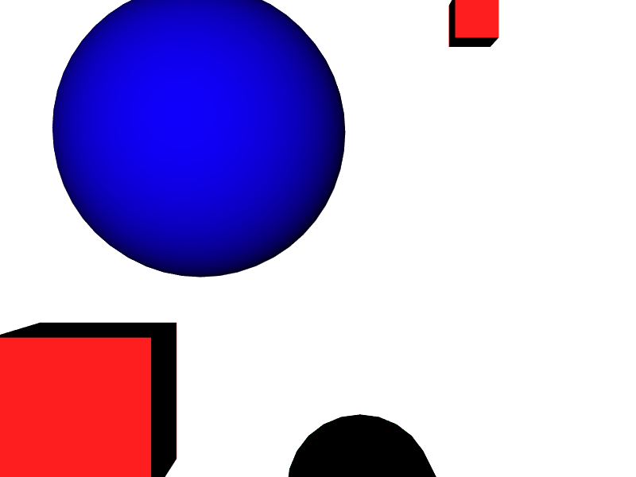
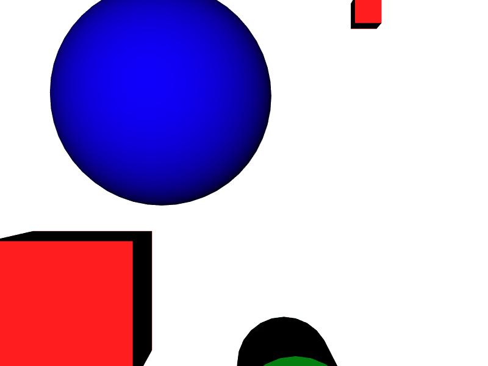
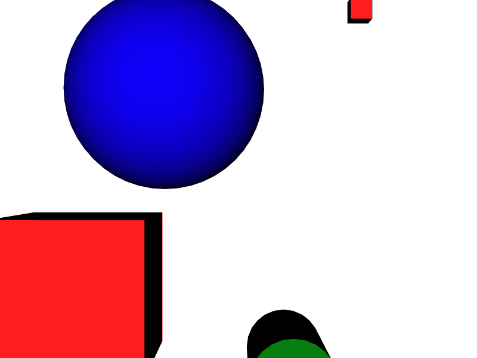
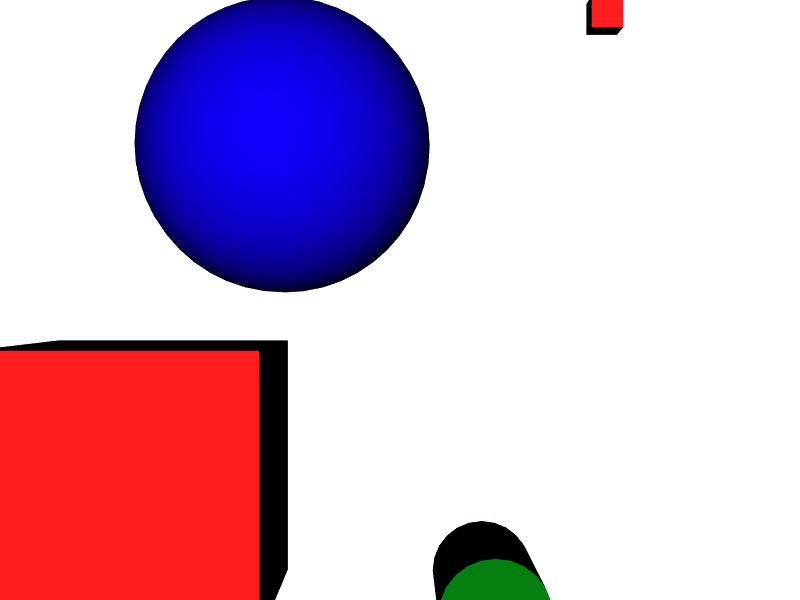
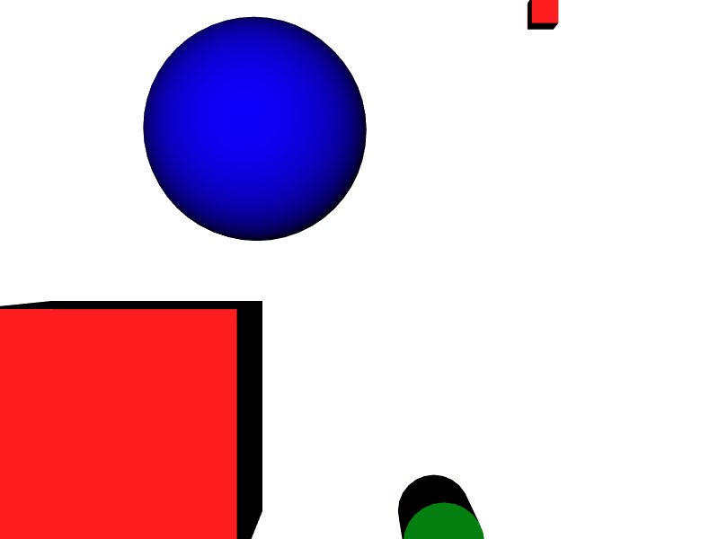
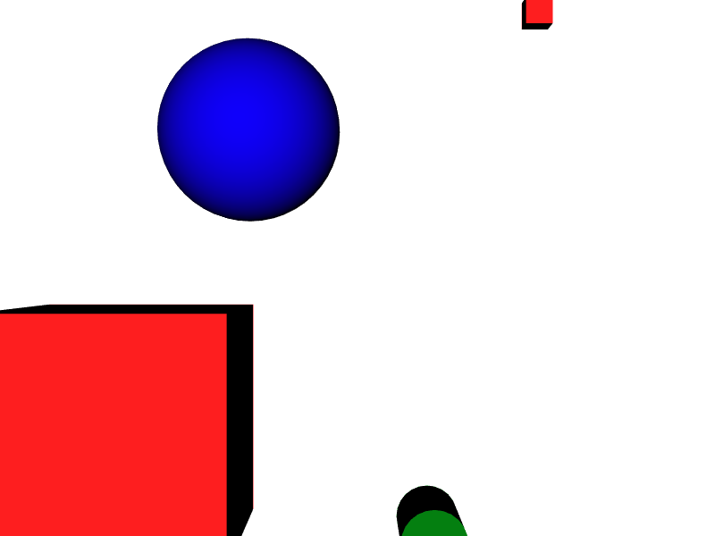
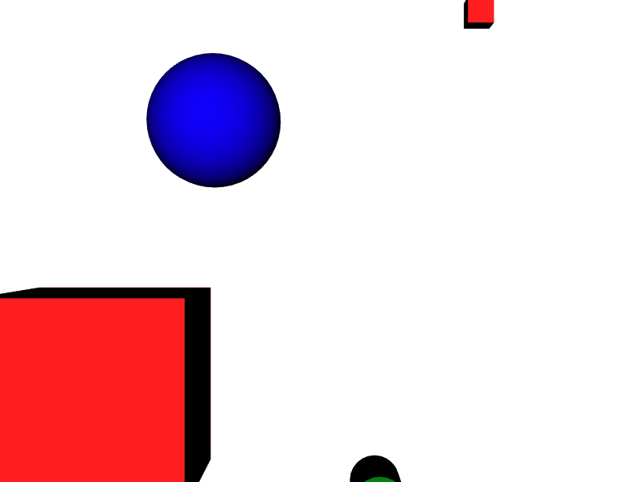
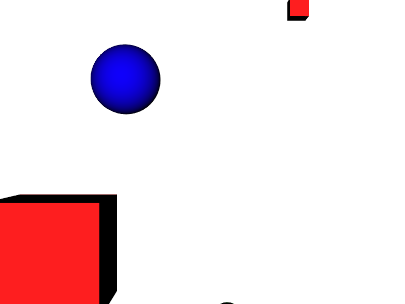
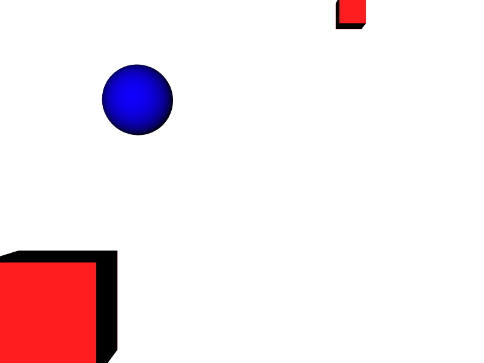
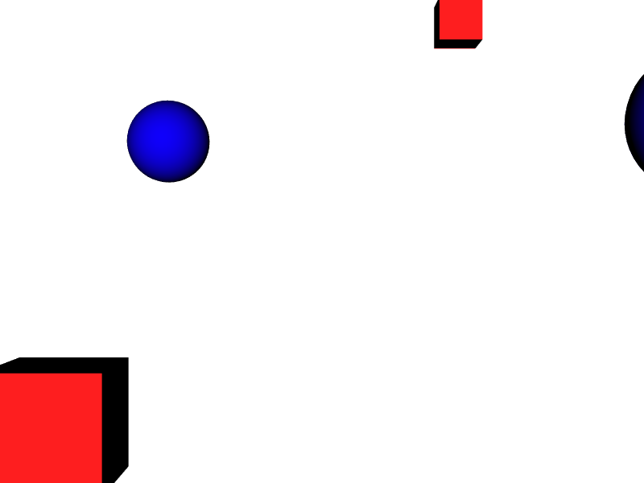
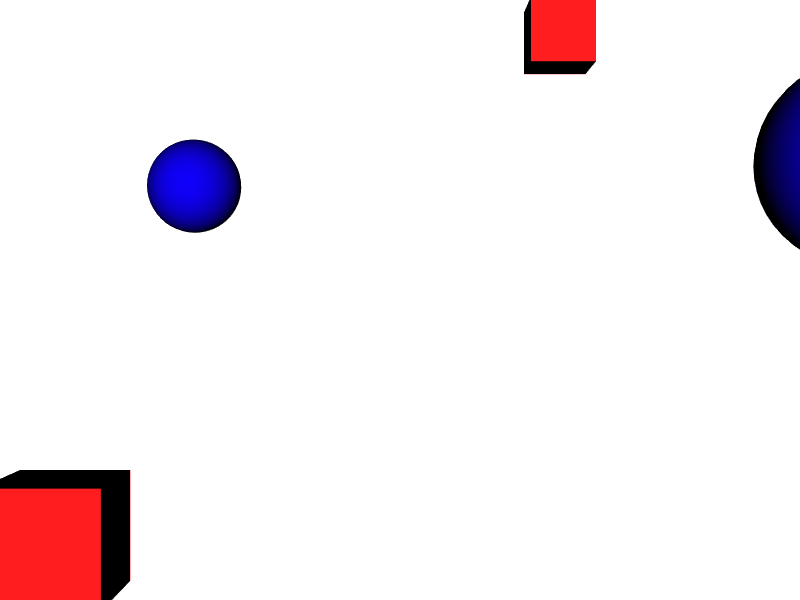
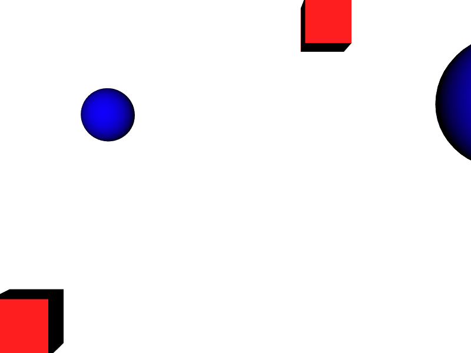
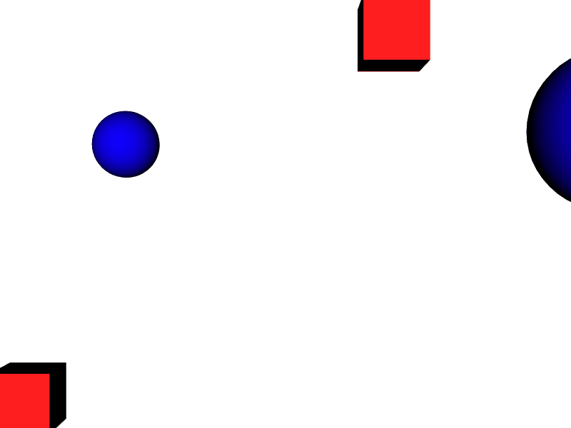
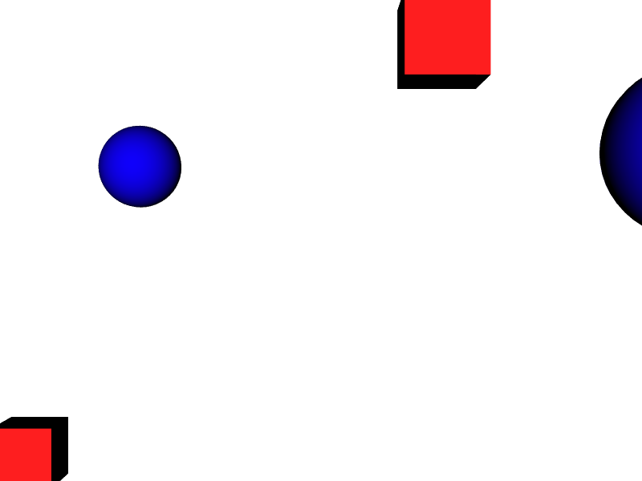

```

---

## 🧩 Prompts Usados
```text
"Crea diferentes figuras en vedo a partir de coordenadas dadas"
"Crea un botón y dos sliders que permitan aplicar cambio de color, escala y rotación a una box en Three js"
"Crea una función que genere diferentes figuras a partir de unas coordenadas dadas usando CreatePrimitive de Unity"
"Exporta distintos objetos creados con vedo en formato stl"
```
---

## 💬 Reflexión Final

Con este taller aprendimos y reforzamos los conceptos de creación de escenas en el plano 3D, a partir de las herramientas vedo de Python, Three js y Unity pudimos ver cómo se pueden crear distintos tipos de objetos de acuerdo a ciertos parámetros a partir de datos predefinidos, pudiendo incluso automatizar esta labor a partir de importar los datos de archivos externos, y además, enlazar ciertas transformaciones a cambios de tiempo e interacciones del usuario, esto puede tener aplicaciones amplias cómo la representación de grandes cantidades de datos para imágenes complejas, y facilita el análisis de estas, siendo útil en el modelo de piezas de manufactura, recreacion de escenarios reales en entornos virtuales, etc.

La parte más compleja fue permitir que las escenas fueran dinámicas y que se pudieran exportar los resultados después de las transformaciones, ya que los cambios en las escenas en cualquier caso implican que estas se redibujan una y otra vez a velocidades altísimas para ser imperceptibles ante el ojo humano, entonces automatizar ese acción de "redibujar" la escena cada vez que existe un cambio en el tiempo o una interacción puede tornarse complejo, pero a la vez es muy interesante, además, el poder exportar los resultados a formatos portables y trabajables en otros entornos resulta interesante ya que abre una posibilidad a realizar aplicaciones con la articulación de distintos entornos.

Para futuros proyectos podríamos mejorar la articulación de los objetos presentes en las escenas entre sí, es decir, que no solamente se observen los cambios que se hacen en cada uno de los objetos sino que además, se pueda permitir que los cambios realizados en un objeto afecten o generen cambios secundarios en otros objetos, por ejemplo, que un objeto tenga que mantener una escala o proporción frente a otro, de manera que cada vez que se transforme alguno de los dos, el segundo a la vez se ajuste, permitiendo generar escenas que puedan ser más articuladas y coherentes al mostrar una verdadera relación de los objetos entre sí.

---

---

## ✅ Checklist de Entrega

- [x] Carpeta `YYYY-MM-DD_nombre_taller`
- [x] Código limpio y funcional
- [x] GIF incluido con nombre descriptivo (si el taller lo requiere)
- [x] Visualizaciones o métricas exportadas
- [x] README completo y claro
- [x] Commits descriptivos en inglés

---
