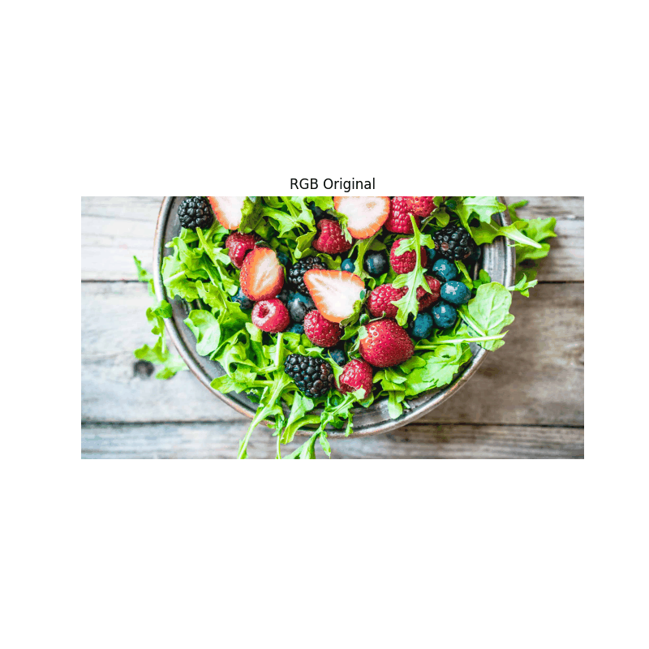
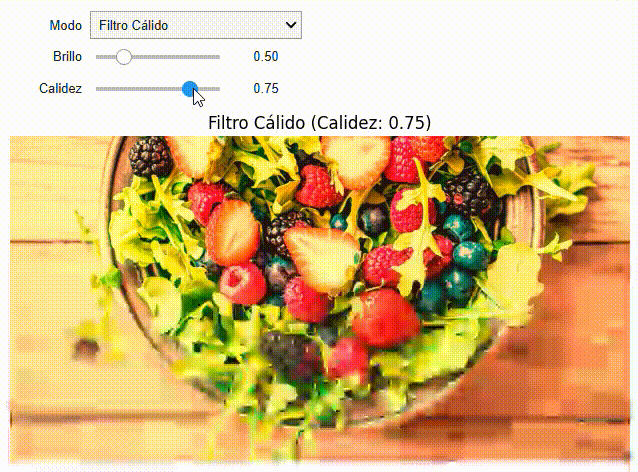

# 🧪  Taller - Explorando el Color: Percepción Humana y Modelos Computacionales

📅 **Fecha**  
`2025-05-21`

## 🎯 **Objetivo del Taller**

Explorar transformaciones de espacios de color convirtiendo imágenes entre RGB, HSV y CIE Lab, visualizar canales individuales para comprender su impacto perceptual, y simular alteraciones visuales como daltonismo (protanopía, deuteranopía) y condiciones de baja luz. Además, aplicar transformaciones de color personalizadas (filtro cálido, monocromo) y permitir ajustes dinámicos mediante controles interactivos (sliders) en Google Colab para experimentar con los parámetros en tiempo real. El taller busca profundizar en la percepción del color y la manipulación de imágenes.

## 🧠 **Conceptos Aprendidos**

Conceptos clave aplicados:

- [x] Conversión entre espacios de color (RGB, HSV, CIE Lab).
- [x] Visualización de canales de color individuales y su impacto perceptual.
- [x] Simulación de alteraciones visuales (protanopía, deuteranopía, condiciones de baja luz).
- [x] Aplicación de transformaciones de color personalizadas (filtro cálido, monocromo).
- [x] Ajuste dinámico de parámetros mediante controles interactivos con ipywidgets.
- [x] Generación de GIFs animados para documentar resultados visuales.

## 🔧 Herramientas y Entornos

Se utilizaron las siguientes herramientas y entornos:

💻 Python (Google Colab)

**Herramientas:** `opencv-python, numpy, matplotlib, scikit-image, colorsys, ipywidgets, imageio`

## 📁 Estructura del Proyecto
``` plaintex
2025-05-21_taller_modelos_color_percepcion/
├── python/
│   ├── taller_modelos_color_percepcion.ipynb  
│   ├── imagen_ejemplo.jpg        
├── resultados/
│   ├── canales_espacio_color.gif  # GIF de canales de espacios de color
│   ├── alteraciones_visuales.gif  # GIF de simulaciones de alteraciones
│   ├── slider_transformaciones.gif # GIF de controles interactivos
│   ├── canales_hsv.png # Imagen de los canales HSV
│   ├── canales_lab.png # Imagen de los canales CIE lab
├── README.md                        
```

## 🧪 Implementación

El taller se divide en las siguientes etapas:

### 🔹 **Etapas Realizadas**

1.**Carga de Imagen:**
- Cargar una imagen (imagen_ejemplo.jpg) usando OpenCV y convertirla a RGB para un procesamiento consistente.
  
2.**Conversiones de Espacio de Color:**
- Convertir la imagen de RGB a HSV (para análisis de matiz, saturación y valor) y CIE Lab (para análisis de color perceptualmente uniforme).
- Visualizar los canales individuales (H, S, V para HSV; L, a, b para CIE Lab) para comprender su contribución.

3.**Simulaciones de Alteraciones Visuales:**

- Simular *protanopía* y *deuteranopía* usando transformaciones en el espacio LMS con matrices específicas.
- Simular condiciones de baja luz reduciendo el brillo.
- Visualizar los efectos para destacar diferencias perceptuales.

4.**Transformaciones de Color Personalizadas:**

- Aplicar un filtro cálido ajustando los canales RGB para resaltar tonos rojos.
- Aplicar una transformación monocromo convirtiendo a escala de grises y mapeando a RGB.

5.**Controles Interactivos (Bonus):**

- Implementar sliders con ipywidgets para ajustar dinámicamente parámetros como brillo  e intensidad de calidez.
- Permitir alternar entre espacios de color y transformaciones (RGB, HSV, CIE Lab, protanopía, etc.) mediante un menú desplegable.

6.**Almacenamiento de Resultados:**

- Generar GIFs animados para documentar visualizaciones de canales, simulaciones de alteraciones y efectos de los sliders.

### 🔹 **Código Relevante**

Fragmentos clave del taller:

- **Simulaciones de alteraciones visuales**
``` Python
def rgb_a_lms(img_rgb):
    """Convierte de RGB a LMS manualmente usando una matriz estándar."""
    matriz_rgb_a_lms = np.array([
        [0.4002, 0.7076, -0.0808],
        [-0.2263, 1.1653, 0.0457],
        [0.0, 0.0, 0.9182]
    ])
    img = img_rgb / 255.0
    alto, ancho, _ = img.shape
    img_flat = img.reshape(-1, 3)
    lms = np.dot(img_flat, matriz_rgb_a_lms.T)
    return lms.reshape(alto, ancho, 3)

def lms_a_rgb(lms):
    """Convierte de LMS a RGB manualmente usando la matriz inversa."""
    matriz_lms_a_rgb = np.array([
        [1.8601, -1.1295, 0.2199],
        [0.3612, 0.6388, -0.0000],
        [0.0000, 0.0000, 1.0891]
    ])
    alto, ancho, _ = lms.shape
    lms_flat = lms.reshape(-1, 3)
    rgb = np.dot(lms_flat, matriz_lms_a_rgb.T)
    rgb = np.clip(rgb, 0, 1) * 255
    return rgb.reshape(alto, ancho, 3).astype(np.uint8)

def simular_protanopia(img_rgb):
    """Simula protanopía (daltonismo) usando el espacio LMS."""
    lms = rgb_a_lms(img_rgb)
    matriz_protanopia = np.array([
        [0, 2.02344, -2.52581],
        [0, 1, 0],
        [0, 0, 1]
    ])
    alto, ancho, _ = lms.shape
    lms_flat = lms.reshape(-1, 3)
    lms_protanopia = np.dot(lms_flat, matriz_protanopia.T)
    lms_protanopia = lms_protanopia.reshape(alto, ancho, 3)
    return lms_a_rgb(lms_protanopia)

def simular_deuteranopia(img_rgb):
    """Simula deuteranopía (daltonismo) usando el espacio LMS."""
    lms = rgb_a_lms(img_rgb)
    matriz_deuteranopia = np.array([
        [1, 0, 0],
        [0.494207, 0, 1.24827],
        [0, 0, 1]
    ])
    alto, ancho, _ = lms.shape
    lms_flat = lms.reshape(-1, 3)
    lms_deuteranopia = np.dot(lms_flat, matriz_deuteranopia.T)
    lms_deuteranopia = lms_deuteranopia.reshape(alto, ancho, 3)
    return lms_a_rgb(lms_deuteranopia)

def simular_baja_luz(img_rgb, brillo=0.5):
    """Simula condiciones de baja luz reduciendo el brillo."""
    return np.clip(img_rgb * brillo, 0, 255).astype(np.uint8)
```

- **Controles Interactivos**
```Python 

from ipywidgets import interact, FloatSlider, Dropdown

# Función para transformación dinámica
def aplicar_transformacion(modo, brillo, calidez):
    img = img_rgb.copy()
    if modo == 'HSV':
        img = cv2.cvtColor(img, cv2.COLOR_RGB2HSV)
        img = img[:, :, 0]  # Mostrar canal Matiz
        titulo = 'HSV - Matiz'
    elif modo == 'CIE Lab':
        img = color.rgb2lab(img)
        img = img[:, :, 0]  # Mostrar canal L
        titulo = 'CIE Lab - L'
    elif modo == 'Protanopía':
        img = simular_protanopia(img)
        titulo = 'Protanopía'
    elif modo == 'Deuteranopía':
        img = simular_deuteranopia(img)
        titulo = 'Deuteranopía'
    elif modo == 'Baja Luz':
        img = simular_baja_luz(img, brillo)
        titulo = f'Baja Luz (Brillo: {brillo:.1f})'
    elif modo == 'Filtro Cálido':
        img = aplicar_filtro_calido(img, calidez)
        titulo = f'Filtro Cálido (Calidez: {calidez:.2f})'
    else:
        titulo = 'RGB Original'
    plt.figure(figsize=(8, 8))
    plt.imshow(img, cmap='gray' if modo in ['HSV', 'CIE Lab'] else None)
    plt.title(titulo)
    plt.axis('off')
    plt.show()

# Crear sliders y menú desplegable
interact(aplicar_transformacion,
         modo=Dropdown(options=['RGB', 'HSV', 'CIE Lab', 'Protanopía', 'Deuteranopía', 'Baja Luz', 'Filtro Cálido'], value='RGB', description='Modo'),
         brillo=FloatSlider(min=0.1, max=1.0, step=0.1, value=0.5, description='Brillo'),
         calidez=FloatSlider(min=0.0, max=0.5, step=0.05, value=0.2, description='Calidez'))
```

## 📊 **Resultados Visuales**

**Imagen Original** <br>

 <br>

📌 El taller incluye GIFs animados para documentar los resultados:

<h3>Canales de Espacios de Color</h3>


<h3>Alteraciones Visuales</h3>


<h3>Controles Interactivos</h3>



---
## 🧩 **Prompts Utilizados**

Prompts que guiaron el desarrollo:
```
"Crear un script en Python para convertir una imagen de RGB a HSV y CIE Lab, visualizar canales individuales y simular protanopía y deuteranopía."

"Implementar sliders interactivos en Google Colab para ajustar brillo y calidez en transformaciones de color."

"Generar GIFs animados para mostrar canales de espacios de color, simulaciones de alteraciones visuales y efectos de sliders interactivos."
```

## 💬 **Reflexión Final**

Este taller nos permitió profundizar en los espacios de color y su influencia en la percepción visual. La conversión de imágenes entre RGB, HSV y CIE Lab me ayudó a comprender cómo cada espacio resalta diferentes aspectos del color, como el matiz en HSV o la uniformidad perceptual en CIE Lab. Simular alteraciones visuales como protanopía y deuteranopía fue revelador, ya que mostró cómo las deficiencias de color afectan la percepción, lo que podría aplicarse en diseños accesibles. Los controles interactivos fueron la parte más atractiva, ya que permitieron experimentar con transformaciones en tiempo real, haciendo los efectos visuales más comprensibles.

El mayor desafío fue implementar las simulaciones de daltonismo, debido a la necesidad de trabajar en el espacio LMS y usar matrices de transformación precisas. Esto se resolvió usando funciones de scikit-image para conversiones robustas.Fue muy interesante desarrollar este apartado porque nos permitió asemejar como es la  visualización de las personas con estas condiciones.  En futuros proyectos, se podría explorar el procesamiento de video en tiempo real con estas técnicas o integrarlas con shaders para un rendimiento optimizado. El taller podría mejorarse añadiendo simulaciones adicionales (como tritanopía) o usando modelos de aprendizaje automático para predecir efectos de percepción de color.


## ✅  Checklist de Entrega

- [x] Carpeta 2025-05-21_taller_modelos_color_percepcion
- [x] Código limpio y funcional en odisea_espacio_color.ipynb
- [x] GIFs incluidos con nombres descriptivos (canales_espacio_color.gif, alteraciones_visuales.gif, slider_transformaciones.gif)
- [x] Visualizaciones exportadas a python/resultados/
- [x] README completo y claro
- [x] Commits descriptivos en inglés
