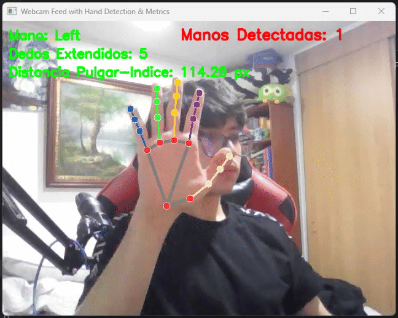
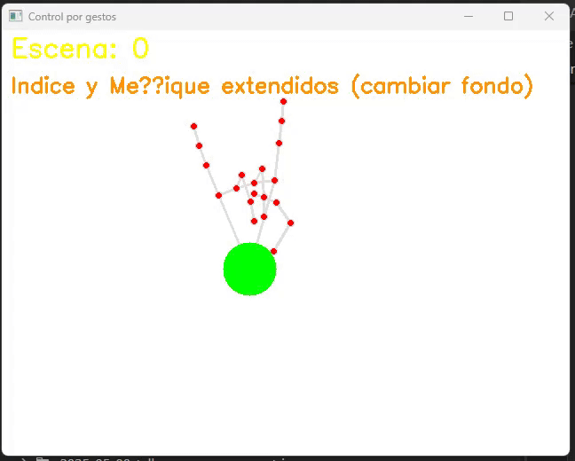
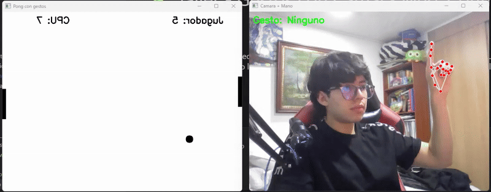

# 🧪 Taller - Gestos con Cámara Web: Control Visual con MediaPipe

## 📅 Fecha
`2025-05-22` – Fecha de realización

---

## 🎯 Objetivo del Taller

Este taller busca capacitar a los participantes en el uso de la webcam y la biblioteca MediaPipe para construir interfaces de usuario innovadoras. Se aprenderá a detectar gestos de manos en tiempo real y a traducirlos en acciones visuales sobre la pantalla, explorando cómo la interacción natural, sin necesidad de hardware adicional, puede ofrecer una experiencia de usuario intuitiva y atractiva.

---

## 🧠 Conceptos Aprendidos

Principales conceptos aplicados:

- [x] **Procesamiento de Video en Tiempo Real con OpenCV:** Activación y captura de flujo de video desde la cámara web, volteo de frames para efecto espejo y redimensionamiento de la ventana para adaptarse dinámicamente al juego.
- [x] **Detección y Seguimiento de Manos con MediaPipe Hands:** Utilización de la biblioteca MediaPipe para identificar y rastrear puntos clave (landmarks) de las manos en cada frame de video, incluyendo la corrección de errores de atributos de landmarks específicos de los dedos.
- [x] **Interpretación de Gestos Manuales:** Desarrollo de funciones lógicas para reconocer gestos específicos a partir de la posición relativa de los landmarks de los dedos, como la extensión de dedos y la detección de gestos como "pulgar arriba" e "índice y meñique extendidos".
Interacción Visual Basada en Gestos: Implementación de acciones dinámicas en pantalla controladas directamente por los gestos de la mano:
  - **Control de Objeto en Juego (Paleta):** Mover una paleta de Pong horizontal o verticalmente utilizando la coordenada de la muñeca detectada por MediaPipe.
  - **Cambio de Atributos Visuales (Color de Fondo):** Alterar el color de fondo del juego con un gesto de "pulgar arriba", incluyendo la generación de colores contrastantes.
  - **Cambio de Orientación del Juego:** Alternar entre una orientación de juego horizontal y vertical mediante un gesto específico (índice y meñique extendidos), ajustando las dimensiones de la ventana y las posiciones de las paletas.
- [x] **Lógica de Juego Básico (Pong):** Creación de la mecánica fundamental de un juego Pong, incluyendo el movimiento de la pelota, detección de colisiones con bordes y paletas, y un sistema de puntuación simple, todo adaptado a las diferentes orientaciones del juego.
- [x] **Manejo de Estados del Juego:** Utilización de variables de estado (ej., game_orientation_horizontal) para controlar el comportamiento y la visualización del juego dinámicamente según el gesto de cambio de orientación.
- [x] **Técnicas de "Debouncing":** Implementación de un tiempo de espera (DEBOUNCE_TIME) para prevenir la activación repetida e indeseada de gestos cuando la mano se mantiene en una posición, mejorando la usabilidad de la interfaz gestual.

---

## 🔧 Herramientas y Entornos

- Python notebook entorno local
- Librerias: `OpenCV` y `MediaPipe`.

---

## 📁 Estructura del Proyecto

```
2025-05-22_taller_gestos_webcam_mediapipe/
├── python/               
│   └── gestos_webcam_mediapipe.ipynb
│   └── juego_con_gestos.ipynb
├── resultados/               
│   └── mediapipe_pong_controller.gif
│   └── webcam_mediapipe_result.gif
├── README.md
```

En este caso, se decidió separar el procesamiento de video en tiempo real y la detección de las manos en el primer notebook `gestos_webcam_mediapipe.ipynb` y, con lo aprendido en este, un segundo notebook `mediapipe_pong_controller.ipynb` donde se hacia uso del reconocimiento de gestos de la mano como controlador del juego Pong.

---

## 🧪 Implementación

### 🔹 Etapas realizadas

#### Detección de manos
1. Activar la cámara web y capturar video en tiempo real.
2. Detectar manos utilizando MediaPipe Hands.
3. Dibujar los nodos identificados en la mano.
4. Medición de métricas de las manos.

#### Pong interactivo con gestos de la mano
1. Creación de los metadatos del juego
2. Lógica de detección de gestos.
3. Manejo de eventos con gestos.
4. Bucle principal del juego.

### 🔹 Código relevante

```python
# --- Control por gestos ---
mp_hands = mp.solutions.hands
hands = mp_hands.Hands(static_image_mode=False, max_num_hands=1, min_detection_confidence=0.5)
mp_draw = mp.solutions.drawing_utils

# --- Funciones auxiliares ---
def is_finger_extended(hand, tip_id, pip_id):
    return hand.landmark[tip_id].y < hand.landmark[pip_id].y

def hand_open(hand):
    return all([
        is_finger_extended(hand, mp_hands.HandLandmark.INDEX_FINGER_TIP, mp_hands.HandLandmark.INDEX_FINGER_PIP),
        is_finger_extended(hand, mp_hands.HandLandmark.MIDDLE_FINGER_TIP, mp_hands.HandLandmark.MIDDLE_FINGER_PIP),
        is_finger_extended(hand, mp_hands.HandLandmark.RING_FINGER_TIP, mp_hands.HandLandmark.RING_FINGER_PIP),
        is_finger_extended(hand, mp_hands.HandLandmark.PINKY_TIP, mp_hands.HandLandmark.PINKY_PIP),
    ])

def hand_closed(hand):
    return all([
        not is_finger_extended(hand, mp_hands.HandLandmark.INDEX_FINGER_TIP, mp_hands.HandLandmark.INDEX_FINGER_PIP),
        not is_finger_extended(hand, mp_hands.HandLandmark.MIDDLE_FINGER_TIP, mp_hands.HandLandmark.MIDDLE_FINGER_PIP),
        not is_finger_extended(hand, mp_hands.HandLandmark.RING_FINGER_TIP, mp_hands.HandLandmark.RING_FINGER_PIP),
        not is_finger_extended(hand, mp_hands.HandLandmark.PINKY_TIP, mp_hands.HandLandmark.PINKY_PIP),
    ])
```

---

## 📊 Resultados Visuales

### 📌 Este taller **requiere explícitamente un GIF animado**:

#### Detección de mano en tiempo real



#### Interacción con gestos



Los **gestos implementados** fueron dos, en ambos casos, se consideraba la posición de todos los dedos menos el pulgar:

  - Palma abierta: Los cuatro dedos completamente extendidos.
  - Rock: Índice y meñique totalmente extendidos, los demás, contraídos.

#### Pong mediante gestos de mano



Los **gestos implementados** fueron dos, en ambos casos, se consideraba la posición de todos los dedos menos el pulgar:

  - Palma abierta: Los cuatro dedos completamente extendidos.
  - Palma cerrada: Los cuatro dedos completamente contraídos.

---

## 🧩 Prompts Usados

```text
Crea un código en python que haga lo siguiente: Activar la cámara web y capturar video en tiempo real.
```

```text
Crea un código en python que haga lo siguiente: Detectar manos utilizando MediaPipe Hands.
```

```text
Este es mi código. Quiero que lo modifiques para medir condiciones como: Número de dedos extendidos Distancia entre dedos (e.g., índice y pulgar), Mano que aparece en pantalla, etc.
[Código de detección de manos]
```

```text
Estoy programando en python notebook en local. Genera un código para jugar pong contra la cpu. 

Sin embargo, quiero usar como controles gestos de la mano usando mediapipe hand. 

Los controles deben ser de la siguiente forma:

1. La paleta del jugador se debe mover con la muñeca.
2. El fondo debe cambiar de color (las paletas y la pelota deben cambiar tambien para asegurar contraste) si la mano esta completamente abierta. (debe verificar cada segundo).
3. Se debe hacer un filtro de espejo (reflejarse el juego) si la mano esta completamente cerrada. 
```
---

## 💬 Reflexión Final

El sistema de detección con gestos es bastante preciso, sin embargo, puede ser bastante sensible a cambios bruscos debido al procesamiento en tiempo real. A pesar de ello, se pueden hacer cosas muy interesantes con la detección de manos y gestos como jugar pong solo con la mano e implementar mecánicas diversas según los gestos, lo cual hace el juego mucho más divertido.

Se podría mejorar la sensibilidad del pulgar, ya que en algunos casos podía llegar a fallar, sin embargo, considero que lo realizado es suficiente para la práctica y se aprendieron una gran diversidad de conceptos tal como se enunciaron inicialmente.

---

## ✅ Checklist de Entrega

- [x] Carpeta `2025-05-22_taller_gestos_webcam_mediapipe`
- [x] Código limpio y funcional (`gestos_webcam_mediapipe.ipynb`)
- [x] GIF incluido con nombre descriptivo
- [x] Visualizaciones y métricas exportadas
- [x] README completo y claro
- [x] Commits descriptivos en inglés

---
