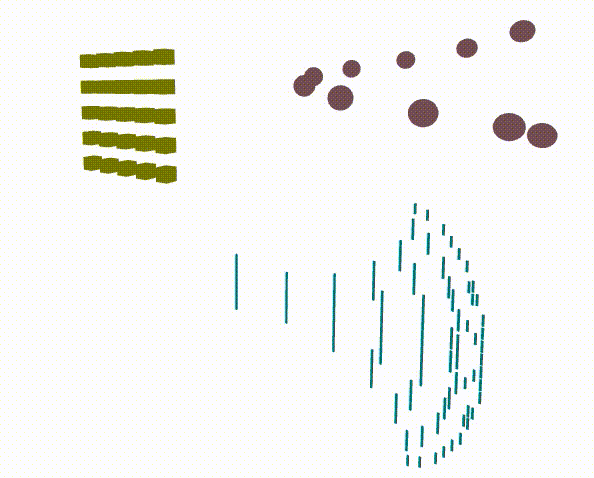
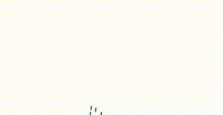
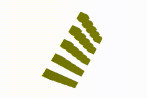

# 🧪 **Taller Modelado Procedural Básico: Geometría desde Código**

## 📅 Fecha
`2025-05-23`

## 🎯 Objetivo del Taller

Explorar la generación procedural de geometrías 3D utilizando React, TypeScript y Three.js con React Three Fiber. El objetivo es construir una escena interactiva que incluya una cuadrícula de cajas animadas, un espiral de esferas con vértices modificados dinámicamente y un árbol fractal recursivo. Se pretende aplicar transformaciones geométricas, animaciones mediante `useFrame`, y patrones fractales, permitiendo una visualización clara y separada de cada elemento con controles de cámara.

## 🧠 Conceptos Aprendidos

Conceptos clave aplicados:

- [x] Transformaciones geométricas (rotación, traslación)  
  - Usadas para animar la cuadrícula y posicionar los elementos en la escena.
- [x] Modificación dinámica de geometrías  
  - Aplicada al espiral mediante manipulación de `bufferGeometry.attributes.position.array`.
- [x] Patrones fractales básicos  
  - Implementados en el árbol recursivo.
- [x] Animaciones con `useFrame`  
  - Usadas para rotación y oscilación en tiempo real.

## 🔧 Herramientas y Entornos

Se utilizaron las siguientes herramientas y entornos:

💻 Three.js / React Three Fiber  
- Versiones: `@react-three/fiber@8.16.6`, `@react-three/drei@9.105.6`, `three@0.164.1`.  
- Node.js y npm para gestión de dependencias.  
- Visual Studio Code para edición de código.

## 📁 Estructura del Proyecto
``` plaintex
2025-05-23_taller_modelado_procedural_basico/
├── threejs/               
│   ├──public/
│     ├── index.html
│   ├── src/
│     ├── App.css
│     ├── App.test.tsx
│     ├── App.tsx         # Código principal del taller
│     ├── index.css
│     ├── index.tsx       # Punto de entrada de React
│     ├── logo.svg
│     ├── react-app-env.d.ts
│     ├── reportWebVitals.ts
│     ├── setupTests.ts
│   ├── .gitignore
│   ├── package-lock.json
│   ├── package.json
│   ├── tsconfig.json
├── resultados/         
│   ├── structures.gif
│   ├── animation_grill.gif
|   ├── animation_sphere.gif
├── README.md
```

## 🧪 Implementación

El taller se divide en las siguientes etapas:

### 🔹 Etapas Realizadas

1. **Preparación de la escena - Creación del proyecto**:
   - Configuré un proyecto React con TypeScript usando `create-react-app`.
   - Instalé dependencias (`@react-three/fiber`, `@react-three/drei`, `three`) y configuré el entorno de desarrollo.
   - Creé los componentes `GridOfBoxes`, `SpiralOfSpheres` y `FractalTree`.

2. **Construcción de la cuadrícula de cajas**:
   - Generé una cuadrícula 5x5 de cajas amarillas con posiciones calculadas y animación de rotación.
   - Añadí un grupo para rotar toda la cuadrícula usando `useFrame`.

3. **Construcción del espiral de esferas**:
   - Creé un espiral de 10 esferas rosadas con posiciones calculadas en 3D.
   - Implementé la modificación dinámica de vértices de la primera esfera para oscilación usando `bufferGeometry.attributes.position.array`.

4. **Construcción del árbol fractal**:
   - Desarrollé un árbol recursivo con ramas que se dividen en ángulos decrecientes según la profundidad.
   - Ajusté la geometría para simular ramas usando cajas pequeñas.

5. **Visualización e interacción**:
   - Separé los elementos en el espacio 3D (cuadrícula a la izquierda, espiral a la derecha, árbol debajo).
   - Configuré la cámara (`position: [0, 5, 30]`, `fov: 90`) y añadí `OrbitControls` para interacción.

### 🔹 Código Relevante

Fragmentos clave del taller para cada elemento:

- **Construcción de la cuadrícula de cajas (`GridOfBoxes`)**
```typescript
const GridOfBoxes = () => {
  const groupRef = useRef<THREE.Group>(null!);

  const boxes = [];
  for (let i = -2; i <= 2; i++) {
    for (let j = -2; j <= 2; j++) {
      boxes.push(
        <mesh key={`${i}-${j}`} position={[i * 2, j * 2, 0]}>
          <boxGeometry args={[1, 1, 1]} />
          <meshStandardMaterial color="yellow" />
        </mesh>
      );
    }
  }

  useFrame(() => {
    if (groupRef.current) {
      groupRef.current.rotation.x += 0.01;
      groupRef.current.rotation.y += 0.01;
    }
  });

  return <group ref={groupRef} position={[-10, 0, 0]}>{boxes}</group>;
};
```

- **Construcción del espiral de esferas (`SpiralOfSpheres`)**
```typescript
const SpiralOfSpheres = () => {
  const meshRef = useRef<THREE.Mesh>(null!);
  const originalPositions = useRef<Float32Array | null>(null);

  const spheres = [];
  for (let i = 0; i < 10; i++) {
    const angle = (i / 10) * Math.PI * 2;
    const radius = 5;
    const x = radius * Math.cos(angle);
    const y = i * 0.5;
    const z = radius * Math.sin(angle);
    spheres.push(
      <mesh
        key={i}
        ref={i === 0 ? meshRef : undefined}
        position={[x, y, z]}
      >
        <sphereGeometry args={[0.5, 32, 32]} />
        <meshStandardMaterial color="pink" />
      </mesh>
    );
  }

  useEffect(() => {
    if (meshRef.current && meshRef.current.geometry) {
      const positions = meshRef.current.geometry.attributes.position.array;
      originalPositions.current = new Float32Array(positions.length);
      originalPositions.current.set(positions);
    }
  }, []);

  useFrame(() => {
    if (
      meshRef.current &&
      meshRef.current.geometry &&
      meshRef.current.geometry.attributes.position &&
      originalPositions.current
    ) {
      const positions = meshRef.current.geometry.attributes.position.array;
      for (let i = 0; i < positions.length; i += 3) {
        const originalZ = originalPositions.current[i + 2];
        positions[i + 2] = originalZ + Math.sin(Date.now() * 0.001 + i) * 0.05;
      }
      meshRef.current.geometry.attributes.position.needsUpdate = true;
      meshRef.current.geometry.computeVertexNormals();
    }
  });

  return <group position={[10, 0, 0]}>{spheres}</group>;
};
```

- **Construcción del árbol fractal (`FractalTree`)**
```typescript
const FractalTree = ({ position = [0, 0, 0], angle = 0, depth = 5 }: { position: [number, number, number]; angle: number; depth: number }) => {
  if (depth <= 0) return null;

  const length = depth * 0.5;
  const newX = position[0] + Math.cos(angle) * length;
  const newY = position[1] + Math.sin(angle) * length;

  return (
    <>
      <mesh position={position}>
        <boxGeometry args={[0.1, length, 0.1]} />
        <meshStandardMaterial color="cyan" />
      </mesh>
      <FractalTree position={[newX, newY, 0]} angle={angle - 0.3} depth={depth - 1} />
      <FractalTree position={[newX, newY, 0]} angle={angle + 0.3} depth={depth - 1} />
    </>
  );
};
```

## 📊 Resultados Visuales

**Escena 3D Interactiva**  
La escena muestra una cuadrícula de cajas amarillas (izquierda), un espiral de esferas rosadas (derecha) y un árbol fractal cian (abajo).

📌 El taller incluye GIFs animados para documentar los resultados:

### **Estructuras de la escena**
Muestra la disposición de la cuadrícula, el espiral y el árbol en la escena.



### Animaciones Dinámicas
Muestra la rotación de la cuadrícula y la oscilación de los vértices del espiral al crearse.




## 🧩 Prompts Usados

Prompts que guiaron el desarrollo:
```
"Create a 3D scene with a grid of boxes, a spiral of spheres, and a fractal tree using React Three Fiber."
"Fix TypeError in SpiralOfSpheres by adding proper geometry checks."
"Fix spiral distortion by using original vertex positions."
```

## 💬 Reflexión Final

Este taller nos permitió aprender y reforzar la generación procedural de geometrías 3D y su animación con React Three Fiber y Three.js. La manipulación dinámica de vértices se manejó usando `bufferGeometry.attributes.position.array` en el espiral, lo que nos enseñó a controlar deformaciones y actualizar normales para una iluminación correcta. También se implementó un árbol fractal recursivo, lo que permitió aplicar los patrones matemáticos en gráficos 3D.

La parte más compleja fue resolver la distorsión en el espiral, ya que requirió ajustar las posiciones originales de los vértices y recalcular normales, un proceso que nos  llevó a entender mejor cómo funcionan las geometrías en Three.js. Lo más interesante fue ver cómo pequeñas modificaciones en `useFrame` generaban animaciones fluidas y visualmente atractivas. En futuros proyectos, me gustaría explorar shaders para efectos visuales avanzados y optimizar el rendimiento con escenas más grandes. También mejoraría la interacción añadiendo controles dinámicos para los usuarios.

## ✅ Checklist de Entrega

- [x] Carpeta `2025-05-23_taller_modelado_procedural_basico`
- [x] Código limpio y funcional
- [x] GIFs incluidos con nombres descriptivos (`structures.gif`, `animations.gif`)
- [x] Visualizaciones exportadas a `resultados/`
- [x] README completo y claro
- [x] Commits descriptivos en inglés
