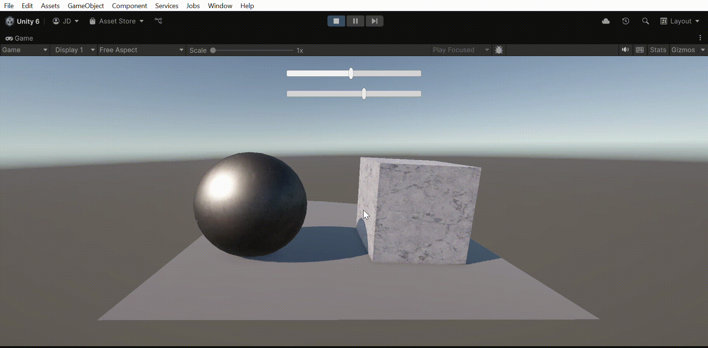
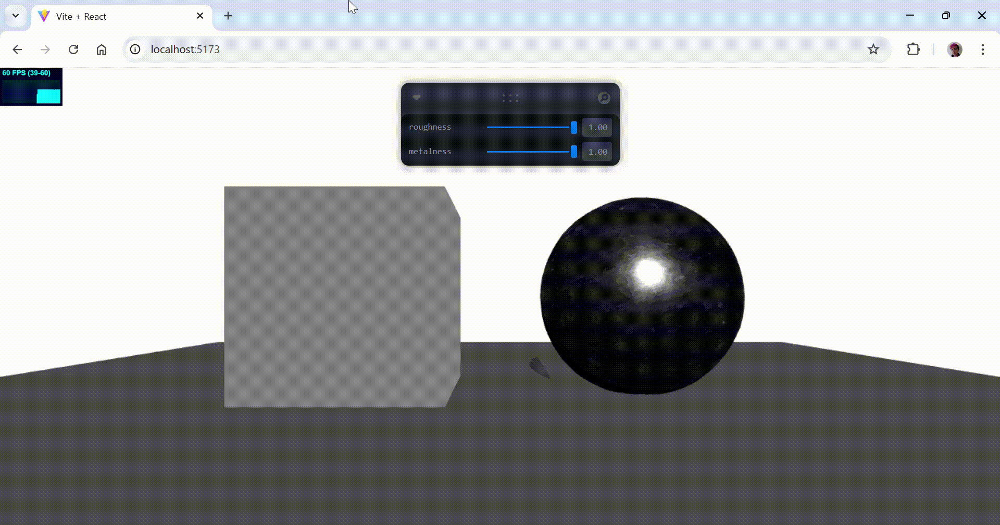

# 🧪  Taller - Materiales Realistas: Introducción a PBR en Unity y Three.js

## 📅 Fecha
`2025-05-23` 

---

## 🎯 Objetivo del Taller

El objetivo del taller es comprender los principios del renderizado basado en física (Physically-Based Rendering - PBR) y aplicarlos a modelos 3D para mejorar su realismo visual. A través de la implementación de materiales PBR en Unity y Three.js, se exploran aspectos como la rugosidad, metalicidad, y mapas normales, entendiendo cómo la luz interactúa con diferentes superficies.

---

## 🧠 Conceptos Aprendidos

Lista los principales conceptos aplicados:

- [x] Fundamentos del Physically-Based Rendering (PBR).
- [x] Uso de mapas PBR: Albedo, Roughness, Metalness, Normal.
- [x] Comparación entre materiales estándar y materiales PBR.
- [x] Implementación de sliders UI para modificar materiales en tiempo real.
- [x] Importación y mapeo de texturas PBR.
- [x] Diferencias visuales entre motores (Unity vs Three.js).

---

## 🔧 Herramientas y Entornos

Especifica los entornos usados:

- [x] Unity (versión LTS, Shader Standard PBR)
- [x] Three.js / React Three Fiber (`@react-three/fiber`, `@react-three/drei`)
- [x] Herramientas de visualización de materiales
- [x] Texturas descargadas desde ambientCG, PolyHaven


---

## 📁 Estructura del Proyecto

```
2025-05-23_taller_materiales_pbr_unity_threejs/
├── unity/
├── threejs/                            
├── resultados/ 
├── datos/           
├── README.md
```

---

## 🧪 Implementación


### 🔹 Etapas realizadas
1. Preparación de la escena: En ambos entornos se construyó una escena básica con una luz direccional, una luz ambiental, un plano como base, y dos objetos, un cubo y una esfera.
2. Importación de texturas PBR: Se seleccionaron y descargaron mapas desde sitios como ambientCG. Se utilizaron mapas de Albedo, Roughness, Metalness y Normal. Entre los mapas se encontraban uno de efecto metálico y uno de efecto de mármol.
3. Aplicación de materiales PBR:
3.1 En Unity, se creó un nuevo material usando el shader estándar, asignando manualmente cada textura al campo correspondiente. Se le dió un material de efecto metálico a la esfera y una textura de efecto de mármol al cubo.
3.2 En Three.js, se utilizó MeshStandardMaterial con texturas cargadas mediante useLoader, mapeadas adecuadamente a cada propiedad del material. Se le dió un material de efecto metálico a la esfera, y el cubo se dejó con el material estándar para comparar.
4. Adición de interfaz gráfica: Para cada entorno se añadieron sliders que permitieron modificar en tiempo real parámetros cómo metallic, smoothness, roughness, y así observar cómo va cambiando el material.
5. Guardado de resultados: Se tomaron capturas y gifs animados del comportamiento del material al modificar sus propiedades.

### 🔹 Código relevante

Shaders en Threejs:

```threejs
const textureLoader = new THREE.TextureLoader();
    const texturePaths = {
      map: '/metal_texturas/Metal055A_1K-JPG_Color.jpg',
      roughnessMap: '/metal_texturas/Metal055A_1K-JPG_Roughness.jpg',
      metalnessMap: '/metal_texturas/Metal055A_1K-JPG_Metalness.jpg',
      normalMap: '/metal_texturas/Metal055A_1K-JPG_NormalDX.jpg',
      displacementMap: '/metal_texturas/Metal055A_1K-JPG_Displacement.jpg',
    };

    Promise.all([
      textureLoader.loadAsync(texturePaths.map),
      textureLoader.loadAsync(texturePaths.roughnessMap),
      textureLoader.loadAsync(texturePaths.metalnessMap),
      textureLoader.loadAsync(texturePaths.normalMap),
      textureLoader.loadAsync(texturePaths.displacementMap),
    ])
      .then(([map, roughnessMap, metalnessMap, normalMap, displacementMap]) => {
        console.log('Texturas cargadas OK');

        const pbrMaterial = new THREE.MeshStandardMaterial({
          map,
          roughnessMap,
          metalnessMap,
          normalMap,
          displacementMap,
          roughness: 1.0,
          metalness: 1.0,
          displacementScale: 1.0,
        });

        pbrMaterialRef.current = pbrMaterial;
```

```Unity
 private Material materialInstance;

    void Start()
    {
        // Creamos una instancia del material que se puede modificar en runtime
        materialInstance = targetObject.GetComponent<Renderer>().material;

        // Asignamos valores iniciales a los sliders
        metallicSlider.value = materialInstance.GetFloat("_Metallic");
        smoothnessSlider.value = materialInstance.GetFloat("_Smoothness");

        // Nos aseguramos de escuchar los cambios (si no lo has hecho ya por UI)
        metallicSlider.onValueChanged.AddListener(UpdateMetallic);
        smoothnessSlider.onValueChanged.AddListener(UpdateSmoothness);
    }

    public void UpdateMetallic(float value)
    {
        materialInstance.SetFloat("_Metallic", value);
    }

    public void UpdateSmoothness(float value)
    {
        materialInstance.SetFloat("_Smoothness", value);
    }
```

---

## 📊 Resultados Visuales





---

## 🧩 Prompts Usados

Enumera los prompts utilizados:

```text
"Escribe un ejemplo en Unity para aplicar mapas PBR (albedo, metalness, roughness, normal) a un objeto"
"¿Cómo se aplica un material PBR usando MeshStandardMaterial en Three.js?"
"Explica cómo usar sliders para cambiar valores de metallic y smoothness en tiempo real en Unity"
```


---

## 💬 Reflexión Final

Este taller me permitió entender a profundidad cómo funciona el renderizado basado en física (PBR) y cómo este mejora significativamente la percepción de realismo en una escena 3D. Aplicar mapas como el normal, roughness o metalness cambia completamente la forma en la que la luz interactúa con el objeto, haciendo que refleje o absorba luz de forma más cercana a la realidad.

Uno de los momentos más interesantes fue ver la diferencia directa entre un material plano y uno texturizado con mapas PBR. También resultó muy enriquecedor configurar sliders para alterar las propiedades en tiempo real, ya que permitió observar cómo la superficie respondía dinámicamente a los cambios de rugosidad o metalicidad. Esta experiencia me ayudó a valorar la importancia de los materiales en la dirección de arte y realismo en videojuegos y visualización interactiva.

---

## ✅ Checklist de Entrega

- [x] Carpeta `YYYY-MM-DD_nombre_taller`
- [x] Código limpio y funcional
- [x] GIF incluido con nombre descriptivo (si el taller lo requiere)
- [x] Visualizaciones o métricas exportadas
- [x] README completo y claro
- [x] Commits descriptivos en inglés

---