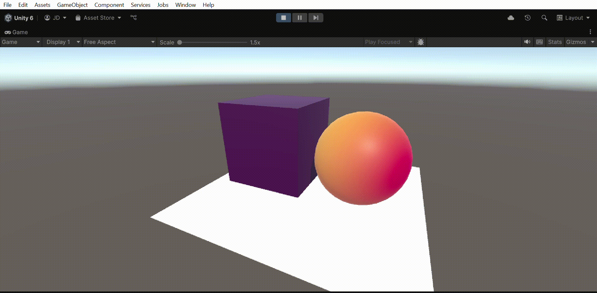
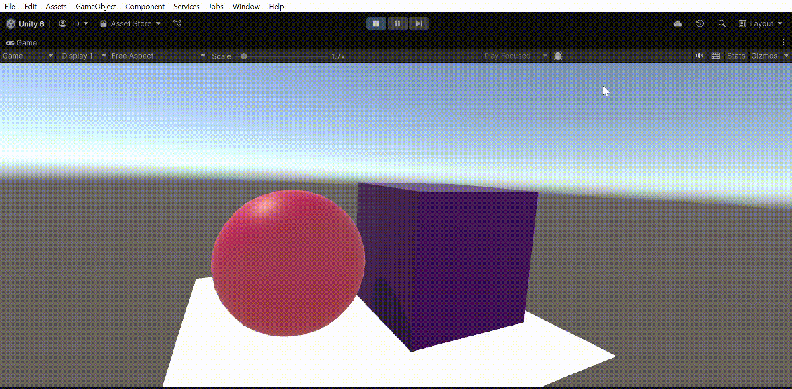
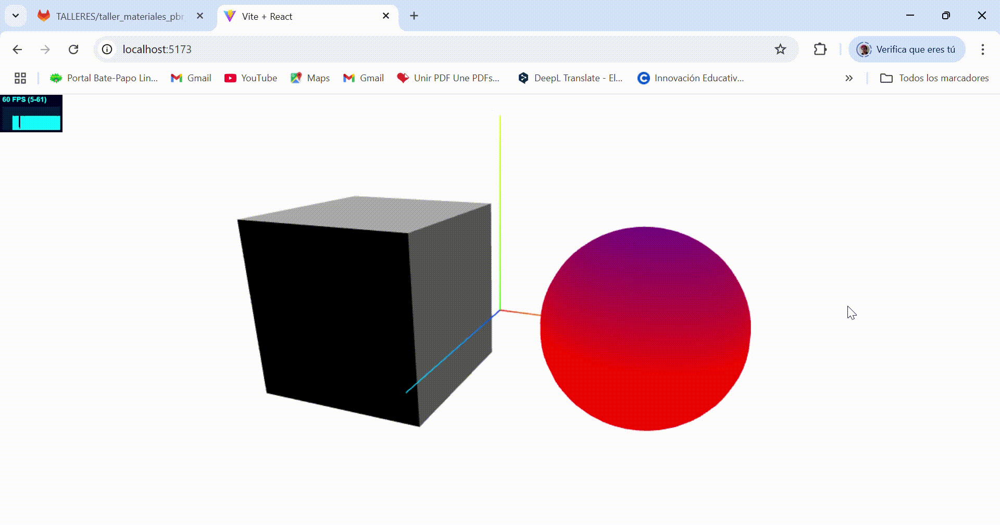

# 🧪  Taller - Sombras Personalizadas: Primeros Shaders en Unity y Three.js

## 📅 Fecha
`2025-05-23` 

---

## 🎯 Objetivo del Taller

El objetivo del taller es introducir a la creación de shaders personalizados que permitan modificar materiales visualmente en tiempo real, de esta forma se puede entender la estructura básica de un shader  se pueden aplicar efectos visuales mediante código.

---

## 🧠 Conceptos Aprendidos

Lista los principales conceptos aplicados:

- [x] Manipulación básica de shaders (HLSL en Unity, GLSL en Three.js).
- [x] Gradientes según posición de vértices.
- [x] Animaciones visuales con tiempo.
- [x] Asignación de materiales personalizados.
- [x] Toon shading y wireframe como efectos visuales.
- [x] Comparación práctica entre motores gráficos.

---

## 🔧 Herramientas y Entornos

Especifica los entornos usados:

- [x] Unity (versión LTS, Shader Graph, HLSL)
- [x] Three.js / React Three Fiber (`@react-three/fiber`, `@react-three/drei`)
- [x] GLSL para shaders personalizados
- [x] Node.js y entorno web (Vite, Next.js, etc.)


---

## 📁 Estructura del Proyecto

```
2025-05-23_taller_shaders_basicos_unity_threejs/
├── unity/
├── threejs/                            
├── resultados/           
├── README.md
```

---

## 🧪 Implementación


### 🔹 Etapas realizadas
1. Preparación de los elementos en la escena: En los dos entornos (Unity y Threejs) se crearon un cubo y una esfera, adicionalmente en el entorno de Unity se agregó un plano sobre el cual "reposan" la esfera y el cubo. 
2. Creación de los shaders: Para cada uno de los entornos se hace la creación de dos shaders, uno para cada figura.
2.1 Unity: Utilizando la herrramienta de Shader Graph se hacen dos shaders, uno que divide las posiciones en x, y, z de la figura y a partir de ellas genera un degradado entre dos colores predefinidos, de esta forma un degradado es vertical, otro horizontal y otro es radial desde adentro hacia afuera, esto gracias al uso de gradientes, además se mezclan los tres en función del seno y el coseno del tiempo; el otro shader haciendo uso de la normal determina la dirección de la luz sobre el objeto y a partir de este define tres niveles, para aplicar un color en tres tonos distintos sobre este, usando la función floor que permite tener sólo valores enteros, de esa forma se genera el efecto de toon shading.
2.2 Threejs: Se crean dos shaders siguiendo la misma lógica que los shaders de Unity, con la diferencia de que se definen en GLSL, de forma que el primer shader utiliza los valores de Threejs de normalMatrix, normal en el vertex, y posteriormente hace la interpolación de colores en el fragment; para el otro shader se toma la dirección de luz en el vertex, y se definen los tres niveles para generar el efecto de toon shading en el fragment.
3. Visualización o interacción: Para ambos entornos se aplica el shader de colores gradientes en función del tiempo sobre la esfera, generando un efecto visual en que la esfera tiene un color de base y el otro color se desplaza oscilando sobre su superficie, y mientras tanto, los cubos tienen el efecto shading que se va adaptando según la cámara sobre sus caras.
4. Guardado de resultados

### 🔹 Código relevante

Shaders en Threejs:

```threejs
# Segmentación semántica con DeepLab
const vertexShader_a = `
    varying vec3 vNormal;

    void main() {
      vNormal = normalize(normalMatrix * normal);
    gl_Position = projectionMatrix * modelViewMatrix * vec4(position, 1.0);
    }
  `;

  const fragmentShader_a = ` 
    varying vec3 vNormal;
    uniform vec3 lightDir;
    uniform float levels;

    void main() {
      vec3 normLight = normalize(lightDir);
      float diffuse = max(dot(vNormal, normLight), 0.0);
      float quantized = floor(diffuse * (levels - 1.0)) / (levels - 1.0);
      vec3 color = vec3(quantized);
      gl_FragColor = vec4(color, 1.0);
    }
  `;

  const vertexShader_b = `
  uniform float uRadius;
  varying float vHeight;

  void main() {
    vHeight = (position.y / uRadius) * 0.5 + 0.5;
    gl_Position = projectionMatrix * modelViewMatrix * vec4(position, 1.0);
  }
`;

const fragmentShader_b = `
  uniform vec3 colorA;
  uniform vec3 colorB;
  uniform float t;
  varying float vHeight;

  void main() {
    float offset = sin(t) * 0.5; 
    float shiftedHeight = clamp(vHeight + offset, 0.0, 1.0);

    vec3 color = mix(colorA, colorB, shiftedHeight);
    gl_FragColor = vec4(color, 1.0);
  }
`;
```

```Unity
 void Unity_Add_float(float A, float B, out float Out)
        {
            Out = A + B;
        }
        
        void Unity_Multiply_float_float(float A, float B, out float Out)
        {
            Out = A * B;
        }
        
        void Unity_Lerp_float4(float4 A, float4 B, float4 T, out float4 Out)
        {
            Out = lerp(A, B, T);
        }
        
        void Unity_Branch_float4(float Predicate, float4 True, float4 False, out float4 Out)
        {
            Out = Predicate ? True : False;
        }
        
        // Custom interpolators pre vertex
        /* WARNING: $splice Could not find named fragment 'CustomInterpolatorPreVertex' */
        
        // Graph Vertex
        struct VertexDescription
        {
            float3 Position;
            float3 Normal;
            float3 Tangent;
        };
        
        VertexDescription VertexDescriptionFunction(VertexDescriptionInputs IN)
        {
            VertexDescription description = (VertexDescription)0;
            description.Position = IN.ObjectSpacePosition;
            description.Normal = IN.ObjectSpaceNormal;
            description.Tangent = IN.ObjectSpaceTangent;
            return description;
        }
        
        // Custom interpolators, pre surface
        #ifdef FEATURES_GRAPH_VERTEX
        Varyings CustomInterpolatorPassThroughFunc(inout Varyings output, VertexDescription input)
        {
        return output;
        }
        #define CUSTOMINTERPOLATOR_VARYPASSTHROUGH_FUNC
        #endif
        
        // Graph Pixel
        struct SurfaceDescription
        {
            float3 BaseColor;
        };
```

---

## 📊 Resultados Visuales






---

## 🧩 Prompts Usados

Enumera los prompts utilizados:

```text
"Escribe un shader en GLSL que permita generar un gradiente por posición en un objeto y se pueda alterar la mezcla de coloes en función del tiempo"
"Escribe un shader en GLSL que permita generar niveles decolores para un objeto en función de la luz que le llega para generar un efecto de toon shading"
```


---

## 💬 Reflexión Final

En este taller aprendí y reforcé los conceptos fundamentales de los shaders, pequeños programas que se ejecutan en la GPU para controlar cómo se renderizan los gráficos 3D, específicamente el color y la luz de los objetos. Al modificar shaders personalizados en Unity (con Shader Graph y HLSL) y en Three.js (con GLSL), comprendí cómo afectan directamente la apariencia visual de una escena. Fue muy revelador ver cómo operaciones matemáticas simples —como un dot product o una interpolación— pueden generar efectos tan expresivos como gradientes, sombras tipo "toon" o animaciones de color.

La parte más interesante fue experimentar con el toon shading y ver cómo la iluminación cuantizada cambia completamente el estilo del objeto, haciéndolo parecer parte de una caricatura o ilustración digital. También fue un reto entender cómo fluyen los datos del vertex shader al fragment shader, y cómo usar variables uniformes para animar efectos visuales con el tiempo. Esta comprensión me permitió ver con claridad la diferencia entre un material estático y uno dinámico que reacciona al entorno o a parámetros personalizados.

---

## ✅ Checklist de Entrega

- [x] Carpeta `YYYY-MM-DD_nombre_taller`
- [x] Código limpio y funcional
- [x] GIF incluido con nombre descriptivo (si el taller lo requiere)
- [x] Visualizaciones o métricas exportadas
- [x] README completo y claro
- [x] Commits descriptivos en inglés

---