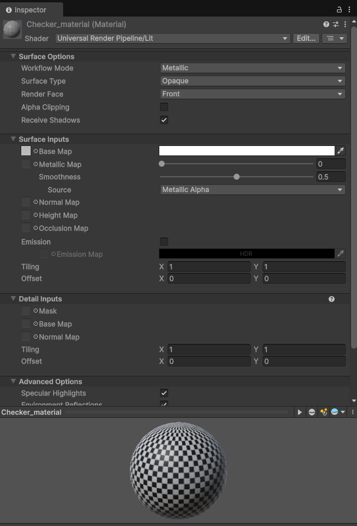
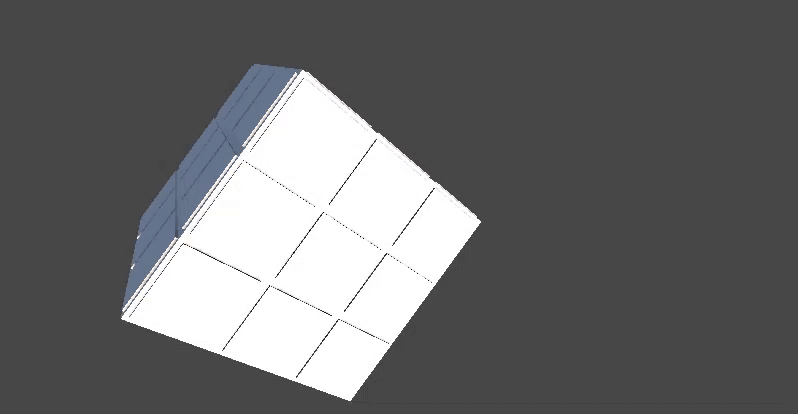
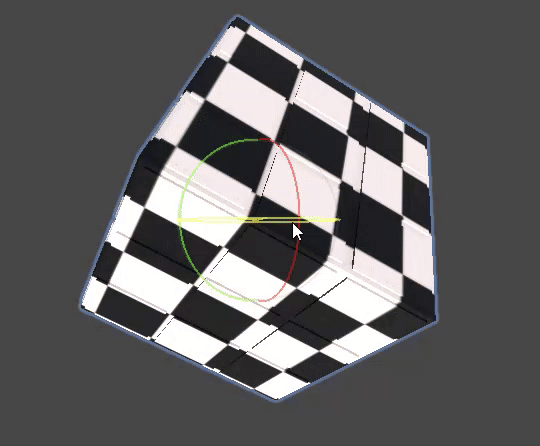

# 🧪 Taller - UV Mapping: Texturas que Encajan

## 📅 Fecha
`2025-05-23` – Fecha de realización

---

## 🎯 Objetivo del Taller

Este taller busca explorar el mapeo UV como técnica fundamental para aplicar correctamente texturas 2D sobre modelos 3D sin distorsión. El objetivo es entender cómo se proyectan las texturas y cómo se pueden ajustar las coordenadas UV para mejorar el resultado visual.

---

## 🧠 Conceptos Aprendidos

### Mapeo UV: El Plano de tu Textura en el Modelo 3D

El mapeo UV es el proceso de proyectar un patrón o plano 2D (la textura) sobre la superficie de un modelo 3D. Las letras U y V designan los ejes de este plano bidimensional, que actúa como el "molde" o "patrón" sobre el cual se despliega la geometría 3D.

Su función principal es asegurar que, al aplicar una imagen (textura) a un modelo 3D, esta se posicione correctamente en su superficie. Sin un mapeo UV adecuado, la textura podría aparecer estirada, rotada o desubicada.

La importancia del mapeo UV radica en su capacidad para permitir que los modelos 3D en videojuegos y producciones cinematográficas muestren personajes y objetos con detalles, colores, sombras y texturas realistas y visualmente atractivos, al definir con precisión la ubicación de cada píxel de la imagen sobre el modelo.

### Principales conceptos aplicados:

- [x] Mapeo UV
- [x] Coordenadas UV
- [x] Importación de modelos 3D con UV
- [x] Aplicación de texturas 2D en Unity

---

## 🔧 Herramientas y Entornos

- Unity LTS

---

## 📁 Estructura del Proyecto

```
2025-05-23_taller_uv_mapping_texturas/
├── unity/               
├── resultados/               
│   └── checker_texture_result.gif
│   └── model_view.gif
├── README.md
```

---

## 🧪 Implementación

### 🔹 Etapas realizadas

1. Búsqueda y descarga del modelo 3D en [plataformas dedicadas](https://www.cgtrader.com/free-3d-models).
2. Descarga de imagen con pátron tipo checkerboard.
3. Importación del modelo 3D a Unity.
4. Creación del material para aplicar la textura.
5. Aplicación de la textura 2D al modelo 3D.

### 🔹 Código relevante

La creación del material es la parte más compleja de realizar.



---

## 📊 Resultados Visuales

### 📌 Este taller **requiere explícitamente un GIF animado**:

#### Modelo importado en Unity



#### Aplicación de textura 2D en el modelo 3D



Para el desarrollo del taller se pedía identificar posibles errores:

1. **Textura estirada:** Al observar los cuadrados individuales del patrón de ajedrez en cada una de las caras visibles del cubo, no se aprecia un estiramiento significativo. Los cuadrados mantienen su proporción cuadrada de manera uniforme en todas las caras. No se ven alargados en una dirección específica.

2. **Textura girada:** El patrón de ajedrez está correctamente alineado con los ejes de cada cara del cubo. No hay signos de que la textura esté girada o rotada de forma incorrecta sobre la superficie del modelo.

3. **Textura mal escalada:** La escala de la textura es adecuada y legible. Los cuadrados son de un tamaño apropiado que permite ver claramente el patrón sin ser ni demasiado grandes ni excesivamente pequeños. 

    **Conclusión:**

El modelo 3D parece tener un mapeo UV correcto y bien ejecutado. No se identifican errores evidentes de textura estirada, girada o mal escalada según los criterios proporcionados. La textura de checkerboard se aplica de manera uniforme y con una escala adecuada en todas las caras visibles del cubo.

---

## 🧩 Prompts Usados

```text
Estoy trabajando en Unity. Quiero importar un modelo .OBJ o .GLTF que incluya coordenadas UV. ¿Dónde lo consigo y cómo lo importo?
```

```text
Estoy trabajando en Unity. Dado que ya tengo el modelo en formato .obj, ¿Cómo importo el modelo y que incluya coordenadas UV?
```

```text
Explícame de forma sencilla, como si tuviera 12 años, qué es mapeo UV y para qué sirve (junto con su importacia).
```

```text
Estoy trabajando en Unity. Dado que ya tengo el modelo en formato .obj, ¿Cómo aplico la textura 2D al modelo 3D?
```

## 💬 Reflexión Final

Este taller me ayudó a entender la importancia del mapeo UV en Unity. Al aplicar texturas a un modelo 3D descargado, me di cuenta de lo crucial que es que el modelo ya tenga un buen mapeo UV.

Afortunadamente, el modelo que usé no me dio problemas; la textura se aplicó correctamente y sin distorsiones. Esto me demostró que, cuando un modelo ya tiene un mapeo UV bien hecho, el proceso de texturizado en Unity es mucho más directo y el resultado es óptimo.

En resumen, el mapeo UV es esencial para que los modelos 3D en Unity luzcan realistas y detallados, uniendo la textura 2D con la forma 3D de manera coherente y sin esfuerzo extra.

---

## ✅ Checklist de Entrega

- [x] Carpeta `2025-05-23_uv_mapping_texturas`
- [x] GIF incluido con nombre descriptivo
- [x] Visualizaciones y métricas exportadas
- [x] README completo y claro
- [x] Commits descriptivos en inglés

---
