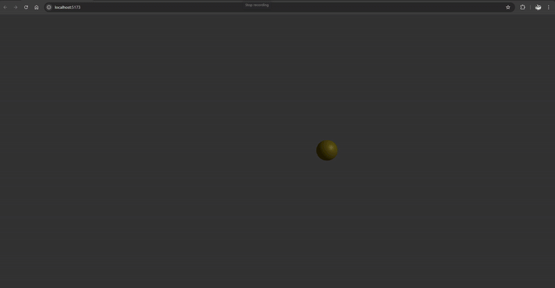
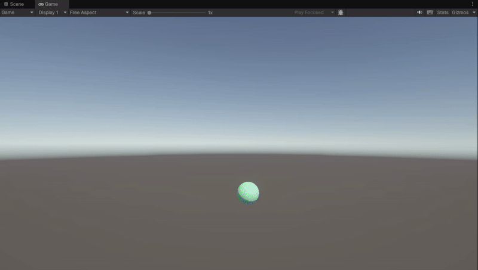
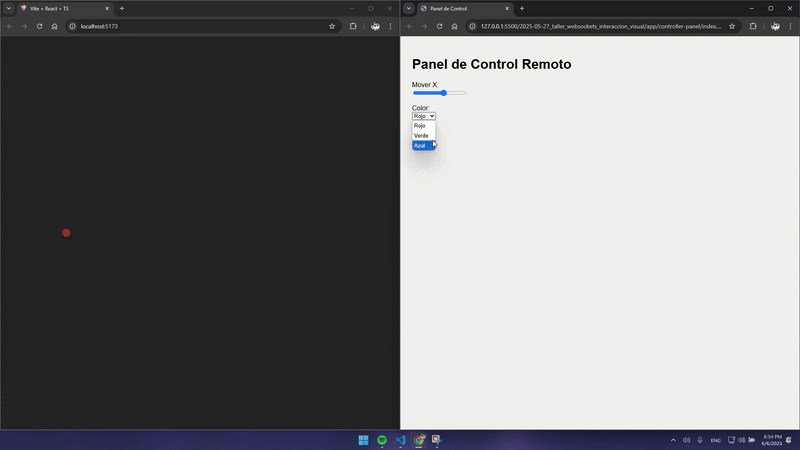

# 🧪 Taller - Dashboards Visuales 3D: Sliders y Botones para Controlar Escenas

## 📅 Fecha

`2025-05-27` – Fecha de realización

---
## 🎯 Objetivo del Taller

Comprender cómo usar WebSockets para habilitar comunicación en tiempo real entre un cliente (interfaz visual) y un servidor. El objetivo es crear una visualización gráfica que reaccione dinámicamente a datos transmitidos por WebSocket.

---

## 🧠 Conceptos Aprendidos

- [x] Websocket
- [x] HTTP
- [x] Uso de Websocket con python, JavaScript y threejs
- [x] Integración de Unity con Websockets
- [x] Uso de herramientas remota para controlar aplicaciones mediante WebSockets. Casos de uso: visualización de sensores, control remoto de escenas, múltiples usuarios en tiempo real

### ¿Qué es un Websocket?

Un WebSocket es una tecnología que permite una comunicación más eficiente y fluida entre un cliente y un servidor. En lugar de enviar cartas una y otra vez, un WebSocket establece una conexión permanente, bidireccional y en tiempo real entre el cliente y el servidor.

### Diferencia con HTTP tradicional

La conexión es persistente y solo se cierra si alguno de los involucrados (cliente o servidor) deciden cerrarla de forma explícita. En cambio, el modelo HTTP tradicional, abre una conexión nueva por cada mensaje enviado.

### ¿Para qué se usa un WebSocket?

Los WebSockets son ideales para aplicaciones que requieren actualizaciones en tiempo real y comunicación constante, como:

- Chats en vivo: Los mensajes aparecen instantáneamente para todos los participantes.
- Juegos online multijugador: Las acciones de los jugadores se sincronizan en tiempo real.
- Aplicaciones de trading financiero: Los precios de las acciones se actualizan al instante.
- Notificaciones push: El servidor puede enviar notificaciones a tu navegador sin que tú las pidas.
- Edición colaborativa: Múltiples usuarios trabajando en el mismo documento y viendo los cambios de los demás en tiempo real.
- Paneles de control o monitoreo en vivo: Gráficos que se actualizan con datos en tiempo real.


---

## 🔧 Herramientas y Entornos

- Python: `websockets`, `asyncio`
- Threejs
- Unity

---

## 📁 Estructura del Proyecto

```
2025-05-27_taller_websockets_interaccion_visual
├── app/
│   └── controller-panel/
│       └── index.html
│       └── script.js
│       └── style.css
│   └── python/
│       └── server.py
│   └── threejs/
├── python/
│   └── server.py
├── results/
│   └── app_result.py
│   └── threejs_socket_result.py
│   └── unity_socket_result.py
├── threejs/
├── unity/
│   └── Assets/
│   └── ProjectSettings/
│   └── Packages/
├── README.md
```
---

## 🧪 Implementación

### 🔹 Etapas realizadas

1. En primer lugar, se creó un servidor WebSocket que envía datos en tiempo real.
2. Posteriormente, se creo una escena en threejs con una esfera, la cual cambia sus características (posición y color) según los datos que envía el servidor.
3. Además, se implementó el mismo concepto en Unity haciendo uso de la libreria `NativeWebSocket`.
4. Finalmente, se creó un panel de control externo (HTML) para mover elementos en una escena 3D.

### 🔹 Código relevante

#### Python Websocket

```python
async def handler(websocket):
    # Registrar nuevo cliente
    connected_clients.add(websocket)
    print("Cliente conectado:", websocket.remote_address)
    try:
        async for message in websocket:
            # Cuando se recibe un mensaje, reenviarlo a todos (broadcast)
            for client in connected_clients:
                if client != websocket:  # Opcional: no reenviarse a sí mismo
                    await client.send(message)
    except websockets.exceptions.ConnectionClosed:
        print("Cliente desconectado:", websocket.remote_address)
    finally:
        connected_clients.remove(websocket)

async def main():
    print("Servidor WebSocket iniciado en ws://localhost:8765")
    async with websockets.serve(handler, "localhost", 8765):
        await asyncio.Future()

asyncio.run(main())
```

#### Script del controlador HTML

```JavaScript
const ws = new WebSocket("ws://localhost:8765");

const xSlider = document.getElementById("xSlider");
const colorSelect = document.getElementById("colorSelect");

function sendUpdate() {
  const message = {
    x: parseFloat(xSlider.value),
    color: colorSelect.value
  };
  ws.send(JSON.stringify(message));
}

xSlider.addEventListener("input", sendUpdate);
colorSelect.addEventListener("change", sendUpdate);

ws.onopen = () => {
  console.log("Conectado al servidor WebSocket");
};

ws.onerror = (err) => {
  console.error("WebSocket error:", err);
};
```
#### Escena threejs

```JavaScript
export default function App() {
  const [position, setPosition] = useState<[number, number, number]>([0, 0, 0]);
  const [color, setColor] = useState("#ff0000");

  useEffect(() => {
    const socket = new WebSocket("ws://localhost:8765");

    socket.onmessage = (event) => {
      try {
        const data: MessageData = JSON.parse(event.data);
        setPosition([data.x, 0, 0]);
        setColor(data.color);
      } catch (err) {
        console.error("Error parsing message", err);
      }
    };

    socket.onopen = () => console.log("WebSocket conectado");
    socket.onerror = (err) => console.error("WebSocket error", err);

    return () => {
      socket.close();
    };
  }, []);

  return (
    <Canvas camera={{ position: [0, 0, 10] }}>
      <ambientLight />
      <pointLight position={[10, 10, 10]} />
      <Sphere position={position} color={color} />
      <OrbitControls />
    </Canvas>
  );
}
```


## 📊 Resultados Visuales
Los resultados obtenidos se pueden ver a continuación: 

### Threejs conectado a websocket



### Unity conectado a websocket



### Panel de control externo (HTML) para mover elementos en una escena 3D



---

## 🧩 Prompts Usados

Se realiza la siguiente consulta a la IA Grok:

```text
Explicame de forma simple qué es un websocket y cómo funciona
```

```text
Explicame de forma simple qué es un websocket y cómo funciona
```

```text
Este es mi codigo en Python. Quiero que lo modifiques para que se genere un color aleatorio usando random, y no una lista de alternativas.
[Código de WebSocket]
```

```text
Estoy trabajando en Unity. Genera una guía paso a paso para usar la librería como NativeWebSocket para conectar el websocket creado en python.
```

```text
Estoy trabajando en Threejs. Quiero generar una escena que sea controlada de forma externa (HTML), así que además de la escena, quiero una página para controlar la esfera en la escena Threejs.
```

```text
Este es mi codigo de mi proyecto de Threejs. Quiero que lo modifiques para que la escena tenga más luces y la esfera se vea con la profundidad necesaria para que se vea como una esfera y no como un circulo.
[Código de Escena_3D]
```

---

## 💬 Reflexión Final

Este taller sobre WebSockets ha sido una revelación, mostrando el verdadero poder de la comunicación en tiempo real. Con WebSockets, la información fluye bidireccionalmente, creando experiencias visuales que reaccionan al instante.

Montar el servidor Python y ver cómo enviaba datos cada medio segundo fue fascinante. Pero la magia realmente sucedió al conectar eso con Three.js y React Three Fiber en el navegador. Observar cómo un simple objeto 3D cambiaba de posición y color en tiempo real, me abrió los ojos al potencial de la interactividad dinámica.

Claro, hubo sus pequeños desafíos como asegurarse de que todo se sincronizara bien y depurar la comunicación entre Python y JavaScript, pero cada uno fue un aprendizaje valioso. Más allá de mover cubos, el taller me hizo pensar en aplicaciones reales: desde monitorear señales cardíacas hasta controlar robots remotamente.

Las posibilidades son enormes: paneles de control que se actualizan al segundo, juegos multiusuario o herramientas de visualización de datos en vivo. En definitiva, este taller no solo me dio las herramientas técnicas para usar WebSockets, sino que también me hizo ver cómo pueden transformar radicalmente la interacción visual en tiempo real.
