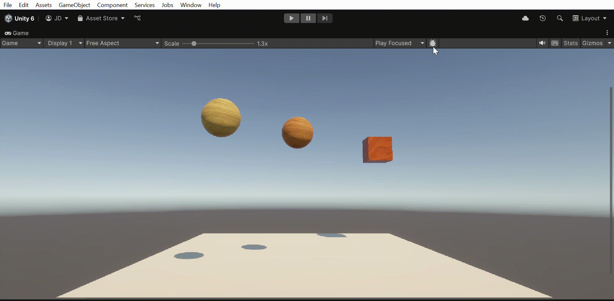

# 🧪 Taller - Colisiones y Partículas: Reacciones Visuales Interactivas

## 📅 Fecha
`2025-06-06` 

---

## 🎯 Objetivo del Taller

Aprender a usar Colliders para detectar colisiones entre objetos y disparar efectos visuales con partículas al momento de una interacción. Este taller permitirá a los estudiantes entender el sistema de físicas de Unity y cómo integrarlo con efectos gráficos simples.

---

## 🧠 Conceptos Aprendidos

Lista los principales conceptos aplicados:

- [x] Manipulación de colliders en Unity
- [x] Configuración y utilización de ParticleSystem en Unity
- [x] Uso de OnCollisionEnter y de IsTrigger
- [x] Ejecución de efectos activados por colisiones

---

## 🔧 Herramientas y Entornos

- Unity Editor
- Rigidbody y Colliders
- Particle System
- Script en C# para detección de colisiones

---

## 📁 Estructura del Proyecto

```
2025-06-06_taller_colisiones_y_particulas/
├── unity/               
├── resultados/                
├── README.md
```

---

## 🧪 Implementación

### 🔹 Etapas realizadas
1. Preparación de elementos: 
  1.1. Se crearon los objetos de la escena, en este caso un plano para el suelo, y dos esferas y un cubo suspendidos a mayor altura.
  1.2. A las esferas y el cubo se les añade un componente "Rigidbody" que activa las físicas de Unity para que los objetos caigan sobre el plano.
  1.3. En el caso del cubo se activa la opción IsTrigger, de forma que el cubo no se detiene sino que atraviesa el plano, mientras que las esferas reposan sobre él.
  1.4. También se añaden colores y texturas a los materiales de los objetos para una estética más agradabe.
2. Creación de sistemas de particulas:
  2.1. Se crean tres objetos de ParticleSystem, uno para cada objeto en la escena, y se modifican asignandoles el color de cada objeto y variando entre las formas de animación (Spheric, Sprite, Rectangle). Además se configuran aspectos cómo el tamaño de las particulas, el tiempo de inicio, etc. 
3. Configuración de scripts:
  3.1. Se crea el script de C# dónde se crea un efecto de tipo ParticleSystem y haciendo uso de OnCollisionEnter lo programamos para que al colisionar, el sistema de partículas se mueva al punto de colisión y se active.
  3.2. En cada objeto se añade el componente del script, y se le asocian cómo parámetros los sistemas de partículas creados anteriormente.
4. Adición de otros efectos asociados a la colisión: Finalmente, se añaden fuentes de sonido y se modifica el script para que estos también se reproduzcan al colisionar.

### 🔹 Código relevante


```C#
public class ColisionParticulas : MonoBehaviour
{
    public ParticleSystem efecto;
    public AudioSource sonido;
    
    private void OnCollisionEnter(Collision collision)
    {
        if (efecto != null)
        {
            efecto.transform.position = collision.contacts[0].point;
            efecto.Play();
            if (sonido != null) sonido.Play();
        }
    }
}

public class ColisionParticulas2 : MonoBehaviour
{
    public ParticleSystem efecto;
    public AudioSource sonido;
    
    private void OnTriggerEnter(Collider other)
    {
        if (efecto != null)
        {
            efecto.transform.position = transform.position;
            efecto.Play();
            if (sonido != null) sonido.Play();
        }
    }
}
```

---

## 📊 Resultados Visuales





---

## 🧩 Prompts Usados


```text
"Crea un script de C# que active un ParticleSystem a través de un OnIsTrigger"
```

---

## 💬 Reflexión Final

Este taller dió herramientas para aprender con un ejemplo simple y práctico lo que son los colliders. Gracias al taller se puede entender que los colliders son una propiedad de los objetos que basados en la posición permiten identificar "colisiones", es decir, verifican cuando la posición de algún objeto coincide con la del collider, de manera que se pueden activar efectos cuando ocurre esto, permitiendo jugar con las físicas del juego o las colisiones entre objetos para dar una sensación más realista de la animación.


---

## ✅ Checklist de Entrega

- [x] Carpeta `2025-06-06_taller_particulas_y_colisiones`
- [x] Código limpio y funcional
- [x] GIF incluido con nombre descriptivo (si el taller lo requiere)
- [x] Visualizaciones o métricas exportadas
- [x] README completo y claro
- [x] Commits descriptivos en inglés

---