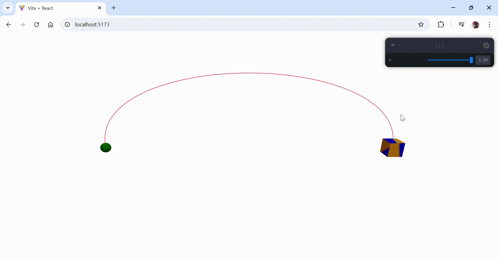
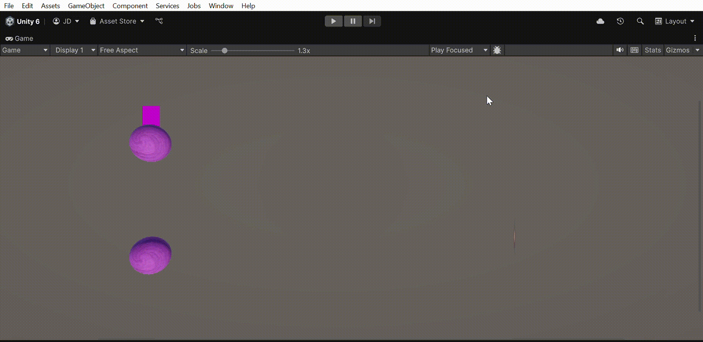

# 🧪 Taller - Interpolación de Movimiento: Suavizando Animaciones en Tiempo Real

## 📅 Fecha
`2025-06-06` 

---

## 🎯 Objetivo del Taller

Implementar técnicas de interpolación (LERP, SLERP, Bézier) para crear animaciones suaves y naturales en objetos 3D. El objetivo es controlar el paso del tiempo y la transición entre estados con efectos realistas como aceleración, desaceleración o movimientos curvos.

---

## 🧠 Conceptos Aprendidos

Lista los principales conceptos aplicados:

- [x] Creación de animaciones con movimiento de los objetos
- [x] Utilización de interpolación para movimientos curvos
- [x] Creación de animaciones que responden a controles de interfaz

---

## 🔧 Herramientas y Entornos

- Unity Editor
- Threejs
- Script en C# para interpolacions

---

## 📁 Estructura del Proyecto

```
2025-06-06_taller_interpolacion_movimiento_animaciones/
├── unity/   
├── threejs/               
├── resultados/                
├── README.md
```

---

## 🧪 Implementación

### 🔹 Etapas realizadas
1. Preparación de elementos: 
  1.1. En Unity, se crearon dos puntos de referencia (esferas) y un objeto principal (cubo) que debía moverse entre ellos. Estos elementos se ubicaron en el espacio 3D de forma visible y se añadieron materiales de diferentes colores para distinguirlos fácilmente.
  1.2. En Three.js, se replicó la escena usando un canvas de React Three Fiber. Se definieron tres puntos (start, end y mesh), con geometrías básicas (SphereGeometry y BoxGeometry) y materiales MeshStandardMaterial con colores planos.
  1.3. Se agregó una fuente de luz (<ambientLight> y <directionalLight>) para dar visibilidad a los objetos dentro del espacio. 
2. Interpolación de movimiento:
  2.1. En Unity, se empleó la función Vector3.Lerp(start, end, t) dentro de un script en C#, donde t variaba en el tiempo con Time.deltaTime o mediante un slider. Esto generaba un desplazamiento lineal del cubo entre los dos puntos.
  2.2. En Three.js, se implementó la interpolación utilizando THREE.Vector3().lerpVectors(start, end, t), calculando una nueva posición en cada frame usando useFrame de React Three Fiber. El valor t fue controlado con una interfaz interactiva creada con leva. 
3. Interpolación de rotación:
  3.1. En Unity, se utilizó Quaternion.Slerp() para interpolar suavemente la rotación del cubo a medida que se movía, haciendo que su orientación se adaptara a la dirección del movimiento.
  3.2. En Three.js, se replicó el comportamiento creando un Quaternion de destino en cada frame con Quaternion.setFromUnitVectors() según la dirección del desplazamiento. Luego, se aplicó quaternion.slerp() para una transición suave de la orientación del objeto.
4. Visualización del trayecto:
  4.1. En Unity, se utilizaron líneas visuales (Gizmos) para mostrar el camino interpolado, y se probaron variantes con curvas (por ejemplo, interpolación Bézier usando puntos de control).
  4.2. En Three.js, se construyó una curva Bézier (THREE.QuadraticBezierCurve3) entre los dos puntos, añadiendo puntos de control desplazados en el eje Y. Esta curva se renderizó usando <Line> y se probó mover el cubo tanto con interpolación lineal como a lo largo de la curva.
5. Interfaz y control del tiempo de interpolación:  
  5.1. En ambas plataformas se permitió controlar manualmente el parámetro t (de 0 a 1) para observar el movimiento cuadro a cuadro. En Unity se implementó con un Slider en la interfaz; en Three.js, con el panel de control leva, permitiendo variar t en tiempo real.
6. Comparación de trayectorias:
  Finalmente, se implementó la comparación visual entre interpolación lineal (trayecto recto) y curva (trayecto Bézier), evidenciando cómo varía la posición y orientación del objeto según el tipo de interpolación utilizado. Esta comparación fue útil para entender cómo elegir el tipo de interpolación según el comportamiento deseado en animaciones.

### 🔹 Código relevante


```C#
 private float tiempo;
    private bool enMovimiento = true;

    void Update()
    {
        if (!enMovimiento) return;

        tiempo += Time.deltaTime / duracion;
        float t = curvaMovimiento.Evaluate(Mathf.Clamp01(tiempo));

        if (usarBezier)
        {
            Vector3 puntoMedio = (puntoInicio.position + puntoFinal.position) / 2 + Vector3.up * 5;
            transform.position = Bezier(puntoInicio.position, puntoMedio, puntoFinal.position, t);
        }
        else
        {
            transform.position = Vector3.Lerp(puntoInicio.position, puntoFinal.position, t);
        }

        Quaternion rotInicial = Quaternion.LookRotation(Vector3.right);
        Quaternion rotFinal = Quaternion.LookRotation(Vector3.left);
        transform.rotation = Quaternion.Slerp(rotInicial, rotFinal, t);
    }
```

```JSX
function BezierLine({ start, end }) {
  const control1 = start.clone().add(new THREE.Vector3(0, 2, 0))
  const control2 = end.clone().add(new THREE.Vector3(0, 2, 0))
  const curve = new THREE.CubicBezierCurve3(start, control1, control2, end)
  const points = curve.getPoints(50)
  const geometry = new THREE.BufferGeometry().setFromPoints(points)

  return (
    <line geometry={geometry}>
      <lineBasicMaterial color="red" />
    </line>
  )
}
```

---

## 📊 Resultados Visuales






---

## 🧩 Prompts Usados


```text
"Crea un script de C# que realice una movimiento de curva de Bézier en un objeto"
"Crea un script de Threejs que realice una movimiento de curva de Bézier en un objeto"
```

---

## 💬 Reflexión Final

Este taller dio herramientas para aprender con un ejemplo simple y práctico qué es la interpolación de movimiento en animaciones. Gracias al taller se puede entender que la interpolación permite mover un objeto suavemente entre dos puntos o estados, variando su posición y rotación en función de un valor intermedio (t) que va de 0 a 1. Esto permite crear animaciones más realistas y controladas, evitando saltos bruscos en el movimiento. Además, al comparar interpolación lineal con trayectorias curvas como las Bézier, se evidenció cómo se puede personalizar el recorrido y comportamiento del objeto según el tipo de interpolación usado, enriqueciendo la experiencia visual y dinámica en una escena.


---

## ✅ Checklist de Entrega

- [x] Carpeta `2025-06-06_taller_interpolacion_movimiento_animaciones`
- [x] Código limpio y funcional
- [x] GIF incluido con nombre descriptivo (si el taller lo requiere)
- [x] Visualizaciones o métricas exportadas
- [x] README completo y claro
- [x] Commits descriptivos en inglés

---