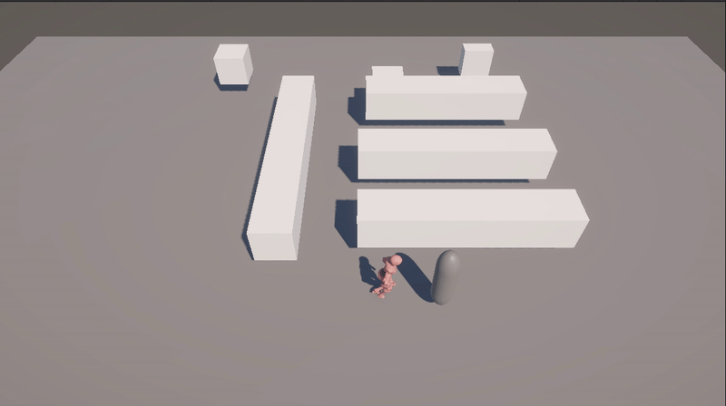
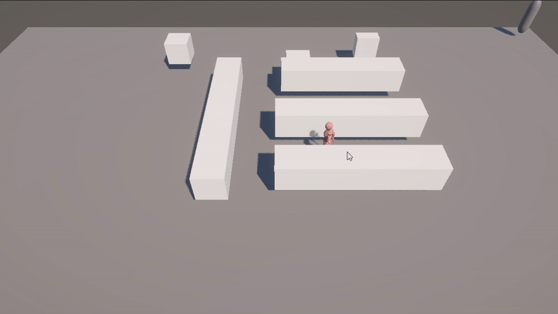
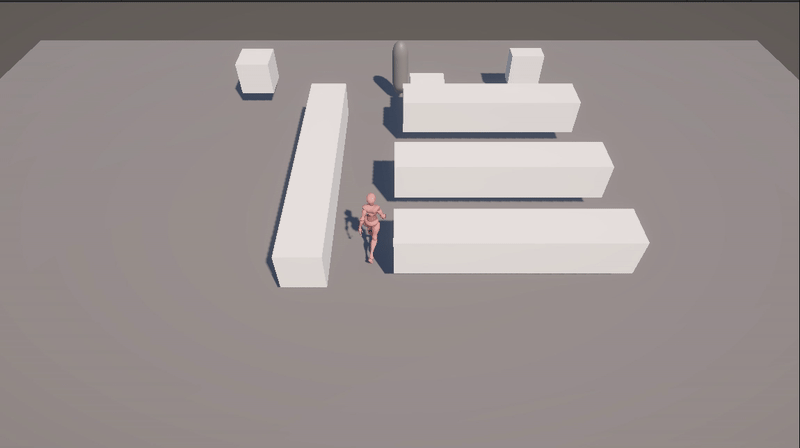
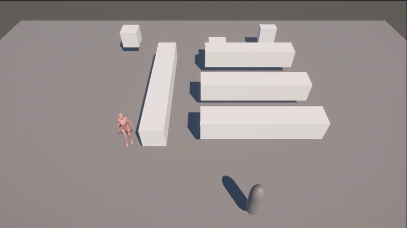

# 🧪 Taller - Animación con AI en Unity para personajes autónomos

## 📅 Fecha

`2025-06-20` – Fecha de realización

---
## 🎯 Objetivo del Taller

Explorar técnicas básicas para implementar comportamientos autónomos en personajes dentro de Unity, utilizando componentes de inteligencia artificial como sistemas de navegación, detección de obstáculos, decisiones reactivas y control de animaciones en tiempo real. Este proyecto implementa un personaje no jugable (NPC) con comportamientos autónomos dentro de Unity. Se integran técnicas básicas de IA como navegación con NavMesh, detección del jugador, transiciones entre estados y control de animaciones con el sistema de Animator.

---

## 🧠 Conceptos Aprendidos

### ¿Qué es la IA para NPCs en videojuegos?
La inteligencia artificial para NPCs (Non-Playable Characters) permite dotar a los personajes no jugables de comportamientos autónomos y creíbles, simulando toma de decisiones y reacciones ante el entorno o el jugador.

Este taller me permitió explorar varios componentes clave de este tipo de IA en Unity:

- [x] NavMesh y NavMeshAgent: para navegación autónoma en un entorno con obstáculos, usando una malla de navegación que define zonas transitables.

- [x] Máquinas de Estados (State Machines): para alternar entre comportamientos como patrullar, perseguir, quedarse quieto o buscar, dependiendo de estímulos del entorno.

- [x] Animator Controller: para vincular los estados lógicos con animaciones, como Idle, Walk, Run y Buscar, usando condiciones basadas en variables como la velocidad.

- [x] Detección por Triggers: para permitir que el personaje "note" al jugador usando colliders con IsTrigger.

- [x] Sincronización entre lógica y animación: aplicando la magnitud de la velocidad del agente de navegación para decidir qué animación mostrar.

- [x] Transiciones reactivas: como correr si el jugador es detectado o detenerse si se está cerca, cambiando el comportamiento y la animación en tiempo real.

- [x] Estados intermedios personalizados: como el estado de "Buscar", que añade realismo cuando el personaje pierde de vista al jugador.

Este enfoque me enseñó a coordinar el movimiento lógico con animaciones visuales, y a implementar un flujo de IA reactiva simple pero funcional en un personaje 3D.


---

## 🔧 Herramientas y Entornos

- Mixamo (Descarga de modelos y animaciones)
- Unity

---

## 📁 Estructura del Proyecto

```
2025-06-20_taller_animacion_ai_unity/
├── Results/
├── Scenes/
├── Scripts/
├── Unity/ # Proyecto para usar
├── README.md
```
---

## 🧪 Implementación

### 🎮 Movimiento del Jugador

Para el jugador, se utilizó una cápsula controlada con teclado mediante el componente CharacterController, permitiendo un movimiento simple y responsivo sin usar físicas complejas como Rigidbody.

```C#
public class MovimientoJugador : MonoBehaviour
{
    public float velocidad = 5f;
    private CharacterController controller;

    void Start()
    {
        controller = GetComponent<CharacterController>();
    }

    void Update()
    {
        float h = Input.GetAxis("Horizontal");
        float v = Input.GetAxis("Vertical");

        Vector3 direccion = new Vector3(h, 0, v).normalized;

        if (direccion.magnitude >= 0.1f)
        {
            controller.Move(direccion * velocidad * Time.deltaTime);
        }
    }
}
```

### 🧭 Movimiento Autónomo del Patrullero

El patrullero fue implementado como un NPC con inteligencia artificial básica usando NavMeshAgent. Este se mueve entre puntos predefinidos, persigue al jugador si lo detecta, y reacciona ante su desaparición con un comportamiento de "búsqueda".

```C#
private NavMeshAgent agent;
private Animator animator;
private Transform jugador;
private bool persiguiendo = false;
private bool buscando = false;
```

En `Start()`, se inicializa el patrullaje:

```C#
agent = GetComponent<NavMeshAgent>();
animator = GetComponent<Animator>();
agent.speed = 0.8f; // velocidad de patrullaje

if (puntos.Length > 0)
    agent.SetDestination(puntos[0].position);
```

### 👁️ Detección y Transición entre Estados

Se usan `OnTriggerEnter` y `OnTriggerExit` para detectar al jugador y cambiar el comportamiento del patrullero:

```C#
void OnTriggerEnter(Collider other)
{
    if (other.CompareTag("Player"))
    {
        jugador = other.transform;
        persiguiendo = true;
        buscando = false;
    }
}

void OnTriggerExit(Collider other)
{
    if (other.CompareTag("Player"))
    {
        jugador = null;
        persiguiendo = false;
        buscando = true;
        temporizadorBusqueda = 0f;

        agent.ResetPath();
        animator.SetTrigger("buscar");
    }
}
```

### 🎬 Control de Animaciones 

Se usa un `Animator Controller` con parámetros como `velocidad` y `buscar`. Las transiciones entre `Idle`, `Walk`, `Run` y `Buscar` están basadas en la magnitud de la velocidad o activadores (`Trigger`).

```C#
// En Update, siempre se sincroniza con la velocidad del agente:
animator.SetFloat("velocidad", agent.velocity.magnitude);
```

Transiciones creadas en Animator:

`Idle → Walk` si `velocidad > 0.1`

`Walk → Run` si `velocidad > 2`

`Any State → Buscar` si se activa el trigger `buscar`

### 🔁 Patrullaje y Persecución

El NPC alterna entre patrullar o perseguir según la presencia del jugador:

```C#
if (persiguiendo && jugador != null)
{
    float distancia = Vector3.Distance(transform.position, jugador.position);
    
    if (distancia > distanciaDetencion)
    {
        ultimaPosicionJugador = jugador.position;
        agent.SetDestination(jugador.position);
        agent.speed = 3.1f; // velocidad al correr
    }
    else
    {
        agent.ResetPath(); // se detiene si ya está cerca
        agent.speed = 0f;
    }
}
else if (!agent.pathPending && agent.remainingDistance < 0.5f)
{
    index = (index + 1) % puntos.Length;
    agent.SetDestination(puntos[index].position);
    agent.speed = 0.8f;
}
```

### 🔍 Estado "Buscar" cuando se pierde al jugador

Cuando el jugador desaparece del rango, el NPC entra en estado buscar por 3 segundos antes de retomar su patrullaje:

```C#
if (buscando)
{
    temporizadorBusqueda += Time.deltaTime;
    bool animacionTerminada = !animator.GetCurrentAnimatorStateInfo(0).IsName("Search");

    if (temporizadorBusqueda >= tiempoBusqueda && animacionTerminada)
    {
        buscando = false;
        agent.speed = 0.8f;
        index = (index + 1) % puntos.Length;
        agent.SetDestination(puntos[index].position);
    }

    return;
}
```


## 📊 Resultados Visuales

Para esta práctica, se solicitó de manera obligatoria los GIFs de los estados del modo IA:

### Personaje estático (Idle)



### Patrullando



### Persiguiendo al jugador



### Realizando la animación de búsqueda



---

## 🧩 Prompts Usados

Se realizan las siguientes consultas a la IA ChatGPT durante el desarrollo del patrullaje y comportamiento autónomo en Unity:

```text
Estoy trabajando en Unity con NavMesh. ¿Cómo puedo hacer que un personaje patrulle automáticamente entre varios puntos usando NavMeshAgent?
```

```text
Estoy usando un modelo de Mixamo en Unity. ¿Qué debo hacer para conectar sus animaciones a un Animator Controller y activar animaciones como Idle, Walk y Run según la velocidad del personaje?
```

```text
Quiero que un personaje patrullero en Unity persiga al jugador cuando entra en un área de detección. ¿Cómo uso OnTriggerEnter y NavMeshAgent para cambiar su comportamiento dinámicamente?
```

```text
Estoy implementando IA en Unity. ¿Cómo puedo crear una máquina de estados sencilla en C# que permita a un personaje patrullar, perseguir al jugador y buscarlo si lo pierde de vista?
```

```text
Cuando el jugador sale del área de detección, quiero que el NPC active una animación de búsqueda y se mueva a la última posición donde lo vio. ¿Cómo lo hago en Unity?
```

```text
¿Cómo puedo evitar que un personaje controlado por teclado atraviese paredes en Unity, usando CharacterController y colisionadores correctamente?
```

```text
Estoy usando Animator en Unity. ¿Cómo configuro las transiciones entre Idle, Walk y Run en base a una variable flotante "velocidad" que cambio desde código?
```

---

## 💬 Reflexión Final

Este taller me permitió comprender de forma práctica cómo se integran distintos componentes de Unity para crear un personaje autónomo con comportamientos realistas. A lo largo del desarrollo, implementé un flujo completo de IA reactiva: desde estados pasivos como Idle hasta respuestas dinámicas como Persecución y Búsqueda. El uso del NavMeshAgent facilitó un movimiento inteligente que evita obstáculos, mientras que el Animator permitió reflejar visualmente los estados internos del NPC, adaptando su animación a la velocidad o situación.

Una de las experiencias más valiosas fue ver cómo los sistemas de navegación, detección por colisión y control de animaciones se combinan armónicamente mediante una máquina de estados sencilla en el script. La implementación de un estado intermedio de búsqueda —en el que el personaje se dirige a la última posición conocida del jugador antes de retomar su patrullaje— añadió un toque de realismo, mostrando cómo un agente puede "recordar" y actuar con cierto nivel de lógica.

En definitiva, esta práctica fortaleció mi comprensión sobre la inteligencia artificial aplicada a videojuegos, tanto desde la lógica de comportamiento como desde su representación visual. Me deja preparado para afrontar diseños de NPCs más complejos en futuros proyectos.
