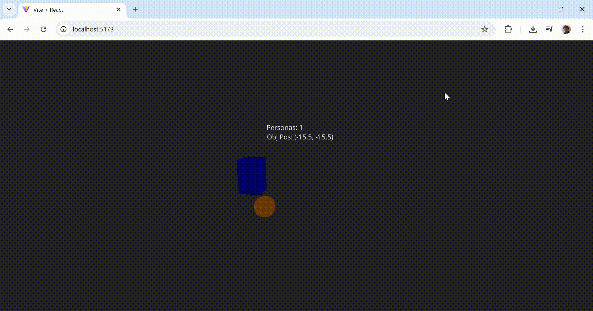

# 🧪 Taller - Creando un Monitor de Actividad Visual en 3D

## 📅 Fecha
`2025-06-20` 

---

## 🎯 Objetivo del Taller

Diseñar una escena 3D interactiva que se adapte en tiempo real según los datos provenientes de un sistema de visión por computador. La escena debe responder visualmente (cambiando color, escala o posición de objetos) en función de métricas detectadas, simulando así un sistema de vigilancia, arte generativo reactivo o interfaz inteligente.

---

## 🧠 Conceptos Aprendidos

- [x] Uso de websockets para transmitir datos desde pythom
- [x] Conexión por websockets a un proyecto Threejs
- [x] Realización de gráficos en Threejs que se actualizan con datos en tiempo real

---

## 🔧 Herramientas y Entornos

Especifica los entornos usados:

- Python + OpenCV/YOLO
- Three.js

---

## 📁 Estructura del Proyecto

```
2025-06-20_taller_monitor_visual_3d_integracion_python/
├── python/               
├── threejs/                
├── resultados/     
├── README.md
```

---

## 🧪 Implementación

### 🔹 Etapas realizadas
Diseño de la Arquitectura de Comunicación:

1. Se definió una arquitectura de tres capas:
    - Capa de Simulación/Datos: Python (Generador de datos).
    - Capa Intermedia/Comunicación: Node.js (Puente TCP a WebSocket).
    - Capa de Visualización: React Three Fiber (Frontend 3D).
    - Se establecieron los protocolos de comunicación: Socket TCP entre Python y Node.js, y WebSocket entre Node.js y React.
2. Configuración del Entorno de Desarrollo:
    - Python: Instalación de librerías como socket, json, time, numpy, random.
    - Node.js: Inicialización de un proyecto Node.js y adición de dependencias como ws (para WebSockets) y net (para sockets TCP).
    - React: Creación de un proyecto React utilizando Vite, y adición de librerías React Three Fiber (@react-three/fiber) y Drei (@react-three/drei) para facilitar el desarrollo 3D.
3. Desarrollo del Backend de Datos (Python):
- Se implementó un script Python que actúa como un servidor TCP de sockets.
- Este script simula la generación de datos en tiempo real (ej. num_people, object_position) y los empaqueta en formato JSON.
- Los datos JSON se envían a través del socket TCP, utilizando un carácter de nueva línea (\n) como delimitador de mensajes para facilitar el parseo en el lado del receptor.
4. Implementación del Servidor Intermediario (Node.js):
- Se desarrolló un servidor Node.js que funciona como un cliente TCP para conectarse al script de Python.
- Paralelamente, este servidor Node.js también actúa como un servidor WebSocket, escuchando conexiones entrantes desde el navegador (frontend).
- La función principal de Node.js es leer los datos JSON del socket TCP (desde Python), parsearlos, y retransmitirlos a todos los clientes WebSocket conectados, cerrando el puente de comunicación.
- Se incluyó lógica de reintento de conexión para manejar desconexiones con Python de manera robusta.
5. Construcción del Frontend 3D (React Three Fiber):
- Se creó un componente principal App.jsx que define la escena 3D utilizando <Canvas>.
- Se implementó un componente WebSocketManager para encapsular la lógica de conexión y recepción de datos desde el servidor WebSocket de Node.js. Este componente gestiona el estado de los datos y los pasa a sus componentes hijos.
- Se desarrollaron componentes 3D reactivos (ej., ReactiveBox, ReactiveSphere, ReactiveText) que reciben los datos del WebSocketManager y utilizan useFrame para actualizar dinámicamente sus propiedades (posición, escala, color, texto) en la escena 3D en función de los datos recibidos.
- Se incorporaron OrbitControls de Drei para permitir la navegación interactiva del usuario dentro de la escena 3D.

### 🔹 Código relevante

```python
while True:
            num_people = random.randint(0, 10)

            move_speed = 1.0 + random.uniform(-0.5, 0.5) 
            current_x += direction_x * move_speed
            current_y += direction_y * move_speed

            if current_x > max_coord or current_x < min_coord:
                direction_x *= -1
                current_x = max(min_coord, min(max_coord, current_x)) 

            if current_y > max_coord or current_y < min_coord:
                direction_y *= -1
                current_y = max(min_coord, min(max_coord, current_y)) 

            data_to_send = {
                "num_people": num_people,
                "object_position": {
                    "x": round(current_x, 2),
                    "y": round(current_y, 2),
                    "z": 0.0 #
                },
                "timestamp": time.strftime("%H:%M:%S")
            }

            json_data = json.dumps(data_to_send)
            message = (json_data + '\n').encode('utf-8')

            conn.sendall(message)
            print(f"Enviado: {json_data}")

            time.sleep(0.5) 
```

```javascript
pythonClient.on('data', (data) => {
    messageBuffer += data.toString('utf-8');
    let messages = messageBuffer.split('\n');
    messageBuffer = messages.pop(); 

    messages.forEach(message => {
        if (message.trim()) {
            try {
                const parsedData = JSON.parse(message);
                
                wss.clients.forEach(client => {
                    if (client.readyState === WebSocket.OPEN) {
                        client.send(JSON.stringify(parsedData));
                    }
                });
            } catch (e) {
                console.error('Error parseando JSON de Python:', e, 'Mensaje:', message);
            }
        }
    });
});
```

---

## 📊 Resultados Visuales



---

## 🧩 Prompts Usados

Enumera los prompts utilizados:

```text
"Crea un servidor de Python que envíe datos a través de websockets"
```

---

## 💬 Reflexión Final

Este taller demostró la viabilidad de establecer una comunicación en tiempo real entre entornos de software distintos, permitiendo la visualización de datos dinámicos en una aplicación 3D basada en web.

La actividad ilustró que la representación de datos no requiere que la fuente de dichos datos resida en el mismo entorno de visualización. Lenguajes como Python, optimizados para el procesamiento y la simulación de datos, pueden funcionar como generadores de información, mientras que plataformas como Three.js, a través de React Three Fiber, proveen capacidades avanzadas para la renderización 3D interactiva en el navegador.

La tecnología fundamental que facilitó esta interconexión fue el uso de WebSockets. A diferencia de los protocolos de solicitud-respuesta como HTTP, los WebSockets establecen un canal de comunicación persistente y bidireccional. Esto permite que los datos fluyan de manera continua y en tiempo real desde el servidor (en este caso, un intermediario Node.js que procesa la entrada de Python) hacia el cliente (la aplicación React Three Fiber en el navegador), y viceversa si fuera necesario.

---

## ✅ Checklist de Entrega

- [x] Carpeta `YYYY-MM-DD_nombre_taller`
- [x] Código limpio y funcional
- [x] GIF incluido con nombre descriptivo (si el taller lo requiere)
- [x] Visualizaciones o métricas exportadas
- [x] README completo y claro
- [x] Commits descriptivos en inglés

---
