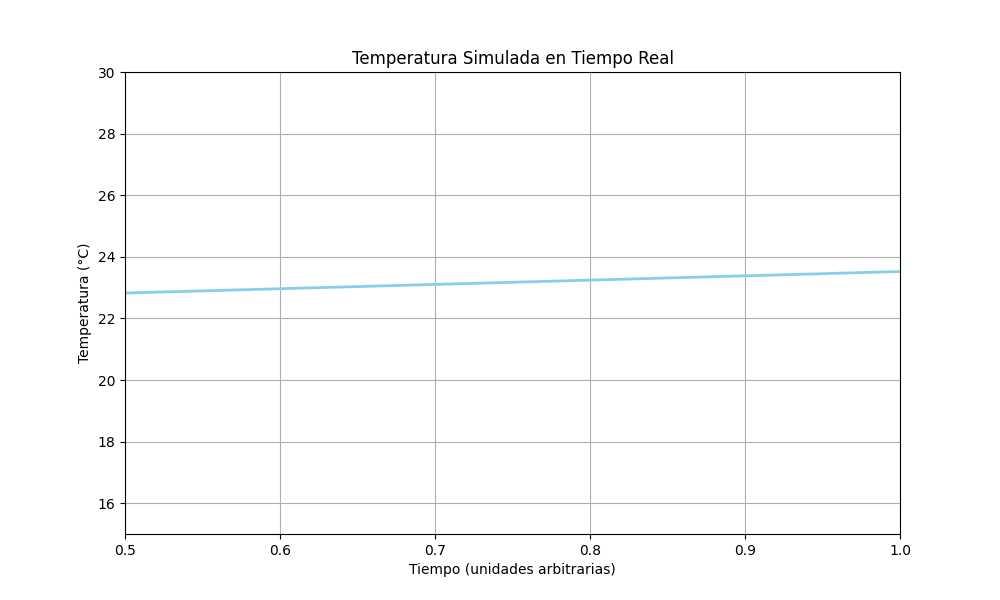

# 🧪 Taller - Visualización de Datos en Tiempo Real: Gráficas en Movimiento

## 📅 Fecha
`2025-06-20` 

---

## 🎯 Objetivo del Taller

Capturar o simular datos (por ejemplo, conteo de objetos, coordenadas, temperatura, pulsos o señales artificiales) y visualizarlos en tiempo real mediante gráficos dinámicos. Se busca explorar cómo enlazar datos numéricos con representaciones gráficas actualizadas en vivo, útiles en monitoreo, visualización científica y dashboards.


---

## 🧠 Conceptos Aprendidos

Lista los principales conceptos aplicados:

- [x] Generación de datos para simulación
- [x] Creación de gráficas con datos en tiempo real con matplotlib
- [x] Exportación de gráficas en png

---

## 🔧 Herramientas y Entornos

Especifica los entornos usados:

- matplotlib, numpy
- plotly, pandas
- opencv-python
- ultralytics

---

## 📁 Estructura del Proyecto

```
2025-06-20_taller_visualizacion_datos_tiempo_real_graficas/
├── python/                            
├── resultados/           
├── README.md
```

---

## 🧪 Implementación

### 🔹 Etapas realizadas
1. Configuración del Entorno Python: Se instalaron e importaron las bibliotecas esenciales como matplotlib.pyplot para graficar, matplotlib.animation para las animaciones, numpy para la simulación de datos y collections.deque para la gestión eficiente del buffer de datos.
2. Simulación de Datos en Tiempo Real: Se desarrolló lógica en Python para simular la generación continua de datos numéricos (como temperatura o conteo de objetos) que varían con el tiempo. Estos datos se almacenaban en un deque para mantener un historial limitado y rodante.
3. Configuración y Renderizado del Gráfico Dinámico: Se inicializó una figura y ejes de Matplotlib. Se creó una función de actualización (update) que era responsable de generar nuevos puntos de datos, añadir estos al búfer, y luego actualizar los datos y límites del gráfico para reflejar la información más reciente.
4. Animación del Gráfico: Se utilizó matplotlib.animation.FuncAnimation() para invocar repetidamente la función de actualización a intervalos definidos, creando la ilusión de un gráfico que se actualiza en tiempo real de forma fluida.
5. Exportación: Adicionalmente, se exploró la exportación de los datos históricos a un archivo CSV y la guardado del gráfico final como imagen PNG.

### 🔹 Código relevante

```python
max_points = 100
data_buffer = deque(maxlen=max_points)
time_buffer = deque(maxlen=max_points)
start_time = 0

fig, ax = plt.subplots(figsize=(10, 6))
line, = ax.plot([], [], lw=2, color='skyblue')
ax.set_title("Temperatura Simulada en Tiempo Real")
ax.set_xlabel("Tiempo (unidades arbitrarias)")
ax.set_ylabel("Temperatura (°C)")
ax.set_ylim(15, 30)
ax.grid(True)

def update(frame):
    global start_time
    new_time = start_time + 0.5
    temperature = 22 + 5 * np.sin(new_time / 5) + np.random.randn() * 0.5 

    data_buffer.append(temperature)
    time_buffer.append(new_time)

    line.set_data(list(time_buffer), list(data_buffer))

    ax.set_xlim(min(time_buffer) if time_buffer else 0, max(time_buffer) if time_buffer else 1)

    print(f"Tiempo: {new_time:.2f}, Temperatura: {temperature:.2f}°C")

    start_time = new_time
    return line,

ani = animation.FuncAnimation(fig, update, interval=500, blit=True) 

plt.show()
```

---

## 📊 Resultados Visuales



---

## 🧩 Prompts Usados

Enumera los prompts utilizados:

```text
"Crea un código que permita exportar en un csv y en png los datos de una gráfia de matplotlib"
```

---

## 💬 Reflexión Final

En este taller se aprendió cómo se pueden crear gráficas con datos en tiempo real, permitiendo que se guarden los resultados en un csv o en un png. Esto es útil para la visualización de datos que pueden provenir de sensores y otro tipo de señales en un programa interactivo.

---

## ✅ Checklist de Entrega

- [x] Carpeta `YYYY-MM-DD_nombre_taller`
- [x] Código limpio y funcional
- [x] GIF incluido con nombre descriptivo (si el taller lo requiere)
- [x] Visualizaciones o métricas exportadas
- [x] README completo y claro
- [x] Commits descriptivos en inglés

---
