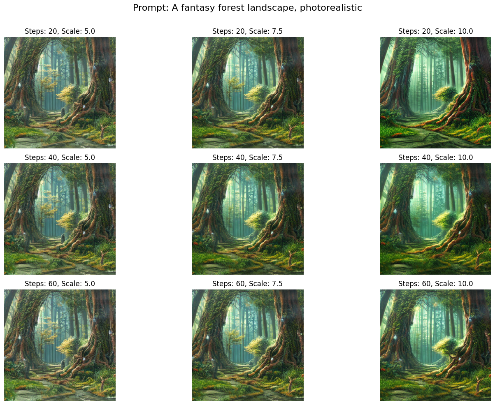
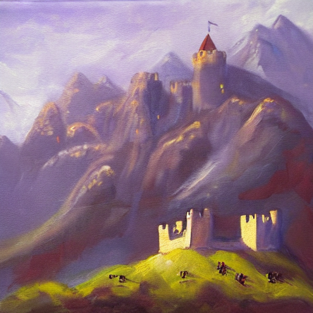
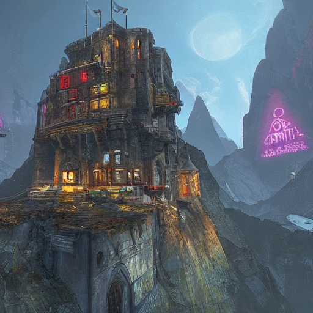
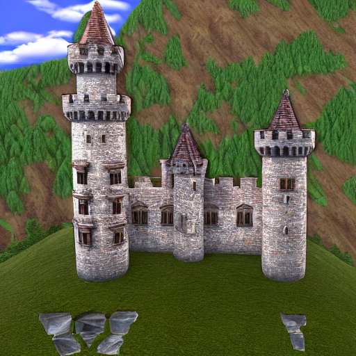
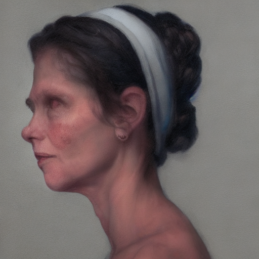
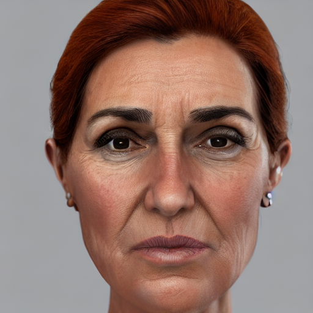
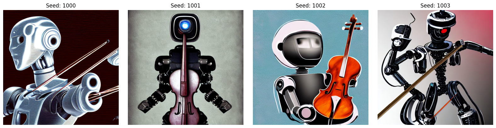

# 🧪 Taller - Explorando el Universo Latente: Introducción a Stable Diffusion

## 📅 Fecha  
`2025-07-03` 

---

## 🎯 Objetivo del Taller

Comprender cómo funcionan los modelos de difusión generativa y aprender a generar imágenes detalladas a partir de descripciones textuales (prompts), usando la librería `diffusers` de Hugging Face en Google Colab o entorno local.

---

## 🧠 Conceptos Aprendidos

Los principales conceptos aplicados fueron:

- [x] Funcionamiento básico de los modelos de difusión generativa.
- [x] Uso de `StableDiffusionPipeline` con Hugging Face Diffusers.
- [x] Generación de imágenes a partir de texto (prompt-based image generation).
- [x] Uso y ajuste de parámetros como `guidance_scale`, `num_inference_steps`, `height`, `width` y `seed`.
- [x] Visualización de resultados y comparación de estilos.
- [x] Introducción al *prompt engineering* y al uso de *negative prompts*.
- [x] Generación de múltiples imágenes por lotes con semillas distintas.

---

## 🔧 Herramientas y Entornos

Los entornos usados para la práctica fueron:

- [x] 💻 **Python en Google Colab (GPU)**
  - Librerías: `diffusers`, `transformers`, `torch`, `matplotlib`

---

## 📁 Estructura del Proyecto

```
2025-07-03_taller_stable_diffusion_diffusers_colab/
├── colab_notebooks/
│   └── stable_diffusion_taller.ipynb
├── resultados/
│   ├── output_city.png
│   ├── forest_step20_scale5.0.png
│   ├── castle_photorealistic.png
│   └── ...
└── README.md
```

---

## 🧪 Implementación

### 🔹 Etapas realizadas

1. **Preparación del entorno**: Se instaló y configuró el entorno de ejecución en Google Colab con GPU habilitada. Se cargó el modelo `runwayml/stable-diffusion-v1-5` con `torch.float16`.
2. **Generación básica**: Se probó la generación de imágenes a partir de descripciones textuales simples y se guardaron los resultados como imágenes PNG.
3. **Ajuste de parámetros**: Se exploraron los efectos de variar `num_inference_steps` y `guidance_scale`, incluyendo el uso de semilla (`seed`) para reproducibilidad.
4. **Estilos visuales**: Se probó un mismo prompt con diferentes estilos como `"oil painting"`, `"cyberpunk"`, `"photorealistic"`, `"digital art"`, etc.
5. **Prompts negativos**: Se utilizó `negative_prompt` para evitar resultados borrosos o deformes.
6. **Generación por lotes**: Se generaron múltiples variantes de una misma escena usando diferentes semillas y se guardaron.
7. **Visualización**: Se usó `matplotlib` para mostrar los resultados en cuadrículas y permitir una comparación visual efectiva.

### 🎨 Prompts de generación utilizados con Stable Diffusion

A continuación, se listan los prompts utilizados con el modelo `StableDiffusionPipeline`, junto con una breve descripción del objetivo visual de cada uno.

| Prompt | Descripción |
|--------|-------------|
| `"A surreal futuristic city in the clouds, digital art"` | Ciudad futurista en las nubes con un estilo artístico digital, buscando un resultado onírico y detallado. |
| `"A fantasy forest landscape, photorealistic"` | Bosque fantástico con un enfoque en realismo fotográfico, con vegetación y profundidad natural. |
| `"A medieval castle in the mountains, oil painting"` | Castillo medieval en un entorno montañoso, simulado como una pintura al óleo. |
| `"A medieval castle in the mountains, cyberpunk"` | Mismo castillo, pero con elementos visuales del estilo cyberpunk (luces, neón, distopía). |
| `"A medieval castle in the mountains, photorealistic"` | Recreación realista del castillo y su entorno en estilo fotográfico. |
| `"A futuristic robot playing the violin, digital art"` | Imagen creativa de un robot tocando violín, con estilo digital y detalles mecánicos. |
| `"A portrait of a woman, realistic, 8k"` | Retrato hiperrealista de una mujer en alta resolución. |


## 🔹 Código relevante

### Python

```python
from diffusers import StableDiffusionPipeline
import torch

pipe = StableDiffusionPipeline.from_pretrained(
    "runwayml/stable-diffusion-v1-5",
    torch_dtype=torch.float16
).to("cuda")

prompt = "A surreal futuristic city in the clouds, digital art"
image = pipe(prompt, num_inference_steps=50, guidance_scale=7.5).images[0]
image.save("output_city.png")
```

```python
# Generar múltiples estilos
styles = ["oil painting", "cyberpunk", "photorealistic"]
for style in styles:
    full_prompt = f"A medieval castle in the mountains, {style}"
    image = pipe(full_prompt, num_inference_steps=40, guidance_scale=7.5).images[0]
    image.save(f"resultados/castle_{style.replace(' ', '_')}.png")
```

Link al notebook: https://colab.research.google.com/drive/1hd-0SESplnAWE_gp5valBkLlRCQVCJbV?usp=sharing

---

## 📊 Resultados Visuales

### 📌 Cuadrícula de comparación de parámetros



### 🖼️ Ejemplos de estilos

#### Prompt: *"A medieval castle in the mountains"*

- `oil painting`

  

- `cyberpunk`  

  

- `photorealistic`  

  

### Uso de prompts negativos

- `Imagen original`

  

- `Imagen usando prompts negativos`

  

### Uso de semillas



---

## 🧩 Prompts Usados

```text
Explícame paso a paso cómo habilitar la GPU en Colab.
```

```text
¿Puedes escribirme un script que genere una imagen con Stable Diffusion a partir de un prompt, y la guarde como PNG?
```

```text
¿Por qué image.show() no muestra la imagen en Colab? ¿Puedes cambiar el código para que use matplotlib?
```

```text
Explicame de forma simple qué es un prompt negativo. ¿Para qué sirve y cómo mejora la calidad de la imagen generada?
```

```text
Quiero ver cómo cambia la imagen si uso diferentes valores de guidance_scale. ¿Me ayudas a escribir un código que los compare en una matriz?
```


---

## 💬 Reflexión Final

Este taller permitió comprender de forma práctica cómo un modelo de difusión puede generar imágenes detalladas a partir de descripciones textuales. A lo largo de los experimentos, se observó que cada parámetro influye significativamente en el resultado final:

- **`guidance_scale`** controla qué tan fiel es la imagen al texto: valores bajos producen imágenes más creativas pero menos precisas, mientras que valores altos hacen que el modelo siga más estrictamente el prompt, aunque con riesgo de perder naturalidad visual.
- **`num_inference_steps`** determina el nivel de detalle: menos pasos generan imágenes más borrosas o simples, mientras que más pasos permiten obtener texturas más nítidas, contornos definidos y sombras mejor modeladas.
- **`seed`** permite controlar la aleatoriedad: usar la misma semilla con diferentes estilos permite comparar resultados consistentes y generar variantes predecibles de una misma escena.
- **`negative_prompt`** ayudó a evitar errores comunes como manos deformes, elementos desenfocados o duplicados, mejorando notablemente la calidad general.

En cuanto a los estilos, los más satisfactorios fueron:

- **`photorealistic`**, por su realismo sorprendente y texturas detalladas.
- **`oil painting`**, que aportó una estética artística y suave muy agradable.
- El estilo **`cyberpunk`** también resultó muy expresivo visualmente, especialmente en escenas urbanas o tecnológicas.

Por otro lado, algunos resultados en estilo **digital art** fueron menos consistentes, dependiendo mucho del prompt usado.

Además, el proceso de comparar imágenes por lotes y guardar resultados permitió visualizar de manera clara cómo los parámetros afectan el estilo y calidad de la imagen. Esto no solo facilita el ajuste fino, sino que también refuerza el aprendizaje sobre el comportamiento del modelo.

Este conocimiento tiene aplicación directa en áreas como **generación de contenido visual asistido por IA**, **videojuegos**, **diseño gráfico**, y en general, en **cualquier proyecto creativo que requiera generar imágenes únicas de forma automatizada**.


---

## ✅ Checklist de Entrega

- [x] Carpeta `2025-07-03_taller_stable_diffusion_diffusers_colab`
- [x] Notebook funcional (`colab_notebooks/stable_diffusion_taller.ipynb`)
- [x] Resultados exportados en `resultados/`
- [x] Visualizaciones comparativas y estilos diferentes
- [x] Uso de parámetros y prompts negativos
- [x] README completo y claro
- [x] Commits descriptivos en inglés
