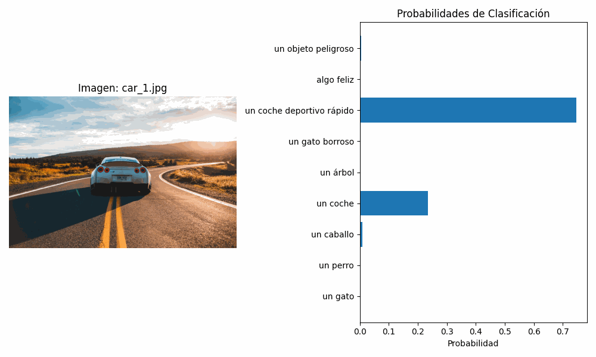

# 🧪 Taller - Visual y Verbal: Clasificación de Imágenes con CLIP

## 📅 Fecha
2025-06-28 – Fecha de realización

---

## 🎯 Objetivo del Taller

Explorar el uso del modelo CLIP (Contrastive Language–Image Pre-training) de OpenAI para clasificar imágenes comparando representaciones de texto e imagen. Este taller permite comprender cómo vincular descripciones en lenguaje natural con imágenes, sin necesidad de entrenamiento adicional.

---

## 🧠 Conceptos Aprendidos

- [x] Procesamiento de imágenes con modelos de visión y lenguaje (CLIP)
- [x] Uso de embeddings para comparar texto e imágenes
- [x] Clasificación zero-shot con prompts en lenguaje natural
- [x] Integración de APIs de imágenes para obtención de datos
- [x] Generación de visualizaciones y GIFs animados para documentación

---

## 🔧 Herramientas y Entornos

- **Python**: Librerías `clip`, `torch`, `pillow`, `matplotlib`, `numpy`, `requests`, `imageio`
- **Google Colab**: Entorno con GPU para procesamiento y visualización
- **API de Unsplash**: Para descargar imágenes automáticamente

📌 Las herramientas se instalaron ejecutando comandos `!pip install` en Google Colab.

---

## 📁 Estructura del Proyecto

```
2025-07-04_taller_clip_clasificacion_visual_verbal/
├── python/
│   └── clasificador_clip.ipynb
├── images/
│   ├── cat_0.jpg
│   ├── cat_1.jpg
│   ├── dog_0.jpg
│   ├── dog_1.jpg
│   ├── car_0.jpg
│   ├── car_1.jpg
│   ├── tree_0.jpg
│   ├── tree_1.jpg
├── resultados/
│   ├── result_cat_0.png
│   ├── result_cat_1.png
│   ├── result_dog_0.png
│   ├── result_dog_1.png
│   ├── result_car_0.png
│   ├── result_car_1.png
│   ├── result_tree_0.png
│   ├── result_tree_1.png
│   ├── results.gif
├── README.md
```
---

## 🧪 Implementación

### 🔹 Etapas realizadas

1. **Configuración de la API de Unsplash**:
   - **Creación de cuenta**: Se creó una cuenta en `https://unsplash.com/` para acceder al panel de desarrolladores (`https://unsplash.com/developers`).

   - **Registro como desarrollador**: En el panel, se seleccionó "New Application" y se aceptaron los términos de uso. Se completó un formulario con el nombre de la aplicación ("Clasificador") y una descripción ("Clasificación de imágenes con CLIP").
   
   - **Obtención de la clave de API**: En la sección "Keys" de la aplicación creada, se copió la **Access Key**, que se usó en el script para autenticar las solicitudes a la API de Unsplash. La clave se ingresó de forma segura mediante `getpass` en Google Colab para evitar exponerla.
     
   - **Conexión con la API**: Se configuró una función `download_images` para realizar solicitudes HTTP a `https://api.unsplash.com/search/photos`, descargando imágenes de categorías como "cat", "dog", "car" y "tree" con un límite de 2 imágenes por categoría para respetar la cuota de 50 solicitudes por hora.

2. **Preparación de datos**:
   - Las imágenes descargadas se almacenaron en la carpeta `images/` dentro de `/content/2025-06-28_taller_clip_clasificacion_visual_verbal` en Google drive.
   - Se usó la librería `PIL` para cargar y preprocesar las imágenes con el transformador proporcionado por CLIP (`preprocess`).

3. **Aplicación de modelo**:
   - Se cargó el modelo CLIP (`ViT-B/32`) con `clip.load`, configurado para usar GPU en Colab.
   - Las imágenes se convirtieron en embeddings usando `model.encode_image`, y los prompts en lenguaje natural se tokenizaron con `clip.tokenize` y convirtieron en embeddings con `model.encode_text`.
   - Se calcularon las probabilidades de clasificación comparando los embeddings de imágenes y texto mediante `model(image, text)` y aplicando `softmax`.

4. **Visualización**:
   - Se generaron gráficos de barras con `matplotlib` para mostrar las probabilidades de cada prompt por imagen, usando `%matplotlib inline` para visualización en Colab.
   - Los gráficos se guardaron en `resultados/` con nombres descriptivos.
   - Se creó un GIF animado (`results.gif`) con `imageio`, combinando los gráficos de resultados para cumplir con el requisito del taller.

5. **Guardado de resultados**:
   - Las imágenes, gráficos y el GIF se guardaron en `resultados/`. Opcionalmente, se montó Google Drive para almacenar los archivos de forma persistente en `/content/drive/MyDrive/2025-06-28_taller_clip_clasificacion_visual_verbal`.

### 🔹 Código relevante

```python
# Descargar imágenes de Unsplash
def download_images(query, api_key, count=3, output_dir=image_dir):
    url = f"https://api.unsplash.com/search/photos?query={query}&per_page={count}&client_id={api_key}"
    response = requests.get(url).json()
    image_paths = []
    for i, photo in enumerate(response['results']):
        img_url = photo['urls']['regular']
        img_data = requests.get(img_url).content
        img_path = os.path.join(output_dir, f"{query}_{i}.jpg")
        with open(img_path, "wb") as f:
            f.write(img_data)
        image_paths.append(img_path)
    return image_paths

# Clasificar imágenes con CLIP
image_paths, images = load_images(image_dir)
text = clip.tokenize(text_descriptions).to(device)
with torch.no_grad():
    image_features = model.encode_image(images)
    text_features = model.encode_text(text)
    logits_per_image, _ = model(images, text)
    probs = logits_per_image.softmax(dim=-1).cpu().numpy()
```

---

## 📊 Resultados Visuales



CLIP clasificó correctamente imágenes de gatos, perros, coches y árboles con probabilidades superiores al 90% para prompts específicos como "un gato" o "un coche". Los prompts descriptivos como "un gato borroso" funcionaron bien en imágenes de baja calidad, mientras que los subjetivos ("algo feliz", "un objeto peligroso") mostraron resultados inconsistentes o subjetivos por lo que es una frase ambigua, dependiendo del contexto visual.

---

## 🧩 Prompts Usados
Estos son los prompts que se usaron para poder clasificar las imágenes

```text
"un gato"
"un perro"
"un caballo"
"un coche"
"un árbol"
"un gato borroso"
"un coche deportivo rápido"
"algo feliz"
"un objeto peligroso"
```

* Dame el code para volver la carpeta images y resultados en un zip y poder descargarla.
---

## 💬 Reflexión Final

Este taller nos permitió profundizar en el uso de modelos multimodales como CLIP, que integran visión y lenguaje para realizar tareas de clasificación sin entrenamiento adicional. Aprendí a manejar embeddings para comparar imágenes y texto, integrar APIs externas como Unsplash para automatizar la obtención de datos, y generar visualizaciones dinámicas. La configuración de la API fue un aprendizaje clave, ya que requirió registrar una cuenta, crear una aplicación y manejar la clave de acceso de forma segura con `getpass`.

La parte más compleja fue gestionar las cuotas de la API de Unsplash, que limita a 50 solicitudes por hora, lo que me obligó a optimizar el número de imágenes descargadas. Lo más interesante fue observar cómo CLIP interpreta prompts subjetivos, como "algo feliz", donde mostró sesgos hacia colores vivos o escenas luminosas. En futuros proyectos, mejoraría la robustez probando prompts multilingües y generando imágenes con Stable Diffusion para explorar casos más abstractos, además de optimizar el manejo de errores de la API para entornos con restricciones de red.

---

## ✅ Checklist de Entrega

- [x] Carpeta `2025-07-04_taller_clip_clasificacion_visual_verbal`
- [x] Código limpio y funcional
- [x] GIF incluido con nombre descriptivo (`results.gif`)
- [x] Visualizaciones exportadas en `resultados/`
- [x] README completo y claro
- [x] Commits descriptivos en inglés

---
