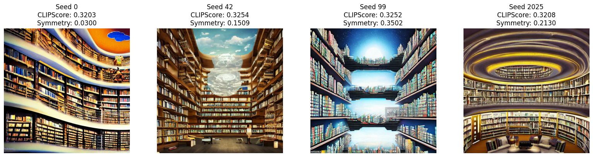

# 🧪 Taller - Evaluando la Creatividad Artificial: Métricas y Reflexión

## 📅 Fecha  
`2025-07-04`

---

## 🎯 Objetivo del Taller

Reflexionar sobre la calidad, coherencia y creatividad de imágenes generadas con IA, aplicando métricas cuantitativas (como CLIPScore y simetría visual) y evaluaciones subjetivas. El propósito es desarrollar pensamiento crítico sobre el papel del ser humano en la generación y evaluación del contenido visual producido por modelos generativos.

---

## 🧠 Conceptos Aplicados

- [x] Evaluación automática de imágenes generadas con IA.
- [x] Uso de CLIP para medir alineación entre texto e imagen (CLIPScore).
- [x] Cálculo de simetría visual con SSIM.
- [x] Análisis crítico de resultados desde una perspectiva subjetiva.
- [x] Reflexión sobre creatividad, control humano y generación automática.

---

## 🔧 Herramientas y Entornos

- [x] 💻 **Python en Google Colab (GPU)**
  - `clip`, `torch`, `Pillow`, `matplotlib`, `skimage`, `numpy`, `cv2`
- [x] 🔍 Modelo usado: `runwayml/stable-diffusion-v1-5`

---

## 📁 Estructura del Proyecto

```
2025-07-05_taller_evaluacion_creatividad_ia_metricas_reflexion/
├── python/
│   └── evaluacion_metricas_clip_ssim.ipynb
├── imagenes_generadas/
│   ├── biblioteca_0.png
│   ├── biblioteca_42.png
│   ├── biblioteca_99.png
│   └── biblioteca_2025.png
├── resultados_metricas/
│   └── metricas_clip_simetria.csv
├── reflexion/
│   └── reflexion_personal.txt
└── README.md
```

---

## 🧪 Implementación

### 🔹 Imágenes Evaluadas

Se generaron 4 imágenes diferentes utilizando el mismo prompt:

> `"A library floating in the sky, digital art"`

Las imágenes se obtuvieron con distintas semillas (0, 42, 99, 2025), y se evaluaron con:

- **CLIPScore**: mide la coherencia entre el prompt y la imagen.
- **Simetría visual (SSIM)**: mide la similitud entre las mitades izquierda y derecha.

Es importante aclarar que decidí usar el mismo prompt para comparar 4 imagenes con un mismo concepto para abordar de una mejor forma el tema de la creatividad y el papel del juicio humano a la hora de crear arte usando Inteligencia Artificial. 

Link al notebook en Colab: https://colab.research.google.com/drive/1jwX5nwoGj4khlo4y-adbidTui7LiGMEg?usp=sharing

### 📊 Resultados de Métricas

| Seed  | CLIPScore | Simetría (SSIM) | Observaciones |
|-------|-----------|------------------|---------------|
| 0     | 0.3203    | 0.0300           | Curvas distorsionadas; cielo abstracto con elementos incoherentes. |
| 42    | 0.3254    | 0.1509           | Escena muy coherente; luz central y buena distribución de elementos. |
| 99    | 0.3252    | 0.3502           | Imagen más simétrica; refleja un concepto visual “espejado”. |
| 2025  | 0.3208    | 0.2130           | Diseño circular armónico, aunque menos flotante visualmente. |

---

### 🖼️ Comparación Visual



> Cuadrícula con las 4 imágenes generadas. Se muestran CLIPScore y Simetría debajo de cada una.

---

## 🧩 Prompts Usados para IA Asistente

```text
🧪 Crea un código en Python que evalúe CLIPScore entre un prompt textual y una imagen PNG usando la librería clip de OpenAI.
```

```text
🧪 ¿Cómo puedo medir la simetría entre la mitad izquierda y la derecha de una imagen con skimage.metrics.structural_similarity?
```

```text
🧪 Este es mi error al calcular SSIM: "win_size exceeds image extent...". ¿Cómo lo soluciono?
```

```text
🧪 Genera 4 imágenes distintas con Stable Diffusion usando el mismo prompt pero diferentes semillas. Que el script me las guarde automáticamente.
```

```text
🧪 Quiero guardar los resultados de CLIPScore y simetría visual en un CSV. ¿Me das un código simple que lo haga?
```

---

## 💬 Reflexión Final

Este taller permitió aplicar de manera práctica dos enfoques complementarios para evaluar imágenes generadas por IA: las **métricas objetivas** y la **valoración subjetiva humana**.

- El **CLIPScore** resultó útil para medir qué tanto se alinea una imagen con su prompt. No obstante, se observó que pequeñas diferencias numéricas (por ejemplo, entre 0.3203 y 0.3252) a veces corresponden a imágenes visualmente muy distintas. Esto revela que esta métrica **no capta completamente aspectos como la estética, la emoción o la creatividad**.

- La **simetría estructural (SSIM)** fue interesante para detectar balance visual, como se evidenció en la imagen con seed 99, que obtuvo el puntaje más alto en simetría. Sin embargo, esto no la convirtió automáticamente en la imagen más agradable o coherente.

- Desde una perspectiva subjetiva, la imagen con seed 42 fue la más satisfactoria por su composición equilibrada, ambientación coherente y buena interpretación del concepto de una “biblioteca flotante”.

Estas observaciones llevan a una reflexión más amplia sobre el papel del humano en la generación de contenido con IA:

> 📌 **¿Fueron útiles las métricas?**  
Sí, pero **solo como apoyo**. Pueden ayudar a detectar tendencias o evaluar ciertos aspectos técnicos, pero **no reemplazan la percepción humana ni el juicio estético**.

> 🧠 **¿Qué parte de la imagen fue decidida por el humano?**  
El prompt, el modelo utilizado, las semillas, el número de pasos de inferencia, la escala de guía... Es decir, **el humano define los límites del espacio creativo**. La IA genera, pero bajo nuestras decisiones.

> 🎨 **¿Podemos medir la creatividad con números?**  
Hasta cierto punto. Las métricas técnicas permiten observar patrones y coherencia, pero **la creatividad va más allá de lo medible**: incluye sorpresa, emoción, simbolismo y subjetividad. Por eso, aunque la IA puede producir imágenes asombrosas, **la interpretación y la valoración creativa siguen siendo profundamente humanas**.


---

## ✅ Checklist de Entrega

- [x] Carpeta `2025-07-05_taller_evaluacion_creatividad_ia_metricas_reflexion`
- [x] Notebook funcional (`python/evaluacion_metricas_clip_ssim.ipynb`)
- [x] Imágenes generadas en `imagenes_generadas/`
- [x] Resultados de métricas en `resultados_metricas/`
- [x] Reflexión crítica individual (`reflexion/reflexion_personal.txt`)
- [x] README documentado con evidencias y análisis
- [x] Commits descriptivos en inglés
