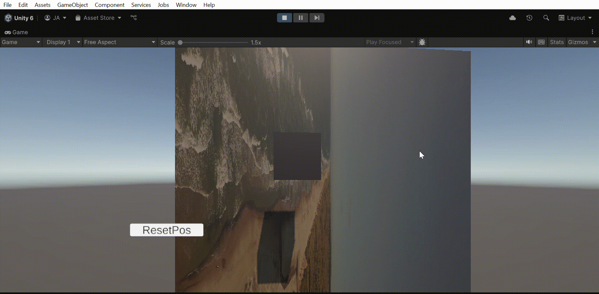

# 🧪 Taller - Realidad Mixta con Unity: Superposición de Elementos sobre Video

## 📅 Fecha  
`2025-07-04` 

---

## 🎯 Objetivo del Taller

Crear una escena en Unity donde se superpongan objetos 3D sobre una fuente de video simulada, recreando una experiencia tipo passthrough similar a la de HoloLens o Meta Quest, pero sin necesidad de visor. El objetivo es entender cómo anclar elementos virtuales sobre un fondo real capturado por cámara o video.

---

## 🧠 Conceptos Aprendidos

- [x] Unity Editor
- [x] Archivo de video
- [x] UI Canvas

---

## 🔧 Herramientas y Entornos

- Unity
- Google Firebase

---

## 📁 Estructura del Proyecto

```
2025-07-04_taller_realidad_mixta_unity_video_passthrough
├── unity/
├── media/
├── resultados/
└── README.md
```

---

## 🧪 Implementación

### 🔹 Etapas realizadas

1. 
2. 
3. 
4. 

---

## 🔹 Código relevante

```cs
 public void LoadData(string userId, System.Action<TransformData> onLoaded) {
        reference.Child("users").Child(userId).GetValueAsync().ContinueWithOnMainThread(task => {
            if (task.IsCompleted) {
                DataSnapshot snapshot = task.Result;
                if (snapshot.Exists) {
                    string json = snapshot.GetRawJsonValue();
                    TransformData data = JsonUtility.FromJson<TransformData>(json);
                    onLoaded?.Invoke(data);
                }
            }
        });
    }
```

```cs
if (Input.GetKeyDown(KeyCode.L))
        {
            firebase.LoadData(userId, data =>
            {
                objeto.position = data.GetPosition();
                objeto.rotation = data.GetRotation();
                Debug.Log("✅ Posición y rotación cargadas");
            });
        }
```

---

## 📊 Resultados Visuales



---

## 🧩 Prompts Usados

```text
"Crea un script de Unity que permita que un objeto siga el movimiento del cursor"
```

---

## 💬 Reflexión Final

E

---

## ✅ Checklist de Entrega

- [x] Carpeta `YYYY-MM-DD_nombre_taller`
- [x] Código limpio y funcional
- [x] GIF incluido con nombre descriptivo (si el taller lo requiere)
- [x] Visualizaciones o métricas exportadas
- [x] README completo y claro
- [x] Commits descriptivos en inglés

---