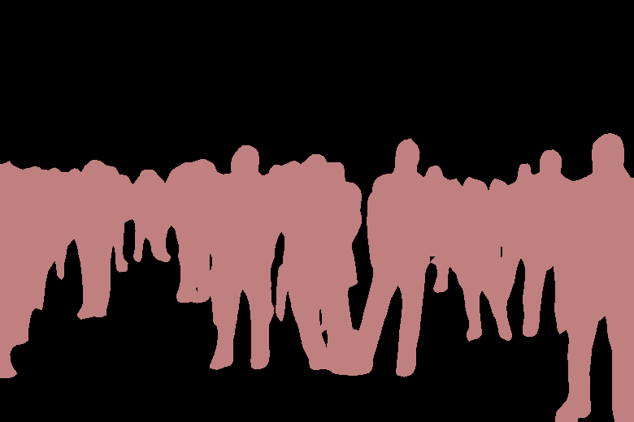
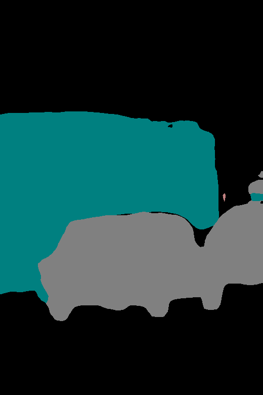
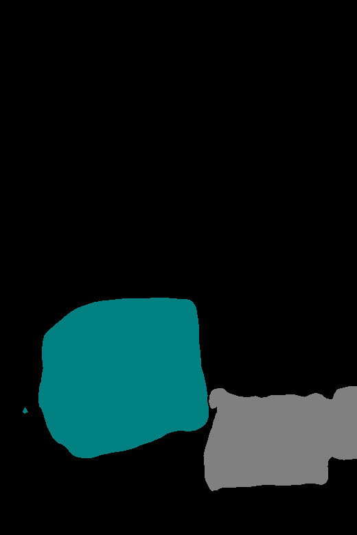

# 🧪 Taller - Segmentación Semántica Multimodal: Qué hay en la Imagen

## 📅 Fecha  
`2025-07-04` 

---

## 🎯 Objetivo del Taller

Aplicar segmentación semántica para identificar y extraer regiones específicas dentro de una imagen, como personas, árboles o vehículos. Se utilizarán modelos avanzados como SAM (Segment Anything Model) o DeepLab, permitiendo al estudiante obtener máscaras y usarlas para análisis, recorte o visualización de componentes.

---

## 🧠 Conceptos Aprendidos

- [x] Preprocesamiento de imágenes para un modelo de segmentación
- [x] Aplicación de un modelo de segmentación semántica preentrenado
- [x] Decodificación de máscaras de clase en visualizaciones RGB

---

## 🔧 Herramientas y Entornos

- DeepLabV3 (via torchvision.models)
- Python: matplotlibr, numpy, Pillow, torch
- Jupyter Notebook

---

## 📁 Estructura del Proyecto

```
2025-07-03_/
├── colab_notebooks/
│   └── segmentacion_deeplabv3.ipynb
├── imagenes_entrada/
├── mascaras_salida/
├── resultados/
└── README.md
```

---

## 🧪 Implementación

### 🔹 Etapas realizadas

1. Importación de librerías y carga del modelo preentrenado: Se instalan e importan las librerías necesarias (Pillow, matplotlib, torchvision, torch, etc.). Luego, se carga el modelo DeepLabV3 con un backbone ResNet101 preentrenado en el dataset COCO.
2. Carga y preprocesamiento de la imagen: Se abre la imagen y se convierte a RGB. Luego, se redimensiona a 520 píxeles de alto (manteniendo proporciones), se transforma a tensor y se normaliza con los valores esperados por el modelo.
3. Aplicación del modelo: Se pasa la imagen al modelo en modo evaluación. El modelo devuelve un tensor con las predicciones de clase por píxel.
4. Codificación de las máscaras a rgb: Se toma la salida del modelo (índices de clases por píxel) y se transforma en una imagen a color usando una tabla de colores fija para las 21 clases del modelo.
5. Mostrar resultados: Se visualizan tanto la imagen original como la segmentación semántica con matplotlib, y luego se exportan los resultados (máscara en escala de grises y segmentación coloreada) a sus respectivas carpetas.

---

## 🔹 Código relevante

```python
preprocess = transforms.Compose([
    transforms.Resize(520),
    transforms.ToTensor(),
    transforms.Normalize(mean=[0.485, 0.456, 0.406],
                         std=[0.229, 0.224, 0.225]),
])

input_tensor = preprocess(input_image).unsqueeze(0)
```

```python
def decode_segmap(image, nc=21):
    label_colors = np.array([
        (0, 0, 0), (128, 0, 0), (0, 128, 0), (128, 128, 0), (0, 0, 128),
        (128, 0, 128), (0, 128, 128), (128, 128, 128), (64, 0, 0),
        (192, 0, 0), (64, 128, 0), (192, 128, 0), (64, 0, 128),
        (192, 0, 128), (64, 128, 128), (192, 128, 128), (0, 64, 0),
        (128, 64, 0), (0, 192, 0), (128, 192, 0), (0, 64, 128)
    ])
    r = np.zeros_like(image).astype(np.uint8)
    g = np.zeros_like(image).astype(np.uint8)
    b = np.zeros_like(image).astype(np.uint8)

    for l in range(0, nc):
        idx = image == l
        r[idx] = label_colors[l, 0]
        g[idx] = label_colors[l, 1]
        b[idx] = label_colors[l, 2]

    rgb = np.stack([r, g, b], axis=2)
    return rgb
```

---

## 📊 Resultados Visuales





---

## 🧩 Prompts Usados

```text
"Crea una función que decodifique máscaras de sam a colores rgb"
```

---

## 💬 Reflexión Final

Durante este taller se comprobó cómo un modelo preentrenado puede segmentar semánticamente objetos en imágenes reales con muy poco código. Se reforzó el conocimiento sobre preprocesamiento, uso de tensores y visualización, además de comprender la utilidad de las máscaras en tareas de visión por computador como segmentación, seguimiento o análisis por clases.

---

## ✅ Checklist de Entrega

- [x] Carpeta `YYYY-MM-DD_nombre_taller`
- [x] Código limpio y funcional
- [x] GIF incluido con nombre descriptivo (si el taller lo requiere)
- [x] Visualizaciones o métricas exportadas
- [x] README completo y claro
- [x] Commits descriptivos en inglés

---

