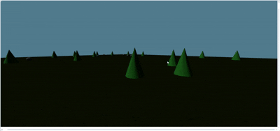

# 🧪 Taller - XR Multidispositivo: Simulación de Experiencia Inmersiva 3D

### 📅 Fecha
`2025-07-02` – Fecha de realización

---

### 🎯 Objetivo del Taller

Desarrollar una escena 3D inmersiva compatible con entornos **WebXR** (Three.js), que pueda explorarse con visor XR o, en su ausencia, mediante navegación tipo **flycam** con teclado y ratón. El objetivo es permitir la interacción fluida con la escena y simular experiencias de realidad extendida desde distintos dispositivos, adaptando la experiencia a usuarios sin visor mediante controles inmersivos.

---

## 🧠 Conceptos Aprendidos

Lista de los principales conceptos aplicados en la práctica:

- [x] Transformaciones geométricas (escala, rotación, traslación) – Usadas para posicionar y rotar el terreno y los objetos.
- [x] Navegación inmersiva con FirstPersonControls
- [x] Adaptado para simular experiencia XR sin visor

---

### 🔧 Herramientas y Entornos

- Three.js / React Three Fiber (versión r148 o superior)
- Vite (como entorno de desarrollo)

---

## 📁 Estructura del Proyecto

```
2025-07-04_taller_xr_multidispositivo_simulacion_inmersiva/
├── threejs/               
│   ├── src/
│   │   ├── App.jsx
│   │   ├── main.jsx
│   ├── .gitignore
│   ├── index.html
│   ├── package.json
│   ├── package-lock.json
│   ├── vite.config.js
│   ├── eslint.config.js
├── resultados/            
│   ├── navigation.gif
├── README.md
```
## 🧪 Implementación

### 🔹 Etapas Realizadas

1. **Preparación de datos o escena**:
   - Se inicializó una escena 3D básica utilizando Three.js, configurando una cámara con perspectiva, un renderer con antialiasing y soporte para sombras. Se definió un fondo dinámico que simula un ciclo día/noche mediante interpolación de colores, estableciendo un entorno inmersivo desde el inicio.
     
   - **Código relevante**:
     ```javascript
     const scene = new THREE.Scene();
     const camera = new THREE.PerspectiveCamera(75, window.innerWidth / window.innerHeight, 0.1, 1000);
     camera.position.set(0, 2, 10);

     const renderer = new THREE.WebGLRenderer({ antialias: true });
     renderer.setSize(window.innerWidth, window.innerHeight);
     renderer.shadowMap.enabled = true;
     renderer.shadowMap.type = THREE.PCFSoftShadowMap;
     renderer.outputColorSpace = THREE.SRGBColorSpace;
     mountRef.current.appendChild(renderer.domElement);

     let dayTime = 0;
     const updateBackground = () => {
       dayTime += 0.001;
       const skyColor = new THREE.Color().lerpColors(new THREE.Color(0x87ceeb), new THREE.Color(0x1a2a44), Math.sin(dayTime) * 0.5 + 0.5);
       scene.background = skyColor;
     };


2. **Aplicación de transformaciones**:
   - Se implementaron transformaciones geométricas para configurar el terreno, rotándolo 90 grados sobre el eje X y aplicando texturas de pasto (`grasslight-big.jpg` y `grasslight-big-nm.jpg`) con normal mapping para dar relieve. Se posicionaron aleatoriamente árboles y rocas usando bucles, aplicando escalas y traslaciones para un entorno natural.

     
   - **Código relevante**:
     ```javascript
     const textureLoader = new TextureLoader();
     const grassTexture = textureLoader.load('https://threejs.org/examples/textures/terrain/grasslight-big.jpg');
     const grassNormal = textureLoader.load('https://threejs.org/examples/textures/terrain/grasslight-big-nm.jpg');
     grassTexture.wrapS = grassTexture.wrapT = THREE.RepeatWrapping;
     grassNormal.wrapS = grassNormal.wrapT = THREE.RepeatWrapping;
     grassTexture.repeat.set(20, 20);
     grassNormal.repeat.set(20, 20);
     const groundMaterial = new THREE.MeshStandardMaterial({
       map: grassTexture,
       normalMap: grassNormal,
       roughness: 0.8
     });
     const groundGeometry = new THREE.PlaneGeometry(100, 100);
     const ground = new THREE.Mesh(groundGeometry, groundMaterial);
     ground.rotation.x = -Math.PI / 2;
     ground.receiveShadow = true;
     scene.add(ground);

     const treeGeometry = new THREE.ConeGeometry(1, 3, 8);
     const treeMaterial = new THREE.MeshStandardMaterial({ color: 0x228B22 });
     for (let i = 0; i < 30; i++) {
       const tree = new THREE.Mesh(treeGeometry, treeMaterial);
       tree.position.set(Math.random() * 80 - 40, 1.5, Math.random() * 80 - 40);
       tree.castShadow = true;
       scene.add(tree);
     }
     ```

3. **Visualización o interacción**:
   - Se integró `FirstPersonControls` para simular la navegación tipo flycam, permitiendo al usuario explorar la escena con el teclado (WASD para movimiento) y el ratón (para mirar). Se configuró la velocidad y sensibilidad de los controles para una experiencia fluida, adaptada a la ausencia de visor XR.
  
     
   - **Código relevante**:
    ```javascript
    // Configuración de los controles inmersivos
    const controls = new FirstPersonControls(camera, renderer.domElement);
    controls.movementSpeed = 10; // Velocidad de movimiento
    controls.lookSpeed = 0.1;    // Sensibilidad del ratón
    
    // Bucle de animación
    function animate() {
      requestAnimationFrame(animate);
      updateBackground();         // Actualiza el fondo dinámico
      controls.update(0.016);     // Actualiza los controles en cada frame
      renderer.render(scene, camera); // Renderiza la escena
    }
    animate();
    ```
   - La interacción se limita a la exploración, pero el entorno inmersivo se logra mediante la distribución de objetos y el fondo dinámico.

4. **Guardado de resultados**:
   - Se capturó un GIF (`navigation.gif`) registrando la navegación por la escena con los controles de flycam. Este archivo se guardó en la carpeta `resultados/` para su inclusión en la entrega.


---

## 📊 **Resultados Visuales**

- El GIF generado muestra la navegación inmersiva por la escena 3D.




---

## 🧩 **Prompts Usados**

Enumera los prompts utilizados:

```text
"Create an immersive 3D scene with a dynamic sky, grass terrain, and interactive elements using Three.js"
"Simulate a WebXR experience with FirstPersonControls for users without XR visor"
```

---

## 💬 **Reflexión Final**

Durante este taller, aprendí y reforcé conceptos clave de Three.js, como la configuración de escenas 3D, el uso de texturas y normal mapping para dar realismo al terreno, y la implementación de controles inmersivos. La navegación con FirstPersonControls fue particularmente interesante, ya que permitió simular una experiencia XR sin necesidad de un visor, adaptándose a mi entorno. El manejo del fondo dinámico con un ciclo día/noche fue un desafío técnico, ya que requirió entender la interpolación de colores y la actualización en tiempo real.

En cuanto a la comparación entre la navegación en XR y sin visor, la experiencia sin visor utilizando `FirstPersonControls` ofrece una sensación de control directa y precisa mediante el teclado y el ratón, lo que resulta cómodo para explorar la escena a mi ritmo. Sin embargo, carece de la inmersión total que proporciona un visor XR, donde la percepción de profundidad y el movimiento de cabeza podrían enriquecer la interacción. Sin visor, la experiencia se siente más como un simulador de vuelo o un juego en primera persona tradicional, lo cual es funcional pero menos envolvente que la inmersión espacial que XR podría ofrecer con un hardware adecuado.

Para mejorar la experiencia, adaptaría varias cosas. Primero, añadiría interacciones más dinámicas, como la capacidad de rotar o seleccionar objetos con un clic, para simular mejor las funcionalidades de un controlador XR. También consideraría integrar un sistema de colisiones básico para evitar que la cámara atraviese los árboles o rocas, lo que aumentaría el realismo. Además, exploraría la adición de audio ambiental (como sonidos de viento o pájaros) para compensar la falta de inmersión visual de un visor, y optimizaría el rendimiento para incluir elementos como agua o partículas, creando un entorno más rico y atractivo. Estos ajustes harían que la simulación sin visor se acercara más a la experiencia inmersiva que XR ofrece con hardware dedicado.

---


## ✅ **Checklist de Entrega**

- [x] Carpeta `2025-07-04_taller_xr_multidispositivo_simulacion_inmersiva`
- [x] Código limpio y funcional
- [x] GIF incluido con nombre descriptivo 
- [x] Visualizaciones o métricas exportadas
- [x] README completo y claro
- [x] Commits descriptivos en inglés

---
