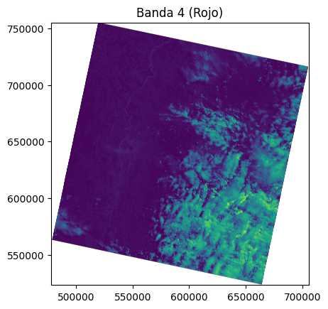
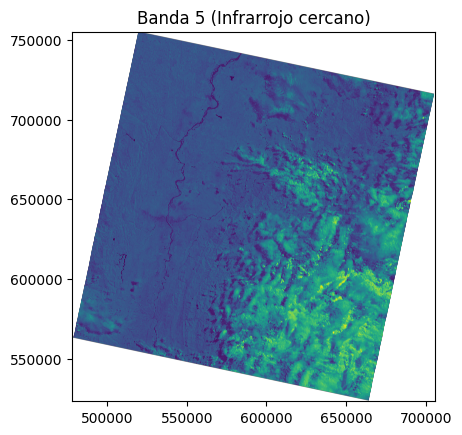
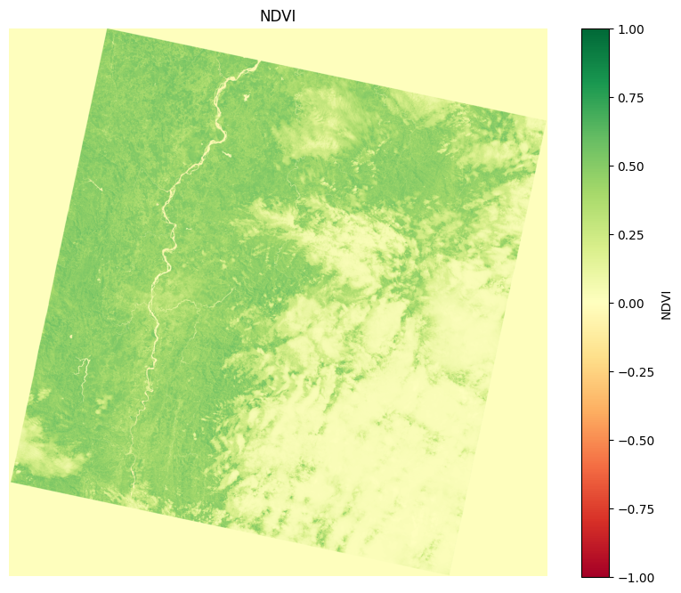
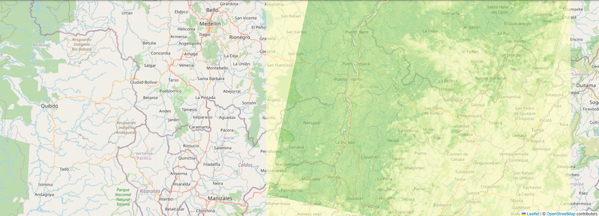
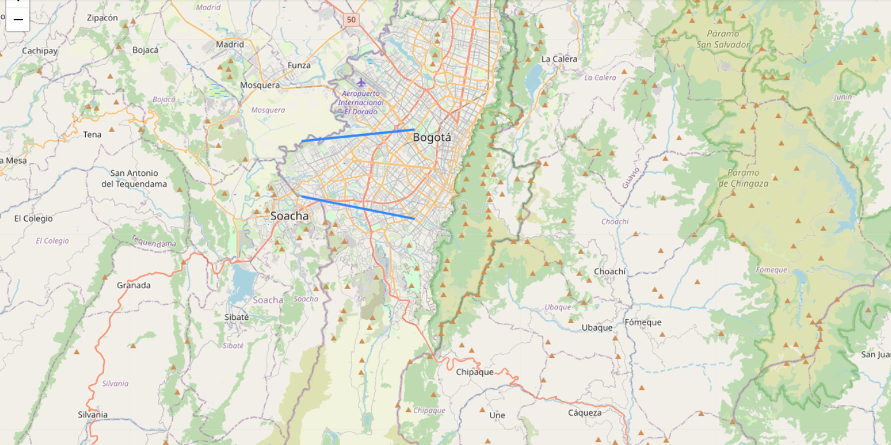

# 🧪 Taller - Mapas Interactivos con Datos Satelitales Abiertos

## 📅 Fecha
`2025-07-18`

---

## 🎯 Objetivo del Taller

Visualizar imágenes satelitales (por ejemplo, Landsat o Sentinel) o mapas base como OpenStreetMap, y permitir interacciones como zoom, cambio de capas, y navegación por clic. El objetivo es aprender a superponer y explorar datos geoespaciales abiertos en un entorno visual y dinámico.

---

## 🧠 Conceptos Aprendidos

Lista los principales conceptos aplicados:

- [x] Búsqueda de datos satelitales abiertos
- [x] Creación de mapas interactivos con Folium
- [x] Cálculo de NDVI para la vegetación
- [x] Adición de capas sobre un mapa interactivo
- [x] Manejo de capas para activar o desactivar elementos en un mapa

---

## 🔧 Herramientas y Entornos

Especifica los entornos usados:

- Python (`rasterio`, `folium`, `geopandas`)
- EarthExplorer (`landsat`)
- Jupyter / Google Colab

---

## 📁 Estructura del Proyecto

```
2025-07-18_taller_mapas_interactivos_datos_satelitales/
├── python/               
├── datos/                
├── resultados/           
├── README.md
```

---

## 🧪 Implementación

Explica el proceso:

### 🔹 Etapas realizadas
1. Preparación de los datos: Entramos a EarthExplorer, creamos una cuenta y buscamos datos, para esto situamos buscamos datos en un área ciruclar, poniendo el centro en latitud 4.6 y longitud -74.1 (cercano a Bogotá), con un radio de 100 kilómetros, luego filtramos en el rango de fecha del 14 al 18 de julio, y descargamos los archivos B4.TIF y B5.TIF, que son la banda roja y la banda infrarroja.
2. visualización de bandas: Se importan las librerias y utilizando rasterio se cargan B4.TIF y B5.TIF y se muestran en una previsualización.
3. Creación del mapa base: Con folium creamos un nuevo mapa base y lo centramos en Bogotá, con latitud 4.6 y longitud -74.1-
4. Cálculo del NDVI: A partir de la banda roja y la banda infrarroja hacemos el cálculo del NDVI y mostramos con matplotlib una gráfica de temperatura del resultado.
5. Carga de rutas: Con geopandas cargamos dos rutas guardadas en un geojson y las imprimimos.
6. Adición de capas al mapa y exportación: Finalmente, añadimos al mapa base una capa con el NDVI y otra capa con las rutas, activamos el manejo de capas para poder ocultar o mostrar las capas y lo exportamos cómo html.

### 🔹 Código relevante

Incluye un fragmento que resuma el corazón del taller:

```python
# Abrir y mostrar B4
with rasterio.open('B4.TIF') as b4:
    plt.title("Banda 4 (Rojo)")
    show(b4)

# Abrir y mostrar B5
with rasterio.open('B5.TIF') as b5:
    plt.title("Banda 5 (Infrarrojo cercano)")
    show(b5)
```

```python
import numpy as np

# Leer bandas como arrays
with rasterio.open('B5.TIF') as b5:
    nir = b5.read(1).astype('float32')
with rasterio.open('B4.TIF') as b4:
    red = b4.read(1).astype('float32')

# Evitar división por cero
ndvi = np.where((nir + red) == 0., 0., (nir - red) / (nir + red))

# Mostrar NDVI como imagen
plt.figure(figsize=(10, 8))
plt.imshow(ndvi, cmap='RdYlGn', vmin=-1, vmax=1)
plt.colorbar(label='NDVI')
plt.title("NDVI")
plt.axis('off')
plt.show()
```

```python
# Convertir GeoDataFrame a GeoJSON y agregar al mapa
folium.GeoJson(
    gdf,
    name="Rutas",
    tooltip=folium.GeoJsonTooltip(fields=gdf.columns[:1].tolist(), aliases=["Ruta"]),
).add_to(m)
m
```

---

## 📊 Resultados Visuales

### 📌 Este taller **requiere explícitamente un GIF animado**:








---

## 🧩 Prompts Usados

Enumera los prompts utilizados:

```text
"Haz una función que permita agregar a un mapa interactivo de Folium, una capa de NDVI calculada anteriormente"

"Haz una función que permita exportar cómo html un mapa interactivo creado con folium en python"
```

---

## 💬 Reflexión Final

A lo largo de este taller exploramos cómo acceder a datos satelitales abiertos, que pueden ser aprovechados en una amplia variedad de proyectos. Aprendimos también sobre sus aplicaciones prácticas, como el cálculo del NDVI (Índice de Vegetación de Diferencia Normalizada), una herramienta útil para analizar el estado de la vegetación en una región determinada.

Además, vimos cómo estos datos pueden integrarse en mapas interactivos enriquecidos con información adicional, como rutas y otras capas geográficas relevantes. Este ejercicio resalta la importancia de saber visualizar, graficar y analizar datos espaciales, tanto históricos como en tiempo real.

En particular, se destacó el gran potencial que tienen los datos satelitales en el análisis de los cambios en los ecosistemas a lo largo del tiempo, especialmente frente a fenómenos como el cambio climático. Visualizaciones como estas no solo facilitan la interpretación, sino que también abren la puerta a soluciones informadas y estrategias de monitoreo ambiental más efectivas.

---

## ✅ Checklist de Entrega

- [x] Carpeta `YYYY-MM-DD_nombre_taller`
- [x] Código limpio y funcional
- [x] GIF incluido con nombre descriptivo (si el taller lo requiere)
- [x] Visualizaciones o métricas exportadas
- [x] README completo y claro
- [x] Commits descriptivos en inglés

---
